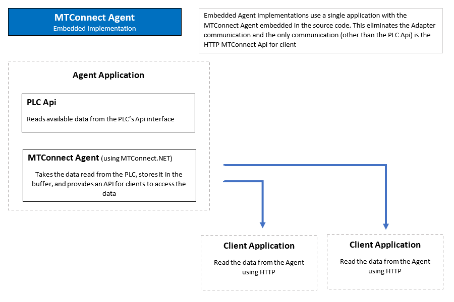

 

# MTConnect.NET

## Overview
MTConnect.NET is a fully featured .NET library for MTConnect® to develop Agents, Adapters, and Clients. Supports MTConnect Versions up to 1.8.

The Agent, Buffers, and Adapter are separated into individual classes in order to allow for modular implementations such as the following : 

- A traditional Agent that uses a REST Api, in-memory buffer, and Adapters that communicate using the SHDR protocol
- An agent imbedded with the Adapter (which elminates the need for the Adapter TCP communication)
- Buffers that read from a permanent storage source (ex. SQL, SQLite, etc.)
- Interfaces other than Http REST such as MQTT
- Integration with cloud services such as AWS and Azure

Other features of MTConnect.NET :
- [Models](src/MTConnect.NET/Models) framework for setting and accessing data using an object model as opposed to DataItem ID's and Types
- Extensible through plugin libraries to extend Types
- Full data validation
- Fully documented objects using text from the MTConnect Standard. This enables Intellisense in applications such as Visual Studio.
- Full list of Component, Composition, and DataItem types. See [Devices](src/MTConnect.NET/Devices) for more information.
- Default Units and UnitConversion is done automatically when sending Streams and when reading Streams.
- Full client support for requesting data from any MTConnect Agent (Probe, Current, Sample Stream, Assets, etc.). See [Clients](src/MTConnect.NET/Clients/Rest) for more information.

## Applications
- [MTConnect Agent](applications/Agents/MTConnect-Agent) : A traditional MTConnect Agent using a REST Api, in-memory buffer, and SHDR for Adapters. Uses the [MTConnectHttpServer](src/MTConnect.NET/Http/MTConnectHttpServer.cs) as the  web server.

- [MTConnect Agent - AspNetCore](applications/Agents/MTConnect-Agent-AspNetCore) : Similar to the MTConenct Agent application but uses either the built-in Kestrel server or can be setup through IIS (Internet Information Services). This allows the agent to be used with all of the features available through ASP.NET and IIS such as security, permissions, monitoring, etc.

- [MTConnect MQTT Agent](applications/Agents/MTConnect-Agent-MQTT) : (In-Progress) An MTConnect Agent with an MQTT broker built-in.

## Nuget Packages
The Nuget packages for the libraries in this repo are listed below:
- [MTConnect.NET](https://www.nuget.org/packages/MTConnect.NET/)

## Supported Frameworks
- .NET 6.0
- .NET 5.0
- .NET Core 3.1

- .NET Standard 2.0

- .NET Framework 4.8
- .NET Framework 4.7.2
- .NET Framework 4.7.1
- .NET Framework 4.7
- .NET Framework 4.6.2
- .NET Framework 4.6.1

## MTConnect Version Compatibility
MTConnect.NET is designed to be fully compatible for all versions of the MTConnect standard. This is done through processing by the [MTConnectAgent](src/MTConnect.NET/Agents/MTConnectAgent.cs) class before data is output. This allows the version to be a parameter when requesting data from the Agent. More information can be found in the [Devices README](src/MTConnect.NET/Devices/README.md).

*NOTE: All data items have not been set for compatiblity as of yet. This should be finished before the Beta is completed.*

## Data Validation
Validation is performed on a Device, Component, Composition, or DataItem level through the classes in [Devices](src/MTConnect.NET/Devices). This allows for validation without the need to use XML schemas.

## Releases
Releases are available under the Releases tab

## Agents
Agents are implemented using the MTConnectAgent class and IMTConnectAgent interface. The MTConnectAgent class implements the MTConnect® standard and is inteded to be full implemenation. More information about agents can be found at [Agents](src/MTConnect.NET/Agents) and Agent Applications can be found at [Agent Applications](applications/Agents).

### Traditional Implementation
 

### Embedded Implementation
 

## Adapters
### SHDR Adapter
The only adapter currently available is one using the SHDR protocol. More information can be found at [Adapters](src/MTConnect.NET/Adapters/SHDR).

## Developer Notes
This repo along with the libraries and applications are free to use and hopefully will help those that are looking at either getting started using MTConnect or those that are looking to use MTConnect for more advanced use cases. The [Models](src/MTConnect.NET/Models) framework will hopefully make using MTConnect much easier and straight forward and promote better usage of the standard's lesser used features.

Feel free to comment, or create pull-requests for anything that could be coded, formatted, or worded better. Attention to detail and continuous improvement are important in manufacturing so they should be just as important for manufacturing software.

One of this project's goals is to expand the use cases for MTConnect and by breaking apart the functionalities of the agent, hopefully that will allow others to be creative in how to use the MTConnect standard.

Hopefully this repo will serve as a "one stop shop" for .NET developers looking to use MTConnect. If anyone is interested in developing a similar repo for another framework or language, feel free to use this as a guide as I imagine some of the classes (which is the most tedious part of the code) could be converted to other languages fairly easily.

This MTConnect.NET update is Part 1 of **The TrakHound Project** which is a project to provide open source code as well as products for each part of a full IIOT implementation. Please show support for our project at [www.TrakHound.com](http://www.trakhound.com).

Thanks for your interest in using these libraries and applications and feel free to contribute or give feedback.

\- Patrick
