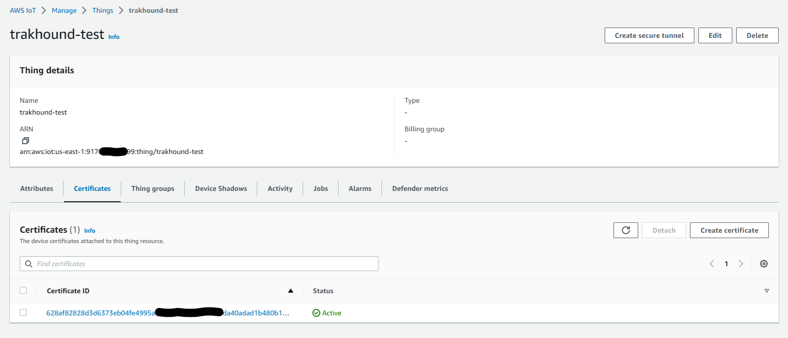
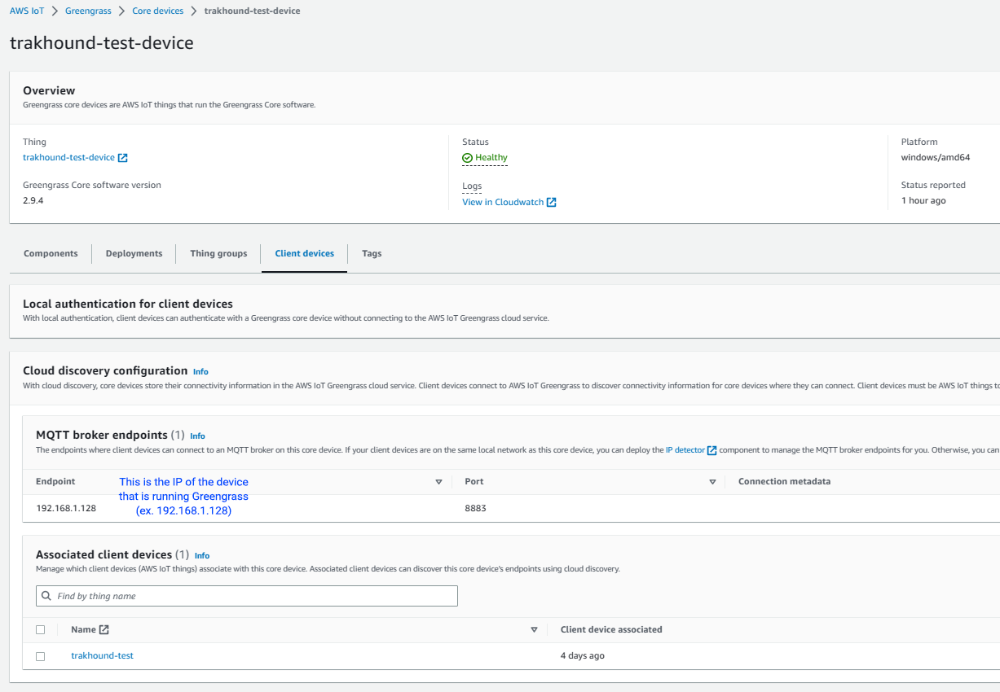

# AWS Greengrass Moquette Broker

## Overview
- AWS Greengrass Core Setup
  - [Getting Started](https://docs.aws.amazon.com/greengrass/v1/developerguide/install-ggc.html)
- AWS Greengrass Moquette Setup
  - [MQTT 3.1.1 broker (Moquette)](https://docs.aws.amazon.com/greengrass/v2/developerguide/mqtt-broker-moquette-component.html)

## AWS Greengrass Moquette Configuration
Under the Deployment configuration for the `aws.greengrass.clientdevices.mqtt.Moquette` component
```json
"moquette": {
  "ssl_port": "8883"
}
```

## Relay Agent Module
- [GitHub](https://github.com/TrakHound/MTConnect.NET/tree/master/applications/Agents/MTConnect-Agent-MQTT-Relay)

### Example Configuration (agent.config.yaml)
```yaml
modules:
  - mqtt-relay:

    # The hostname of the MQTT broker to publish messages to
    server: localhost
    
    # The port number of the MQTT broker to publish messages to
    port: 8883

    # Set the ClientId to the AWS Thing ID
    clientId: trakhound-test

    # The cerficates to use are for the AWS Thing that is configured for the AWS Core Device
    tls:
      pem:
        certificateAuthority: C:\Users\patrick\Downloads\AmazonRootCA1.pem
        certificatePath: C:\Users\patrick\Downloads\2316549874654321654984984158961634984794-certificate.pem.crt
        privateKeyPath: C:\Users\patrick\Downloads\2316549874654321654984984158961634984794-private.pem.key
```

## Screenshots

### AWS Thing


### AWS Core Device

