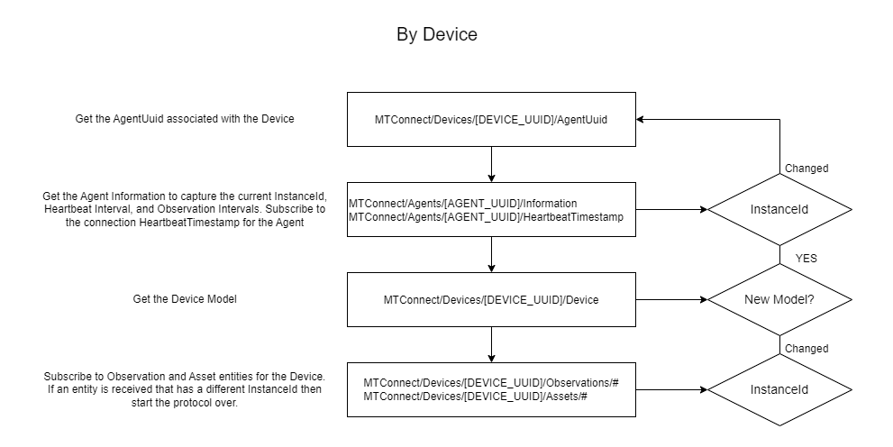

# MQTT Protocol for MTConnect

## Overview
This is a protocol for accessing MTConnect data using MQTT that mimics the functionality of the MTConnect HTTP REST protocol. 
The main difference between the HTTP and MQTT protocols is that the MQTT protocol deals with the individual MTConnect entities directly (ex. Device, Observation, Asset).

#### All Devices


#### By Device



### Multiple Configurable Observation Intervals
This protocol enables multiple intervals that Observations can be received. 
This interval essentially implements a window that a maximum of one Observation per DataItem will be published. 
This can be used by client applications such as Dashboards. An interval of "0" will indicate that all observation changes are published.

#### Observation Topics
The interval (in milliseconds) is specified in the brackets suffix for an Observations topic following the pattern below:

##### Observation Interval 1000ms
```
MTConnect/Devices/ff8fc5c5-206f-4d94-96a8-a03c70b682b8/Observations[1000]/#
```

##### Observation Interval 100ms
```
MTConnect/Devices/ff8fc5c5-206f-4d94-96a8-a03c70b682b8/Observations[100]/#
```

##### Observation Interval 0 ("Realtime")
```
MTConnect/Devices/ff8fc5c5-206f-4d94-96a8-a03c70b682b8/Observations/#
```


### Agent Connection Heartbeat
A connection heartbeat that represents the connection between the MTConnect Agent and the MQTT Broker can be read from the topic below:
```
MTConnect/Agents/[AGENT_UUID]/HeartbeatTimestamp
```

The payload is a simple 64 bit Integer representing the last timestamp (in Unix milliseconds) that the Agent sent a heartbeat.

Using this timestamp in combination with the HeartbeatInterval property found in the **MTConnect/Agents/[AGENT_UUID]/Information** topic, 
the connection status of the MTConnect Agent can be determined. 
Typically waiting for 3 failed heartbeats allows for temporary connection interruptions and follows a similar pattern of other MTConnect related heartbeat protocols.


### Entity level Agent InstanceId support
Each MTConnect entity contains an InstanceId property which can be compared to the **InstanceId** property found in the **MTConnect/Agents/[AGENT_UUID]/Information**.
If the entity's InstanceId property differs, then it can be assumed that the Agent was restarted, reconfigured, etc. and the protocol should be restarted.
This is similar to the MTConnect HTTP protocol.