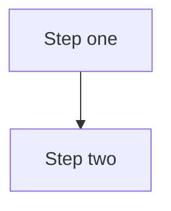

# MTConnect.NET documentation site

VitePress-based documentation site for `MTConnect.NET`, rooted at this `docs/` directory.

## Prerequisites

- Node.js 18 or newer (Node 20 LTS recommended).
- `npm` (bundled with Node).

## Local development

From the repository root:

```bash
npm install            # one-time install of VitePress + the Mermaid plugin
npm run docs:dev       # serves at http://localhost:5173
```

The dev server hot-reloads on every save. Edit any `docs/**/*.md` and the open browser tab updates in place.

## Build a static bundle

```bash
npm run docs:build     # produces docs/.vitepress/dist/
npm run docs:preview   # serves the built bundle locally for a final pass
```

The build output lands in `docs/.vitepress/dist/` and is excluded from version control.

## Mermaid diagrams

Every architecture / sequence / class-relationship / state-machine / wire-flow diagram in this site is authored in [Mermaid](https://mermaid.js.org/) — no ASCII art, no external image renders for schematic content. Mermaid is enabled via `vitepress-plugin-mermaid` (configured in `docs/.vitepress/config.ts`).

To author a diagram in any markdown page:

````markdown

````

Mermaid syntax is documented at <https://mermaid.js.org/intro/syntax-reference.html>.

## Layout

- `docs/index.md` — landing page.
- `docs/getting-started.md` — quickstart walkthrough.
- `docs/<section>/index.md` — the index page for each top-level section.
- `docs/<section>/<page>.md` — the leaf pages within a section.
- `docs/.vitepress/config.ts` — site config (nav, sidebar, Mermaid plugin, base URL).
- `docs/.vitepress/dist/` — build output (excluded from version control).

## Authoring conventions

- Internal links use site-relative paths (`/configure/agent`, not `../configure/agent.md`).
- Code samples include the target language fence (` ```csharp `, ` ```bash `, ` ```yaml `).
- External links use the full URL.
- The site is configured with `cleanUrls: true`; pages are linked without the `.md` suffix.
