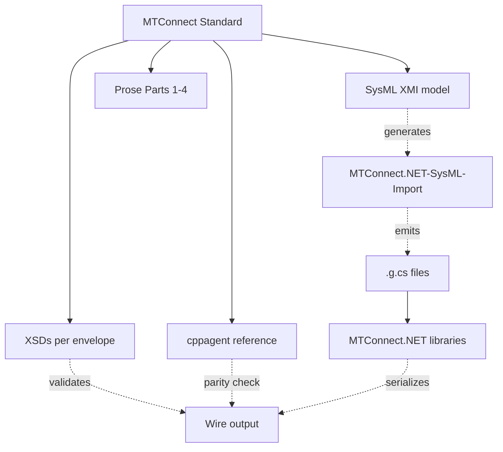

# MTConnect Standard compliance

`MTConnect.NET` targets **100% MTConnect Standard compliance** across every advertised spec version from v1.0 through v2.7. This section answers the question "if I write to the spec using `MTConnect.NET`, am I conformant?" without requiring you to read the source.

## What this section covers

- **[Per-version compliance matrix](./per-version-matrix)** — which spec versions are supported, with a per-envelope (Streams / Devices / Assets / Error) status per version.
- **[Wire-format compliance](./wire-format)** — which on-the-wire codecs are byte-for-byte cppagent-parity (XML, JSON-CPPAGENT v2 array-of-wrappers, JSON-CPPAGENT-MQTT) and which deviate, with the deviations documented and justified.
- **[Spec-source-vs-implementation cross-references](./spec-cross-references)** — for every code path that implements a normative spec rule, the citation that grounds it (SysML XMI element, XSD type, prose paragraph).
- **[Known divergences from the Standard](./known-divergences)** — places where the Standard contradicts itself, with the artifact `MTConnect.NET` follows named explicitly and the upstream maintainer report linked.
- **[Compliance test harness](./test-harness)** — how to run the compliance tier of the test suite against any deployment, with sample output and how to interpret the failure categories.

## How compliance is verified in `MTConnect.NET`

The SysML XMI model is the source of truth for type definitions, `MinimumVersion` / `MaximumVersion` metadata, controlled-vocabulary enumerations, and structural constraints. The `MTConnect.NET-SysML` generator walks the XMI and emits source files that the libraries compile against. The XSDs validate every wire envelope at build time and at run time. The cppagent reference output is used as the parity oracle for the JSON-CPPAGENT v2 codec.

## When the Standard contradicts itself

The Standard occasionally disagrees with itself — XMI declares one thing, the XSD encodes another, the prose says a third, and the cppagent reference does a fourth. When this happens, this site states the divergence explicitly, names which artifact `MTConnect.NET` follows, and links to the maintainer-bound writeup that asks the Standard to resolve the contradiction. See [Known divergences from the Standard](./known-divergences) for the running list.

The library's compliance is not blocked by the Standard's internal disagreements; the chosen authority is documented and stable.

## See also

- [Wire formats](/wire-formats/) — the codec-level reference for XML, JSON v1, JSON-CPPAGENT v2, JSON-CPPAGENT-MQTT, and SHDR.
- [API reference](/api/) — per-type pages carry "Introduced in" and "Deprecated in" badges that surface the spec-version metadata directly.
- [Concepts](/concepts/) — the data-model overview that grounds the compliance vocabulary.
