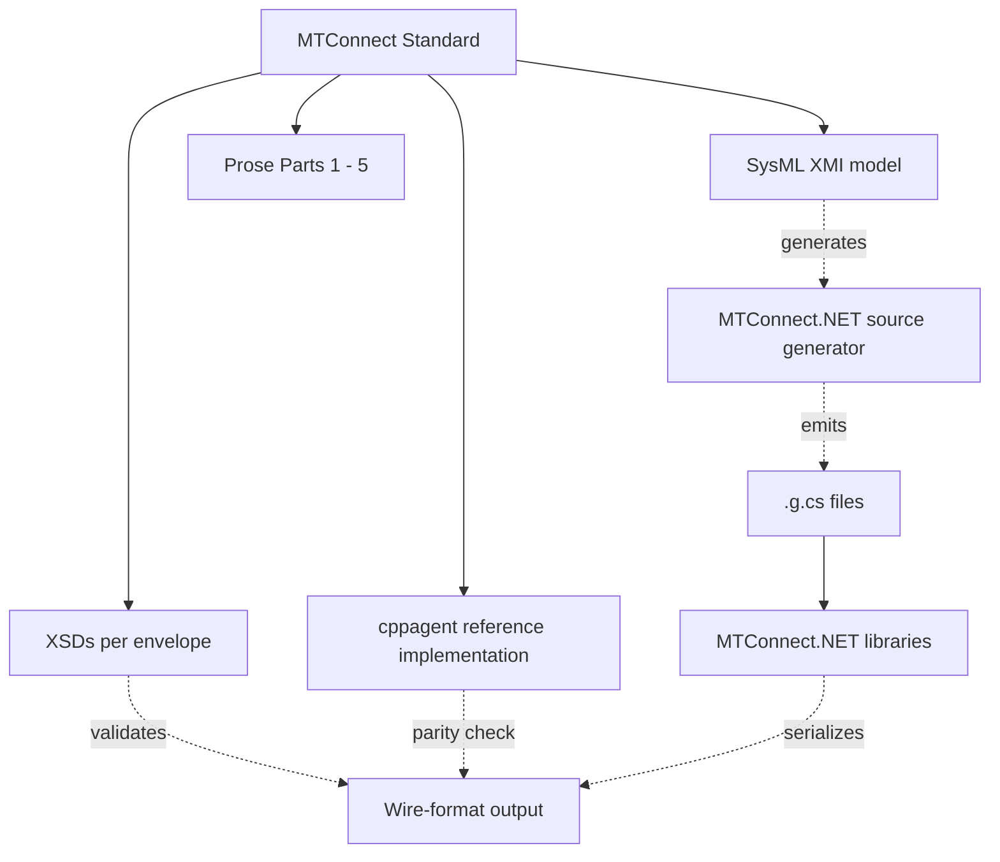

# Spec source-of-truth and cross-references

The MTConnect Standard ships through four artifacts. When the artifacts disagree, the library follows an explicit hierarchy. This page describes that hierarchy, the cross-reference pattern used in the code and tests, and how to audit any individual claim against the spec.

## The four artifacts



1. **SysML XMI** — `https://github.com/mtconnect/mtconnect_sysml_model`. The most-authoritative source for the type system: class hierarchy, properties, enum values, version introduction. Published per spec release as `MTConnectSysMLModel_V<version>.xml`.
2. **XSDs** — `https://schemas.mtconnect.org/schemas/MTConnect<Envelope>_<version>.xsd`. The authoritative source for envelope wire shape: element names, attribute lists, occurrence constraints.
3. **Prose** — the published Standard documents at [docs.mtconnect.org](https://docs.mtconnect.org/). Authoritative for semantic intent: what an enum value means, what a normative MUST applies to.
4. **cppagent** — `https://github.com/mtconnect/cppagent`. The reference implementation. Authoritative for the JSON-CPPAGENT wire shape (since the spec does not normatively define the JSON envelope's bytes). Non-normative for XML, where the XSD is the authority.

## Source-of-truth hierarchy

Per the MTConnect maintainer working group's published guidance, **XMI is the normative artifact** for the type system. When XMI and the XSD disagree on a type's structure, XMI wins; the XSD is regenerated from XMI in the next spec release. When XMI and the prose disagree on a semantic intent, XMI wins for the type-system shape and prose wins for the runtime semantic — but only where the prose explicitly states a MUST that the XMI cannot encode (e.g. `Result MUST be UNAVAILABLE when no valid value is determined`).

When cppagent and XMI disagree, **cppagent is the reference but is non-normative**. The library defers to XMI for the type system and uses cppagent only as the byte-shape reference for the JSON-CPPAGENT codec where the XSD has no opinion. The known cases where cppagent contradicts XMI are cataloged at [Known divergences](/compliance/known-divergences).

| Question | Wins |
|---|---|
| Does a class exist at version V? | XMI |
| Does a class have property P? | XMI |
| Is property P a `uml:DataType` or a `uml:Class`? | XMI |
| What does enum value E mean? | XMI; prose if XMI is silent |
| What attributes does element X carry on the wire? | XSD |
| Is element X required or optional? | XSD; XMI if XSD ambiguous |
| What MUST an agent return when no value is available? | Prose (`Part_2.0` §3) |
| What does the JSON wire shape look like for X? | cppagent (JSON-CPPAGENT codec) |
| What does the XML wire shape look like for X? | XSD |
| What does an SHDR line look like for X? | Prose (`Part_5.0`) |

## Citation pattern in the library

Every test that asserts spec behavior cites the source. The pattern is documented in the codebase as a comment block on the relevant fixture; examples:

```csharp
// AssetCount is declared as a scalar IntegerEvent (representation=VALUE)
// across every published v2.x. Sources:
//   - SysML XMI: AssetCount packagedElement, result : integer (uml:DataType).
//     https://github.com/mtconnect/mtconnect_sysml_model
//   - XSD: AssetCount element substitutes IntegerEvent, xs:simpleContent.
//     https://schemas.mtconnect.org/schemas/MTConnectStreams_2.5.xsd
//   - Prose: Part_2.0 §11.5 "Asset events".
//     https://docs.mtconnect.org/
// The cppagent reference auto-injects representation="DATA_SET" but is
// non-normative; the library follows XMI / XSD per the hierarchy above.
// Tracked upstream: https://projects.mtconnect.org/issues/3890
```

Three rules for the citation block:

1. **At least one of XMI / XSD / prose is cited per spec assertion.** Mechanical assertions (a constant has a specific value) cite XMI. Structural assertions (an envelope carries an attribute) cite XSD. Semantic assertions (an enum value means X) cite prose.
2. **The URL is a permanent link.** Either a tagged release (`/blob/v2.7/MTConnectSysMLModel_V2.7.xml`) or a schemas.mtconnect.org canonical URL. Tip-of-trunk URLs are forbidden because they drift.
3. **The cppagent reference is cited where it is the source-of-truth (JSON-CPPAGENT codec) and as a disagreement reference where it diverges from the normative source.**

## How to audit a single claim

A consumer who reads "`MTConnect.NET` claims X about the spec" can audit it by:

1. Finding the X claim in the relevant doc page or in the relevant test fixture.
2. Following the cited URL to the authoritative artifact.
3. Verifying the cited element / class / section actually says what the citation claims.

The compliance test harness (see [Test harness](/compliance/test-harness)) automates step 3 for a battery of pinned assertions: each test cites its source in a fixture comment, runs the assertion, and fails if the assertion drifts from the source's current value.

## Per-version XMI cite pattern

The XMI model is published per spec version. The library cites the version it asserts at:

- For "class C exists at version V": cite `MTConnectSysMLModel_V<V>.xml`'s `packagedElement` for class C.
- For "class C was introduced at version V": cite class C's `introducedAtVersion` tag in `MTConnectSysMLModel_V<latest>.xml` (introductions persist in every later release's XMI).
- For "class C was deprecated at version W": cite class C's `deprecatedAtVersion` tag.

The introduction-version metadata is harvested into the generated `.g.cs` files; every `MinimumVersion` / `MaximumVersion` property value on every shipped class is traceable back to a SysML XMI tag.

## Where to next

- [Per-version matrix](/compliance/per-version-matrix) — the per-version envelope and type coverage.
- [Wire-format compliance](/compliance/wire-format) — XSD validation and cppagent parity testing.
- [Known divergences](/compliance/known-divergences) — the documented cases where the artifacts disagree.
- [Test harness](/compliance/test-harness) — running the compliance tier locally.
