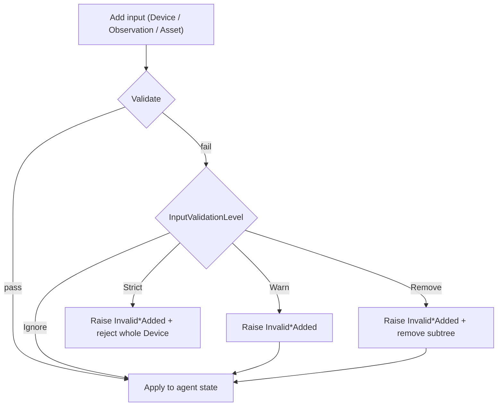

# Agent validation events

[`MTConnectAgent`](/api/MTConnect.Agents.MTConnectAgent) raises a small, uniformly-shaped family of events whenever input rejected by its validation pipeline is added — invalid Components, Compositions, DataItems, Observations, and Assets. The agent does **not** throw; it raises an event, lets you log or react, and continues serving requests. Consumers wire one or more handlers; contributors extending the agent add a new entry to the family by following the same naming and call-site pattern.

## The event family

The agent exposes one event per validatable element kind:

| Event | Delegate | When it fires |
| --- | --- | --- |
| `InvalidDeviceAdded` | [`MTConnectDeviceValidationHandler`](/api/MTConnect.MTConnectDeviceValidationHandler) | `AddDevice(IDevice)` rejects a Device whose top-level validation does not pass — the Device is null, or its `Uuid` is null or empty. |
| `InvalidComponentAdded` | [`MTConnectComponentValidationHandler`](/api/MTConnect.MTConnectComponentValidationHandler) | A generic `Component` (unknown `Type`) is encountered while initialising a Device. |
| `InvalidCompositionAdded` | [`MTConnectCompositionValidationHandler`](/api/MTConnect.MTConnectCompositionValidationHandler) | A generic `Composition` is encountered while initialising a Device. |
| `InvalidDataItemAdded` | [`MTConnectDataItemValidationHandler`](/api/MTConnect.MTConnectDataItemValidationHandler) | A generic `DataItem` (unknown `Type`) is encountered while initialising a Device. |
| `InvalidObservationAdded` | [`MTConnectObservationValidationHandler`](/api/MTConnect.MTConnectObservationValidationHandler) | An observation value fails per-DataItem validation, or its `DataItemKey` is unknown. |
| `InvalidAssetAdded` | [`MTConnectAssetValidationHandler`](/api/MTConnect.MTConnectAssetValidationHandler) | An asset fails its `Process(...)` validation pipeline. |

The family is closed across the five Device-tree element kinds plus the top-level Device itself. Every entry carries a universal [`MTConnect.ValidationResult`](/api/MTConnect.ValidationResult) payload exposing `IsValid`, a machine-readable `Code`, and a human-readable `Message` — see [v7 migration: ValidationResult consolidation](/migration/v7-validation-result) for the pre-v7 per-domain structs this replaced.



## Consumer POV

### Why events, not exceptions

`MTConnectAgent` is a long-running service. Throwing on the first invalid Component or stray Observation would crash the host process and take the rest of the agent down with it. The event-based contract lets callers:

- log the failure (with the rich [`ValidationResult`](/api/MTConnect.ValidationResult) payload) and keep serving valid data;
- decide centrally how strict to be — set [`InputValidationLevel`](/api/MTConnect.Agents.InputValidationLevel) to `Ignore`, `Warn`, `Remove`, or `Strict` on the agent configuration, and the same handler runs across every level above `Ignore`;
- attribute the failure to the source `deviceUuid` so multi-device hosts can route the diagnostic appropriately.

### Wire-up

Attach one handler per event you care about; you can also attach the same handler to every event by adapting the signatures:

```csharp
using MTConnect;
using MTConnect.Agents;
using MTConnect.Assets;
using MTConnect.Configurations;
using MTConnect.Devices;
using MTConnect.Observations;

var agent = new MTConnectAgent(new AgentConfiguration
{
    InputValidationLevel = InputValidationLevel.Warn,
});

agent.InvalidDeviceAdded += (device, result) =>
    Console.Error.WriteLine($"invalid Device (code={result.Code}): {result.Message}");

agent.InvalidComponentAdded += (deviceUuid, component, result) =>
    Console.Error.WriteLine($"[{deviceUuid}] invalid Component {component.Type}: {result.Message}");

agent.InvalidCompositionAdded += (deviceUuid, composition, result) =>
    Console.Error.WriteLine($"[{deviceUuid}] invalid Composition {composition.Type}: {result.Message}");

agent.InvalidDataItemAdded += (deviceUuid, dataItem, result) =>
    Console.Error.WriteLine($"[{deviceUuid}] invalid DataItem {dataItem.Type}: {result.Message}");

agent.InvalidObservationAdded += (deviceUuid, dataItemKey, result) =>
    Console.Error.WriteLine($"[{deviceUuid}] invalid observation for {dataItemKey}: {result.Message}");

agent.InvalidAssetAdded += (asset, result) =>
    Console.Error.WriteLine($"invalid Asset {asset.AssetId}: {result.Message}");
```

### Handler signatures

The delegates are all defined under the [`MTConnect`](/api/MTConnect) namespace and follow a uniform shape — the offending element, plus a universal [`MTConnect.ValidationResult`](/api/MTConnect.ValidationResult) describing what failed:

```csharp
public delegate void MTConnectDeviceValidationHandler(IDevice device, ValidationResult validationResults);
public delegate void MTConnectComponentValidationHandler(string deviceUuid, IComponent component, ValidationResult validationResults);
public delegate void MTConnectCompositionValidationHandler(string deviceUuid, IComposition composition, ValidationResult validationResults);
public delegate void MTConnectDataItemValidationHandler(string deviceUuid, IDataItem dataItem, ValidationResult validationResults);
public delegate void MTConnectObservationValidationHandler(string deviceUuid, string dataItemKey, ValidationResult validationResults);
public delegate void MTConnectAssetValidationHandler(IAsset asset, ValidationResult validationResults);
```

`InvalidDeviceAdded` and `InvalidAssetAdded` are the two members that do not carry a `deviceUuid` string: the offending element *is* the Device (or stands in for one, in the Asset case).

`InvalidObservationAdded` carries the `DataItemKey` (a string) rather than an `IDataItem`, because the failure mode includes the case where the key did not resolve to a DataItem at all.

### Validation codes

`ValidationResult.Code` is a stable, machine-readable string the agent stamps onto each failure so subscribers can branch without parsing the human-readable message. The currently emitted codes for `InvalidDeviceAdded` are:

| `Code` | Cause |
| --- | --- |
| `DeviceNull` | `AddDevice(null)` was called. |
| `DeviceUuidMissing` | The Device had no `Uuid` (null or empty). The accompanying `Message` includes the device's registration index, `Type`, and `Name` (when set) so multi-device hosts can attribute the failure. |

### Pre-flight validation

[`MTConnectAgent.ValidateDevice(IDevice)`](/api/MTConnect.Agents.MTConnectAgent) exposes the same check `AddDevice` runs internally, so callers can validate a Device *before* attempting registration — useful when reading from a config file or building a Device programmatically:

```csharp
var result = agent.ValidateDevice(device);
if (!result.IsValid)
{
    Console.Error.WriteLine($"Refusing to add Device ({result.Code}): {result.Message}");
    return;
}
agent.AddDevice(device);
```

### What happens to the rejected input

The handler runs first; what the agent does next depends on `InputValidationLevel`:

- **`Ignore`** — the event does not fire, and the input is kept. Useful only for debugging.
- **`Warn`** — the event fires; the input is kept.
- **`Remove`** — the event fires; the offending node is pruned from its parent (e.g. `device.RemoveDataItem(id)`).
- **`Strict`** — the event fires; the entire Device is rejected (the `AddDevice` call returns `false` and no part of the tree is added).

## Contributor POV

The event family is designed to grow. When a new element class becomes validatable, follow the established pattern so consumers can wire it the same way they wire every other entry.

### Naming convention

- Event name: `Invalid<Noun>Added`, e.g. `InvalidComponentAdded`, `InvalidDeviceAdded`.
- Delegate name: `MTConnect<Noun>ValidationHandler`, e.g. `MTConnectComponentValidationHandler`, `MTConnectDeviceValidationHandler`.
- The validation result carries the description of *why* the input is invalid; the noun carries the *what*.

### Wiring a new entry

1. Add the delegate to [`libraries/MTConnect.NET-Common/Delegates.cs`](https://github.com/TrakHound/MTConnect.NET/blob/master/libraries/MTConnect.NET-Common/Delegates.cs). The first parameter is normally the `deviceUuid`; the second is the offending element; the third is the `ValidationResult`. (`InvalidAssetAdded` is the documented exception — assets are not tied to a single device, so the asset itself stands in for the device UUID.)
2. Add the event to `MTConnectAgent` next to the existing five, with an XML doc-comment that mirrors the others (`/// <summary>Raised when an Invalid <Noun> is Added</summary>`).
3. At the Add* call site, raise the event when the validation result fails and `_configuration.InputValidationLevel > InputValidationLevel.Ignore`:

   ```csharp
   if (!validationResult.IsValid)
   {
       if (_configuration.InputValidationLevel > InputValidationLevel.Ignore)
       {
           InvalidDeviceModelAdded?.Invoke(deviceUuid, deviceModel, validationResult);
       }
       if (_configuration.InputValidationLevel == InputValidationLevel.Strict) return null;
   }
   ```

4. Add a test that exercises both halves of the contract:

   ```csharp
   [Test]
   public void InvalidDeviceModelAdded_fires_and_the_device_is_not_added()
   {
       var agent = new MTConnectAgent(new AgentConfiguration { InputValidationLevel = InputValidationLevel.Strict });
       var fired = false;
       agent.InvalidDeviceModelAdded += (_, _, _) => fired = true;

       var ok = agent.AddDevice(BrokenDeviceModelFixture());

       Assert.That(fired, Is.True);
       Assert.That(ok,    Is.False);
       Assert.That(agent.GetDevices(), Is.Empty);
   }
   ```

### Cross-reference

- [v7 migration: ValidationResult consolidation](/migration/v7-validation-result) — how the three pre-v7 per-domain structs collapsed into the universal `MTConnect.ValidationResult` used by every member of this family.
- [TrakHound/MTConnect.NET#169](https://github.com/TrakHound/MTConnect.NET/pull/169) — the canonical worked example of extending the family (adds `InvalidDeviceAdded`, `ValidateDevice`, and the `DeviceNull` / `DeviceUuidMissing` codes).
- [`MTConnectAgent`](/api/MTConnect.Agents.MTConnectAgent) — the surface where every entry lives.
- [`InputValidationLevel`](/api/MTConnect.Agents.InputValidationLevel) — the agent-wide knob that gates whether the family fires at all.
