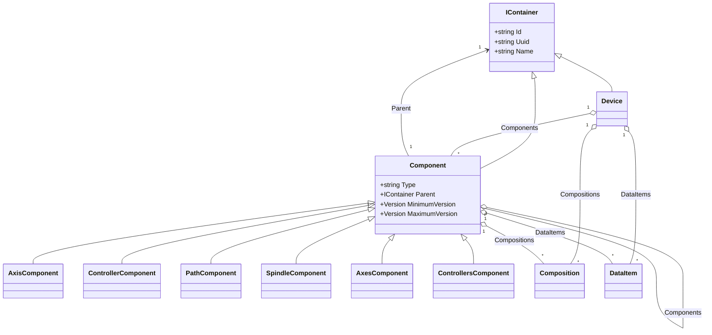

# Components

A **Component** is a recursively-nested machine piece under a [Device](/concepts/devices). Components model the physical and logical breakdown of equipment — an Axis, a Path, a Spindle, a Coolant subsystem, a Door — and they carry the [DataItems](/concepts/data-items) that observe each piece. `MTConnect.NET` represents a Component with the [`MTConnect.Devices.Component`](/api/MTConnect.Devices/Component) class implementing `IComponent`, and ships one concrete subclass per Component type defined in the MTConnect SysML model (`AxisComponent`, `ControllerComponent`, `LinearComponent`, `RotaryComponent`, `SpindleComponent`, and so on, generated from the SysML XMI into `.g.cs` files under `libraries/MTConnect.NET-Common/Devices/Components/`).

## The Component tree

A Component nests under either a Device or another Component. The tree is unconstrained in depth; the MTConnect Standard does not cap it. Every Component carries:

- **`Id`** — locally unique within the Device. Used to compose paths (`mill-01.path.axes.x`).
- **`Name`** — display name.
- **`Type`** — the `TypeId` of the concrete Component class (`"Axis"`, `"Controller"`, `"Spindle"`).
- **`Parent`** — the `IContainer` (Device or Component) that owns it.
- **`Components`** — children Components.
- **`Compositions`** — child Compositions (see below).
- **`DataItems`** — DataItems attached directly to this Component.



The `Type` string is canonical — it is the camel-case `TypeId` constant on the concrete class — and matches the element name the XSD expects on the wire. `AxisComponent.TypeId == "Axis"`, `ControllerComponent.TypeId == "Controller"`, etc. The MTConnect SysML model is the source of truth for the Component class hierarchy ([`mtconnect/mtconnect_sysml_model`](https://github.com/mtconnect/mtconnect_sysml_model)); generated `.g.cs` files carry the `MinimumVersion` / `MaximumVersion` introducing each Component.

## Organizer Components

A few Components exist solely as containers for siblings of the same logical kind: an `Axes` Organizer holds `Axis` children, a `Controllers` Organizer holds `Controller` children, an `Auxiliaries` Organizer holds auxiliary subsystems. The MTConnect Standard treats Organizers as required wrappers — an `Axis` must live under an `Axes`, not directly under a `Device` — and `MTConnect.NET` enforces this in [`Device.AddComponent`](/api/MTConnect.Devices/Device#AddComponent) and `Component.AddComponent`: passing a non-organizer Component whose type has an associated Organizer triggers auto-creation of the Organizer wrapper if none is present.

```csharp
using MTConnect.Devices;
using MTConnect.Devices.Components;

var device = new Device { Id = "mill", Type = Device.TypeId };
var xAxis = new LinearComponent { Id = "x", Name = "X" };

device.AddComponent(xAxis);
// device.Components -> [AxesComponent { Id = "ax", Components = [xAxis] }]
// The Axes organizer was created automatically.
```

The Organizer lookup runs through [`MTConnect.Devices.Organizers`](/api/MTConnect.Devices/Organizers), a static table that maps a Component type to its required Organizer type. `IComponent.IsOrganizer` flags Organizer instances so traversal code can skip past them when presenting a "logical" device tree to a UI.

## Compositions

A **Composition** is a finer-grained part underneath a Component — the bearing inside an Axis, the chip conveyor inside a coolant system, the door panel inside a Door Component. Compositions exist from MTConnect v1.4 onward (the `Composition` class's `DefaultMinimumVersion` is `MTConnectVersions.Version14`), and they share the DataItem-bearing pattern with Components:

- A Composition has an `Id`, a `Name`, a `Type`, and a `DataItems` collection.
- A Composition has no nested `Components` — the tree of structural breakdown stops at the Composition level.
- A Composition has a `Parent` of type `IContainer`.

Compositions are valuable when the granularity below a Component is observable but does not warrant a full Component sub-tree. The classic case: a `LinearComponent` representing an axis has DataItems for `POSITION` and `LOAD`, but the axis's `Motor` Composition has its own `TEMPERATURE` DataItem. Modeling the motor as a Component would add nesting noise; a Composition is the right granularity.

```csharp
using MTConnect.Devices;
using MTConnect.Devices.Components;
using MTConnect.Devices.Compositions;

var spindle = new SpindleComponent { Id = "spindle" };
var motor = new MotorComposition { Id = "motor", Name = "Spindle motor" };
motor.AddDataItem(new TemperatureDataItem(motor.Id));
spindle.AddComposition(motor);
```

The wire shape on `/probe` reflects the nesting:

```xml
<Spindle id="spindle">
  <Compositions>
    <Motor id="motor" name="Spindle motor">
      <DataItems>
        <DataItem category="SAMPLE" id="motor-temp" type="TEMPERATURE"/>
      </DataItems>
    </Motor>
  </Compositions>
</Spindle>
```

## Querying the tree

`Component` mirrors the lookup helpers on `Device`:

- `GetComponents()` — every Component beneath this one, recursively.
- `GetComponent<TComponent>(name?, searchType?)` — typed lookup. `SearchType.Child` searches direct children; `SearchType.AnyLevel` searches the whole sub-tree.
- `GetCompositions()` / `GetComposition<TComposition>(...)` — same shape, Composition-typed.
- `GetDataItems()` — every DataItem under this Component, including those on its Compositions and recursive sub-Components.

Typed lookup is the recommended path. Passing a concrete generic type pulls the `TypeId` constant from the type reflection-free at the call site:

```csharp
var spindle = device.GetComponent<SpindleComponent>();
var motorTemp = spindle.GetDataItem<TemperatureDataItem>();
```

## Version gating

Every Component class declares `MinimumVersion` and (optionally) `MaximumVersion`. When `Device.Process(IDevice, Version)` serializes the model for a target version, Components whose `MinimumVersion` is above the target are pruned and Components whose `MaximumVersion` is below the target are pruned. This is how the same model serves both a v1.6 consumer and a v2.5 consumer from one in-memory tree — the serializer prunes against the requested version's compatibility window, never against the model's declared version. The SysML model is consulted for every type's introduction version; see [Compliance: Spec cross-references](/compliance/spec-cross-references) for the citation pattern.

## Where to next

- [DataItems](/concepts/data-items) — the primitive observable points hanging off Components.
- [Relationships](/concepts/relationships) — cross-Component links (parent, coordinate-system, ID-references).
- [`IComponent` API reference](/api/MTConnect.Devices/IComponent).
- [Cookbook: Write an agent](/cookbook/write-an-agent) — building a model from scratch.
