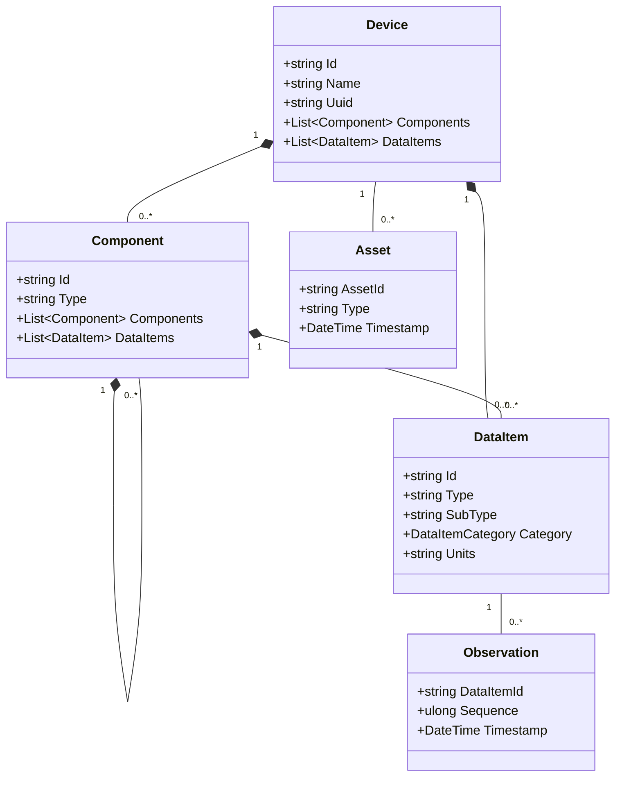
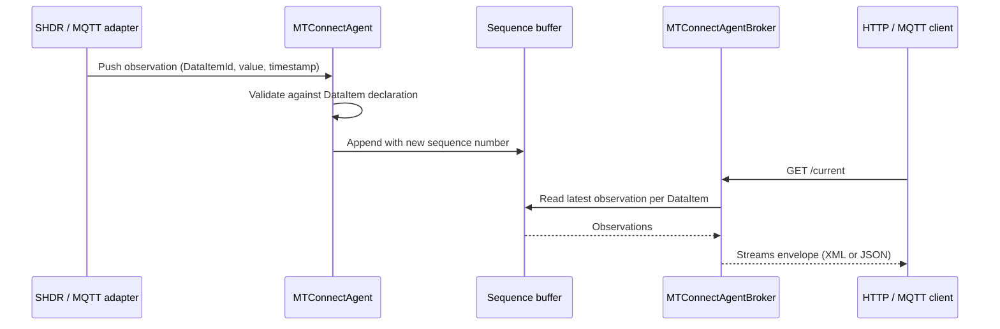

# Concepts

This section maps the MTConnect Standard's core concepts to the public types in `MTConnect.NET`. Read it once and the rest of the site falls into place — the [API reference](/api/) names the types, [Configure & Use](/configure/) configures them, [Wire formats](/wire-formats/) serializes them, but everything ultimately reduces to the five concepts described here.

## The five concepts

- **Device** — the top-level addressable thing the agent emits observations for. A CNC mill, a robot, a 3D printer. Modeled by the `Device` class in `MTConnect.Devices`.
- **Component** — a recursively-nested machine piece under a Device (an axis, a path, a spindle, a controller). Modeled by `Component` and its many specializations (`Axes`, `Path`, `Spindle`, `Controller`, …) in `MTConnect.Devices.Components`.
- **DataItem** — a primitive observable point on a Component (a position, a temperature, an execution state, a tool offset). Modeled by `DataItem` and its specializations in `MTConnect.Devices.DataItems`. A DataItem declares its `type`, `subType`, `category` (`SAMPLE` / `EVENT` / `CONDITION`), `units`, and `nativeUnits`; observations get serialized using those declarations.
- **Observation** — a time-stamped value flowing through a DataItem. Modeled by `Observation` and its specializations (`SampleObservation`, `EventObservation`, `ConditionObservation`) in `MTConnect.Observations`. Carries a `sequence` number, a `timestamp`, and the value itself.
- **Asset** — a non-observation entity the device tracks (a cutting tool, a fixture, a file, a raw material, a pallet). Modeled by `Asset` and its specializations in `MTConnect.Assets`. Assets have an identity that outlives any single observation.

## Class relationships

## How a request flows through the agent

## Where to look next

- **The data model in code**: see the API pages for `Device`, `Component`, `DataItem`, `Observation`, and `Asset`. Each page lists the spec versions in which the type appears and the wire codecs that serialize it.
- **The MTConnect Standard prose**: <https://www.mtconnect.org/standard>.
- **Validating that your configured devices match the spec**: see the [`Devices.xml` validation guide](/configure/agent) under Configure & Use.
- **Recipes that use these concepts**: [Cookbook](/cookbook/).
