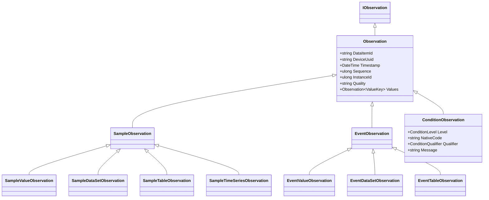

# Observations

An **Observation** is the time-stamped value flowing through a [DataItem](/concepts/data-items). DataItems declare the shape; Observations carry the data. Every Observation in `MTConnect.NET` inherits from [`MTConnect.Observations.Observation`](/api/MTConnect.Observations/Observation) and is one of three concrete subclasses chosen by the DataItem's `Category`:

- [`SampleObservation`](/api/MTConnect.Observations/SampleObservation) for SAMPLE DataItems.
- [`EventObservation`](/api/MTConnect.Observations/EventObservation) for EVENT DataItems.
- [`ConditionObservation`](/api/MTConnect.Observations/ConditionObservation) for CONDITION DataItems.



## Core fields

Every Observation carries:

- **`DataItemId`** — must equal the `Id` of a DataItem present in the Device's model. The agent rejects observations whose `DataItemId` does not resolve.
- **`DeviceUuid`** — the owning Device's `Uuid`.
- **`Timestamp`** — when the value was observed. Encoded as UTC ISO 8601 on the wire, with optional fractional seconds (`2025-01-01T12:34:56.789Z`).
- **`Sequence`** — assigned by the agent as the observation enters the buffer. Monotonically increasing across the agent's lifetime; resets only on a buffer wipe. Consumers use Sequence to paginate `/sample` responses.
- **`InstanceId`** — the agent's instance identifier. A consumer that sees the instance change knows the agent restarted and the sequence numbers reset.
- **`Quality`** — optional. Carries data-quality annotation (`VALID`, `INVALID`, `QUESTIONABLE`, `OVERRANGE`). Enum source: SysML `QualityEnum`. Introduced in v2.3.
- **`Values`** — the dictionary of value entries the Observation carries. For VALUE-representation observations there is one entry keyed `"VALUE"`; for DATA_SET / TABLE / TIME_SERIES the entries map to the spec-defined keys.

## The Unavailable sentinel

The MTConnect Standard mandates that when an agent cannot determine a valid value for a DataItem, the result MUST be reported as the literal string `UNAVAILABLE`. The library makes this a first-class constant on [`Observation.Unavailable`](/api/MTConnect.Observations/Observation):

```csharp
public const string Unavailable = "UNAVAILABLE";
```

Every serializer, every codec, every Output transformer (under `MTConnect.NET-Common/Observations/Output/`) treats `Unavailable` as the canonical absent-value sentinel. Source: MTConnect Standard `Part_2.0` Streams §3 ([docs.mtconnect.org](https://docs.mtconnect.org/)).

## Samples

A SAMPLE observation carries a numeric value plus the SAMPLE-specific metadata that the DataItem declares. The four concrete sample subclasses map to the four DataItem `Representation` modes:

- [`SampleValueObservation`](/api/MTConnect.Observations/SampleValueObservation) — one scalar. `CDATA = "1.5"` on the wire.
- [`SampleDataSetObservation`](/api/MTConnect.Observations/SampleDataSetObservation) — entries-of-scalars.
- [`SampleTableObservation`](/api/MTConnect.Observations/SampleTableObservation) — entries-of-entries-of-scalars.
- [`SampleTimeSeriesObservation`](/api/MTConnect.Observations/SampleTimeSeriesObservation) — a fixed-cadence vector. Carries `SampleCount` and `SampleRate` attributes.

A typical Sample creation in code:

```csharp
using MTConnect.Observations;

var obs = new SampleValueObservation
{
    DeviceUuid = device.Uuid,
    DataItemId = "x-pos-actual",
    Timestamp = DateTime.UtcNow,
    CDATA = "12.345",
};
agent.AddObservation(device.Uuid, obs);
```

## Events

An EVENT observation carries a discrete-state value. The shape mirrors Samples — `EventValueObservation`, `EventDataSetObservation`, `EventTableObservation` — but the wire envelope groups them under `<Events>` rather than `<Samples>`. EVENT values are not numerically interpolated; consumers carry-forward the last known state until the next observation.

A canonical Event:

```csharp
var avail = new EventValueObservation
{
    DeviceUuid = device.Uuid,
    DataItemId = "mill-01-avail",
    Timestamp = DateTime.UtcNow,
    CDATA = "AVAILABLE",
};
agent.AddObservation(device.Uuid, avail);
```

## Conditions

A CONDITION observation aggregates alarm-style state into a level: `NORMAL`, `WARNING`, `FAULT`, or `UNAVAILABLE`. Conditions deviate from Samples and Events in two ways:

1. **Multiple actives**: a single CONDITION DataItem can hold many simultaneously-active condition observations, each keyed by `nativeCode`. Setting `NORMAL` with no `nativeCode` clears every active.
2. **Auxiliary attributes**: a Condition carries `nativeCode` (vendor's alarm code), `qualifier` (`HIGH` / `LOW`, from [`ConditionQualifier`](/api/MTConnect.Observations/ConditionQualifier)), `nativeSeverity`, and `message` (human-readable text).

Class shape:

```csharp
public class ConditionObservation : Observation, IConditionObservation
{
    public ConditionLevel Level { get; set; }     // NORMAL, WARNING, FAULT, UNAVAILABLE
    public string NativeCode { get; set; }
    public ConditionQualifier Qualifier { get; set; }
    public string NativeSeverity { get; set; }
    public string Message { get; set; }
}
```

A typical Condition lifecycle in code:

```csharp
using MTConnect.Observations;

// Raise a fault.
agent.AddObservation(device.Uuid, new ConditionObservation
{
    DataItemId = "ctrl-system",
    Timestamp = DateTime.UtcNow,
    Level = ConditionLevel.FAULT,
    NativeCode = "E1024",
    Qualifier = ConditionQualifier.HIGH,
    Message = "Spindle over-temperature",
});

// Clear all actives by sending NORMAL with no native code.
agent.AddObservation(device.Uuid, new ConditionObservation
{
    DataItemId = "ctrl-system",
    Timestamp = DateTime.UtcNow,
    Level = ConditionLevel.NORMAL,
});
```

Source: MTConnect Standard `Part_2.0` Streams §10 ([docs.mtconnect.org](https://docs.mtconnect.org/)); SysML `ConditionLevelEnum` ([`mtconnect/mtconnect_sysml_model`](https://github.com/mtconnect/mtconnect_sysml_model)).

## Reset triggers

For accumulator-shaped DataItems (`PART_COUNT`, `ACCUMULATED_TIME`, `MATERIAL_FEED`), each observation carries an optional `ResetTriggered` field that marks the point at which the accumulator was zeroed. The values are spec-defined: `SHIFT`, `MANUAL`, `DAY`, `MAINTENANCE`, `MONTH`, `SHIFT_CHANGE`, `WEEK`, etc. Enum source: SysML `ResetTriggeredEnum`. Consumers detect a reset event by observing the field set on an incoming observation, not by inferring a value drop.

## Sample vs Current vs Probe

The agent exposes three retrieval endpoints with different semantics:

- **`/probe`** — returns the Device model. No observations.
- **`/current`** — returns the most-recent observation per DataItem.
- **`/sample`** — returns every observation between `from` and `to` (or `count` after `from`), wrapping at the buffer's circular boundary if the range spans the wrap point.

The `Sequence` field is the cursor for `/sample`. A consumer that paginates calls `/sample?from=<lastSeen+1>&count=<batch>` and advances the `from` cursor with each batch. See [Wire formats](/wire-formats/) for the Streams envelope shape.

## Where to next

- [Assets](/concepts/assets) — non-observation entities the device tracks.
- [Relationships](/concepts/relationships) — how DataItem-to-DataItem references thread through observations.
- [`IObservation` API reference](/api/MTConnect.Observations/IObservation).
- [Wire formats: JSON v1](/wire-formats/json-v1) — Observation serialization shapes.
