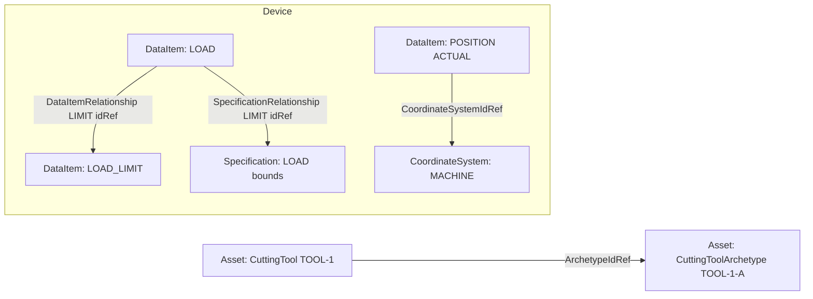

# Relationships

Beyond the strict containment tree (Device → Component → DataItem), the MTConnect Standard models cross-tree references through a set of explicit **Relationship** types. Relationships let a DataItem on one Component name another DataItem it depends on, an Asset describe its dependency on another Asset, and a Component point at a coordinate system or a sensor configuration. `MTConnect.NET` exposes the full Relationship hierarchy as concrete classes under [`MTConnect.Devices.DataItems`](/api/MTConnect.Devices.DataItems/) and [`MTConnect.Devices.Configurations`](/api/MTConnect.Devices.Configurations/), generated from the SysML model.

## DataItem relationships

A `DataItem` can declare relationships to other DataItems through `DataItemRelationship`:

```csharp
public abstract class AbstractDataItemRelationship
{
    public string Id { get; set; }
    public string Name { get; set; }
    public string IdRef { get; set; }      // the target DataItem's Id
}

public class DataItemRelationship : AbstractDataItemRelationship
{
    public DataItemRelationshipType Type { get; set; }
}
```

The relationship type ([`DataItemRelationshipType`](/api/MTConnect.Devices/DataItemRelationshipType)) is one of:

- **`LIMIT`** — the source DataItem's value is bounded by the target's value.
- **`OBSERVATION`** — the source is observationally dependent on the target.
- **`ATTACHMENT`** — the source DataItem is attached to the target (for fixture-style relationships).

A typical usage: a `LOAD` SAMPLE DataItem declares a `LIMIT` relationship to the `LOAD_LIMIT` EVENT DataItem that holds its current upper bound.

```xml
<DataItem category="SAMPLE" id="spindle-load" type="LOAD" units="PERCENT">
  <Relationships>
    <DataItemRelationship idRef="spindle-load-limit" type="LIMIT"/>
  </Relationships>
</DataItem>
```

Source: `Part_2.0` Streams §6 ([docs.mtconnect.org](https://docs.mtconnect.org/)); SysML `DataItemRelationship` class ([`mtconnect/mtconnect_sysml_model`](https://github.com/mtconnect/mtconnect_sysml_model)).

## Specification relationships

For DataItems whose semantics are governed by a published specification, `SpecificationRelationship` references a `Specification` element under a Component's `Configuration`:

```csharp
public class SpecificationRelationship : AbstractDataItemRelationship
{
    public SpecificationRelationshipType Type { get; set; }  // LIMIT
}
```

The `Specification` carries the spec-declared `Maximum`, `Minimum`, `Nominal`, `UpperLimit`, `LowerLimit`, `UpperWarning`, `LowerWarning` values. A `LOAD` SAMPLE DataItem points at the Specification through a `SpecificationRelationship`; the consumer renders bands and alarms from the spec rather than guessing thresholds.

## Component relationships

A Component can declare a `ComponentRelationship` to another Component — the spec models siblings that "belong together" but do not strictly nest, like a Path and the Controller that runs it. The relationship type ([`ComponentRelationshipType`](/api/MTConnect.Devices.Configurations/ComponentRelationshipType)) is one of `PARENT`, `CHILD`, `PEER`. Authored under the Component's `Configuration.Relationships`:

```xml
<Component>
  <Configuration>
    <Relationships>
      <ComponentRelationship idRef="ctrl" type="PARENT"/>
    </Relationships>
  </Configuration>
</Component>
```

Source: `Part_3.0` Devices §7 ([docs.mtconnect.org](https://docs.mtconnect.org/)); SysML `ComponentRelationship` class.

## Asset relationships

An Asset can reference other Assets through `AssetRelationship` — a CuttingTool referencing its archetype, a Pallet referencing the Fixture mounted on it. The `IdRef` is the target Asset's `AssetId`, and the `Type` is spec-defined per Asset class (`CuttingToolArchetypeReference.ArchetypeIdRef` for CuttingTools, etc.).

## CoordinateSystem references

A Component can declare a `CoordinateSystem` element under its `Configuration` and refer to it from DataItems via `CoordinateSystemIdRef`:

```csharp
public class DataItem : IDataItem
{
    public string CoordinateSystemIdRef { get; set; }
    public DataItemCoordinateSystem CoordinateSystem { get; set; }
    // ...
}
```

The legacy `CoordinateSystem` enum (`MACHINE`, `WORK`) was deprecated in v1.6 in favor of the `CoordinateSystem` element under `Configuration`; the library serializes the enum when targeting a version below v1.6 and the element when targeting v1.6+. The version-aware serialization is centralized in `DataItem.Process(IDataItem, Version)`.

## Sensor configurations

A Component can declare a `SensorConfiguration` element under its `Configuration` that describes the firmware version, calibration date, and per-channel measurement metadata of the sensors mounted on it. The channels reference DataItems through `Channel.Number` and back-reference the Component's DataItems. Source: SysML `SensorConfiguration` class.

## Mermaid view of the cross-reference shape



Every Relationship resolves by `IdRef` — the textual ID of the referenced entity — not by a hard reference to an object. This is by design: agents pass models around as serialised XML / JSON, and IDs survive serialization where in-memory pointers do not. `MTConnect.NET` does not auto-resolve relationships when deserializing a model; callers resolve via [`Device.GetDataItemByKey(idRef)`](/api/MTConnect.Devices/Device#GetDataItemByKey) and friends when the relationship is needed.

## Version gating across relationships

Relationship types are version-gated like DataItem types:

- `DataItemRelationship` enters at v1.5.
- `SpecificationRelationship` enters at v1.7.
- `ComponentRelationship` enters at v1.5; the `PEER` type at v1.7.
- The `Specification` element enters at v1.4.

`DataItem.Process(IDataItem, Version)` and `Component.Process(IComponent, Version)` strip Relationships whose `MinimumVersion` exceeds the target. Source: SysML model's per-class `introducedAtVersion` field, mirrored into the generated `.g.cs` files.

## Where to next

- [Devices](/concepts/devices) — the containment tree Relationships layer over.
- [Components](/concepts/components) — the Components that author Configuration.
- [DataItems](/concepts/data-items) — the DataItems that emit Relationships.
- [`DataItemRelationship` API reference](/api/MTConnect.Devices/DataItemRelationship).
