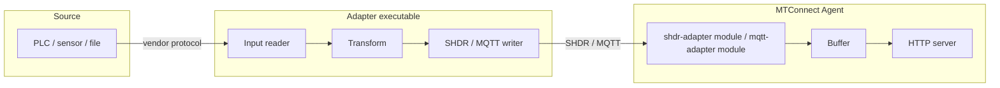

# Configure an adapter

An adapter ships data from a custom source (PLC, sensor, file, network feed) into one or more MTConnect agents. `MTConnect.NET` provides two adapter shapes:

1. **The standalone adapter application** — a configurable executable that reads from a declared input and writes SHDR or MQTT to a declared output.
2. **The embeddable adapter library** — `MTConnect.NET-Applications-Adapter`, for building a custom adapter executable.

This page documents the standalone adapter's YAML config plus the agent-side adapter modules that consume it.

## Adapter vs agent — which side is which



The **adapter** runs close to the data source, often on the same machine or LAN segment. It speaks the source's native protocol (vendor PLC API, OPC-UA, raw TCP) and translates to MTConnect-compatible SHDR or MQTT lines. The **agent** runs anywhere reachable from the adapter's output socket.

## Standalone adapter config

The adapter reads its configuration from `adapter.config.yaml`. The two top-level shapes are `input:` (where data comes from) and `output:` (where SHDR / MQTT lines go).

```yaml
input:
  type: tcp-csv
  hostname: 192.168.1.100
  port: 9000
  fieldMap:
  - field: 0
    dataItem: avail
  - field: 1
    dataItem: x-pos-actual
  - field: 2
    dataItem: spindle-load

output:
  type: shdr
  port: 7878
  heartbeat: 1000

deviceKey: mill-01
```

### `deviceKey`

The adapter's device identifier. Every SHDR line emitted on the adapter's socket is associated with this `deviceKey`; the agent's `shdr-adapter` module uses the same `deviceKey` to route incoming lines to the correct Device in its model. The `deviceKey` matches the `name` attribute on the agent-side Device (or its `Id` if no Name is set).

### `input:`

The adapter ships built-in input shapes:

| `type:` | Description |
|---|---|
| `tcp-csv` | TCP socket emitting CSV-per-line. `fieldMap` maps each CSV field to a DataItem. |
| `tcp-shdr` | TCP socket emitting SHDR-formatted lines from an upstream source. |
| `http-poll` | Periodic GET against an HTTP endpoint; expects an MTConnect-shaped response. |
| `file-tail` | Tail a log file; one line per observation. |
| `python` | Run a Python script for each observation; the script returns the value via Python.NET. |

The shape of the input block depends on `type:`. The `tcp-csv` example above is the most common; `http-poll` looks like:

```yaml
input:
  type: http-poll
  url: http://192.168.1.100/data
  interval: 1000
```

For a fully custom input, write a class implementing `IAdapterInput` and use the embeddable adapter library.

### `output:`

The adapter ships two output shapes:

| `type:` | Description |
|---|---|
| `shdr` | TCP server that emits SHDR lines on the configured port. The agent's `shdr-adapter` module connects to this port. |
| `mqtt` | MQTT client that publishes to an external broker on a per-DataItem topic. |

Example MQTT output:

```yaml
output:
  type: mqtt
  server: broker.example.com
  port: 1883
  topicPrefix: MTConnect/Adapter
  username: adapter-01
  password: <secret>
```

When using MQTT output, the corresponding agent-side module is `mqtt-adapter` rather than `shdr-adapter`.

### `heartbeat`

For SHDR output, the interval (in milliseconds) at which the adapter sends a heartbeat (`* PING\n`) to its consumer. The agent expects a heartbeat at least every `heartbeat` interval; missed heartbeats trip the connection-loss state machine and force a reconnect.

Default: `1000` ms (1 second).

## Agent-side: `shdr-adapter` module

For each running adapter, the agent's config declares a corresponding `shdr-adapter` module instance. The module connects to the adapter's SHDR output socket and routes incoming lines to the matching Device:

```yaml
modules:
- shdr-adapter:
    deviceKey: mill-01
    hostname: localhost
    port: 7878
    heartbeat: 1000
    reconnectInterval: 1000
    connectionTimeout: 1000
```

The full key reference is at [Configure modules: SHDR adapter](/configure/module-config#shdr-adapter).

## Agent-side: `mqtt-adapter` module

For MQTT-output adapters, the agent's config declares a corresponding `mqtt-adapter` module instance:

```yaml
modules:
- mqtt-adapter:
    deviceKey: mill-01
    server: broker.example.com
    port: 1883
    topic: MTConnect/Adapter/mill-01
```

The full key reference is at [Configure modules: MQTT adapter](/configure/module-config#mqtt-adapter).

## SHDR line shape

The SHDR protocol is described in MTConnect Standard `Part_5.0` ([docs.mtconnect.org](https://docs.mtconnect.org/)). A line is:

```text
<timestamp>|<dataItemKey>|<value>
```

with optional `|key|value` repeats for compound observations:

```text
2025-01-01T12:34:56.789Z|avail|AVAILABLE
2025-01-01T12:34:56.789Z|x-pos-actual|12.345
2025-01-01T12:34:56.789Z|spindle-load|45|spindle-load-cond|NORMAL||
```

The `dataItemKey` resolves through the agent-side Device's `GetDataItemByKey(key)` lookup, which checks `Id`, then `Name`, then `Source.DataItemId`, then `Source.Value`. Authoring the adapter's `fieldMap` against the Device's `Name` attribute (rather than its auto-generated `Id`) is the most resilient pattern: a model edit that re-assigns IDs does not break the adapter.

A heartbeat line is the literal `* PING\n`, to which the consumer responds with `* PONG <heartbeat-ms>\n` per the spec.

## Buffering and reconnect

The adapter buffers outbound lines while disconnected; on reconnect, the adapter does NOT replay the buffered lines. The agent-side `shdr-adapter` module emits an `UNAVAILABLE` observation for every DataItem associated with the adapter when the connection drops, and the agent re-establishes the connection through the `reconnectInterval` poll loop.

For deployments that cannot tolerate data loss across a disconnect, route the adapter's output through MQTT with a persistent broker (set `cleanSession: false` on the MQTT client and use a durable topic queue) — the broker absorbs the in-flight messages while either end is offline.

## Where to next

- [Configure an agent](/configure/agent-config) — the agent side of the data flow.
- [Configure modules](/configure/module-config) — per-module configuration reference.
- [Cookbook: Write an adapter](/cookbook/write-an-adapter) — a programmatic walk-through.
- [Wire formats: SHDR](/wire-formats/shdr) — the on-the-wire shape.
