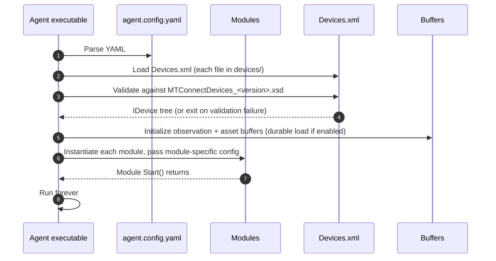

# Configure an agent

An agent's runtime behavior is shaped by two files: `agent.config.yaml` (the agent's YAML config) and `Devices.xml` (the static device model). This page documents every key in `agent.config.yaml`, the canonical YAML shape, the per-module configuration discriminators, and the validation pipeline that runs at agent startup.

## File layout

The standalone agent application reads its configuration from `agent.config.yaml` next to the executable (or, in the Docker image, from `/config/agent.config.yaml`). The file is YAML 1.2 with two top-level shapes: a `modules:` list (the agent's HTTP / MQTT / SHDR / adapter modules) and a flat block of agent-wide settings (buffer sizes, default version, durability, etc.).

A minimal `agent.config.yaml` for a single-device HTTP agent:

```yaml
# Path to the directory holding Devices.xml (or to a specific .xml file).
devices: devices

# Agent-wide settings.
observationBufferSize: 150000
assetBufferSize: 1000
durable: false
defaultVersion: 2.5
enableAgentDevice: true

# Modules attached to the agent.
modules:

- http-server:
    port: 5000
    indentOutput: true
    documentFormat: xml
    accept:
      text/xml: xml
      application/json: json
    responseCompression:
    - gzip
    - br
```

## Agent-wide settings

Every key below is a top-level key in `agent.config.yaml`.

### `devices`

Path to the device-model source. Can be:

- A directory — the agent loads every `*.xml` file in the directory.
- A single file path — the agent loads just that file.

Default: `devices` (a directory in the agent's working directory). The on-disk path is resolved relative to the agent's working directory, not to the location of `agent.config.yaml`.

### `observationBufferSize`

The maximum number of observations the agent retains in its in-memory circular buffer. When full, the oldest observation is discarded; the next-sequence cursor wraps and consumers paginating across the wrap point see a gap.

Default: `150000`. Suggested rule of thumb: at least `<emission rate per second> * <retention seconds>`. A 100 Hz adapter emitting on 10 DataItems wants `1000 * <retention seconds>`.

### `assetBufferSize`

The maximum number of assets the agent retains. When full, the least-recently-updated asset is evicted. Removed-flag assets count toward the limit until they age out.

Default: `1000`.

### `durable`

Whether the agent persists its buffers to disk and restores them on restart. When true, the agent writes buffer pages to `durableBufferPath` (default: a `buffer/` directory next to the executable). Restart picks up where the agent left off; the `instanceId` is preserved, so consumers do not see a sequence reset.

Default: `false`. Set true in production for cases where a consumer must not lose data on agent restart.

### `durableBufferPath`

Directory path for the durable buffer. Used only when `durable: true`. Default: `buffer` (relative to the agent's working directory).

### `defaultVersion`

The MTConnect spec version the agent defaults to when a request omits the `?version=` query parameter. Format: `<major>.<minor>` as a string (e.g. `"2.5"`).

Default: the library's `MTConnectVersions.Max`. Set this explicitly in production so a consumer pinned to a specific spec version is not surprised by a library upgrade.

### `enableAgentDevice`

Whether to auto-register the self-describing Agent Device. The Agent Device emits its own `AVAILABILITY`, `ASSET_CHANGED`, `ASSET_REMOVED`, and `MTCONNECT_VERSION` observations, and gives consumers a single point to monitor the agent's health.

Default: `true`. Set false when a consumer is strict about device counts (some legacy integrations break if the device list contains entries they did not author).

### `processors`

A list of input processors that run on every observation before it enters the buffer. The shipped processor types include the Python processor (`python:`), which can run a per-observation Python transform via [Python.NET](https://pythonnet.github.io/).

```yaml
processors:
- python:
    directory: processors
```

The `directory` key points at the directory holding the Python scripts. Each script is named after the DataItem it transforms.

## Modules block

The `modules:` block is a YAML sequence of single-key maps. The key names the module type; the value is the module-specific configuration.

```yaml
modules:
- http-server:           # one module instance
    port: 5000
- mqtt-relay:            # another module instance
    server: broker.example.com
- shdr-adapter:          # a third
    deviceKey: Okuma
    port: 7878
```

The shipped module types:

- `http-server` — the HTTP endpoint surface. See [Configure modules: HTTP server](/configure/module-config#http-server).
- `mqtt-broker` — embedded MQTT broker emitting topics for each Device. See [Configure modules: MQTT broker](/configure/module-config#mqtt-broker).
- `mqtt-relay` — outbound publisher to an external MQTT broker. See [Configure modules: MQTT relay](/configure/module-config#mqtt-relay).
- `mqtt-adapter` — inbound consumer from an external MQTT broker. See [Configure modules: MQTT adapter](/configure/module-config#mqtt-adapter).
- `shdr-adapter` — inbound SHDR adapter (the agent connects to a TCP socket that emits SHDR). See [Configure modules: SHDR adapter](/configure/module-config#shdr-adapter).
- `http-adapter` — inbound HTTP adapter (the agent polls an HTTP endpoint that emits MTConnect-shaped responses). See [Configure modules: HTTP adapter](/configure/module-config#http-adapter).

Multiple instances of the same module type are allowed and common — two `http-server` modules on different ports (one TLS, one plain), or two `shdr-adapter` modules for two devices.

## Devices.xml

The device model is authored in XML against the MTConnect Devices schema ([schemas.mtconnect.org](https://schemas.mtconnect.org/)). A single `Devices.xml` declares one or more Devices, each with its Component / Composition / DataItem tree.

```xml
<MTConnectDevices xmlns="urn:mtconnect.org:MTConnectDevices:2.5"
                  xmlns:xsi="http://www.w3.org/2001/XMLSchema-instance"
                  xsi:schemaLocation="urn:mtconnect.org:MTConnectDevices:2.5
                                      https://schemas.mtconnect.org/schemas/MTConnectDevices_2.5.xsd">
  <Devices>
    <Device id="mill-01" uuid="1234-5678" name="Mill #1">
      <DataItems>
        <DataItem category="EVENT" id="mill-01-avail" type="AVAILABILITY"/>
      </DataItems>
      <Components>
        <Controller id="ctrl">
          <DataItems>
            <DataItem category="EVENT" id="ctrl-mode" type="CONTROLLER_MODE"/>
            <DataItem category="EVENT" id="ctrl-exec" type="EXECUTION"/>
          </DataItems>
        </Controller>
      </Components>
    </Device>
  </Devices>
</MTConnectDevices>
```

The agent validates `Devices.xml` against the XSD declared by the document's namespace at startup. If validation fails, the agent logs the failure and exits with a non-zero code; see [Troubleshooting: XSD validation failures](/troubleshooting/xsd-validation-failures).

The XML namespace selects the target MTConnect version: `urn:mtconnect.org:MTConnectDevices:2.5` validates against `MTConnectDevices_2.5.xsd`. Authoring against the lowest version your consumer base requires is the safest default; the agent serializes the model upward (and prunes properties added after the target) on every response.

## Startup pipeline



A successful startup logs:

```text
[12:34:56 INF] Devices: 1 loaded
[12:34:56 INF] Modules: 3 started
[12:34:56 INF] Listening on http://0.0.0.0:5000
[12:34:56 INF] Agent UUID: <auto-generated>
[12:34:56 INF] Instance ID: 1737504000
```

## Validation tooling

To validate `agent.config.yaml` without starting the agent, the standalone agent ships a `--validate` flag that parses the YAML, applies it to the configuration object, and exits with a status code:

```sh
MTConnect.NET-Agent --validate --config /path/to/agent.config.yaml
```

For `Devices.xml`, use the same `--validate` flag — the validation pipeline runs the XSD validator on every file in `devices/` and reports each file's status.

## Where to next

- [Configure an adapter](/configure/adapter-config) — the adapter side of the data flow.
- [Configure modules](/configure/module-config) — every module's full config-key reference.
- [Cookbook: Write an agent](/cookbook/write-an-agent) — a programmatic alternative to the YAML config.
- [Troubleshooting: Schema version mismatches](/troubleshooting/schema-version-mismatches) — when consumer and agent advertise different versions.
