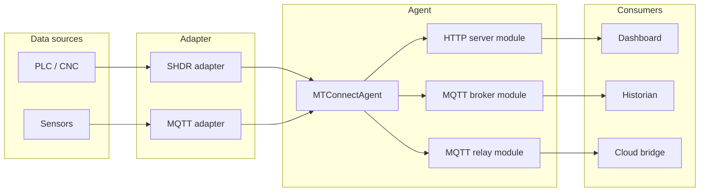

# Configure & Use

End-to-end guides for installing, configuring, running, and connecting consumers to `MTConnect.NET`. This is the operator-facing complement to the type-level [API reference](/api/) — read this section to stand up a real agent against real equipment.

## What this section covers

- **[Install](./install)** — NuGet package install for each shipped library, plus the prebuilt agent and prebuilt adapter, with per-target-framework notes.
- **[Configure an agent](./agent)** — `agent.config.yaml` (every key, every default, every permissible value), `Devices.xml` (schema, sample, common pitfalls, XSD validation), per-module configuration, logging.
- **[Configure an adapter](./adapter)** — SHDR / HTTP adapter config, ports, data-source bring-up, queue-vs-interval semantics.
- **[Run](./run)** — local development with `dotnet run`, Docker with `trakhound/mtconnect.net-agent`, Windows-service and systemd-unit deployment.
- **[Connect a consumer](./consumer)** — `curl` + browser examples for `/probe`, `/current`, `/sample`, `/asset`; MQTT subscriber examples for the relay topic tree; JSON v2 sample parser in .NET and Python.
- **[Operate](./operate)** — observability (logs, metrics, traces), common error modes and recovery, backup and restore of the agent's storage layer.

## Topology

The agent's modular architecture means the same agent process can speak any combination of HTTP, MQTT broker (embedded), MQTT relay (to an external broker), SHDR adapter, MQTT adapter, and HTTP adapter — all configured through `agent.config.yaml`.

## Integrations

Step-by-step guides for the most-requested deployment shapes:

- **[InfluxDB](./integrations/influxdb)** — pipe MTConnect observations into InfluxDB for time-series storage and Grafana dashboards.
- **[MQTT — Protocol overview](./integrations/mqtt-protocol)** — the MTConnect-over-MQTT topic tree, payload formats, and broker-side considerations.
- **[MQTT — AWS Greengrass (Moquette)](./integrations/mqtt-aws-greengrass-moquette)** — running the agent against the Moquette broker on Greengrass.
- **[MQTT — AWS Greengrass (Mqtt-Bridge)](./integrations/mqtt-aws-greengrass-mqtt-bridge)** — bridging local-broker traffic out through Greengrass.
- **[MQTT — AWS IoT](./integrations/mqtt-aws-iot)** — publishing directly to AWS IoT Core.
- **[MQTT — HiveMQ](./integrations/mqtt-hivemq)** — running against HiveMQ as the external broker.
- **[OpenSSL setup](./integrations/openssl)** — generating and configuring TLS certificates for HTTPS and MQTTS endpoints.

## See also

- [Getting started](/getting-started) — the three-step quickstart, if you haven't installed the agent yet.
- [Wire formats](/wire-formats/) — what the agent emits on the wire, by codec.
- [Cookbook](/cookbook/) — recipes for the common deployment patterns.
- [Troubleshooting](/troubleshooting/) — what to do when something goes wrong.
