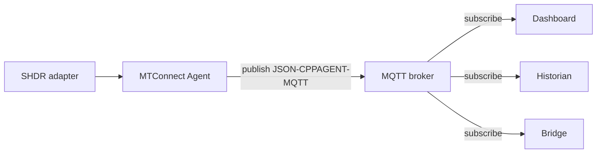

# Configure the MQTT relay

This recipe configures the `mqtt-relay` module — the agent's outbound publisher that pushes observations and assets to an external MQTT broker. By the end you have:

- The agent publishing to a broker every 500 ms (Samples) and 5 s (Current).
- A subscriber receiving the published payloads in JSON-CPPAGENT-MQTT format.
- TLS enabled on the broker connection.
- A durable-relay configuration that buffers and replays on reconnect.

## 1. The minimal config

In `agent.config.yaml`:

```yaml
modules:
- mqtt-relay:
    server: broker.example.com
    port: 1883
    topicPrefix: MTConnect/Document
    topicStructure: Document
    documentFormat: JSON-CPPAGENT-MQTT
    currentInterval: 5000
    sampleInterval: 500
```

That is the smallest config that works. The relay publishes to four topics per Device:

- `MTConnect/Document/Probe/<deviceUuid>` — full `MTConnectDevices` envelope, on model change.
- `MTConnect/Document/Current/<deviceUuid>` — full `MTConnectStreams` `Current` envelope, every `currentInterval` ms.
- `MTConnect/Document/Sample/<deviceUuid>` — full `MTConnectStreams` `Sample` envelope (delta since last publish), every `sampleInterval` ms.
- `MTConnect/Document/Asset/<deviceUuid>/<assetId>` — full `MTConnectAssets` envelope, on asset change.

## 2. The topology



The relay decouples the agent from its consumers. Consumers come and go; the broker absorbs the publish-subscribe semantics.

## 3. Document structure vs Entity structure

Two `topicStructure:` values:

- **`Document`** — full envelope per topic. Consumers parse `MTConnectStreams` / `MTConnectDevices` / `MTConnectAssets` envelopes.
- **`Entity`** — one entity per topic. Topics are `<prefix>/Observations/<deviceUuid>/<dataItemId>`, `<prefix>/Devices/<deviceUuid>`, `<prefix>/Assets/<deviceUuid>/<assetId>`. The payload is a single entity.

Document is the cppagent-MQTT parity shape; Entity is the library's per-observation shape that some downstream consumers (Kafka bridges, time-series databases) find easier to ingest.

Switch to Entity by setting `topicStructure: Entity` and (optionally) `documentFormat: JSON` to use the library's JSON v1 codec instead of JSON-CPPAGENT.

## 4. TLS-enabled relay

For broker-side TLS, set `useTls: true` and configure the `tls:` block:

```yaml
modules:
- mqtt-relay:
    server: broker.example.com
    port: 8883
    useTls: true
    tls:
      pem:
        certificateAuthority: /etc/mtconnect/ca.crt
        certificatePath: /etc/mtconnect/agent.crt
        privateKeyPath: /etc/mtconnect/agent.key
        privateKeyPassword: <secret>
    topicPrefix: MTConnect/Document
    topicStructure: Document
    documentFormat: JSON-CPPAGENT-MQTT
    currentInterval: 5000
    sampleInterval: 500
```

The `pem:` block declares a PEM-encoded certificate chain. Two alternates:

- `pfx:` — a PKCS#12 bundle path + password (Windows-friendly).
- Omit both — the agent picks up the platform certificate store's roots; useful for brokers using a public CA-signed certificate.

See [Troubleshooting: MQTT TLS handshake](/troubleshooting/mqtt-tls-handshake) when the handshake fails.

## 5. Authenticated relay

Brokers commonly require username/password authentication:

```yaml
modules:
- mqtt-relay:
    server: broker.example.com
    port: 1883
    username: agent-01
    password: <secret>
    clientId: agent-01-relay
    cleanSession: false        # preserve session across reconnects.
    qos: 1                     # at-least-once delivery.
    topicPrefix: MTConnect/Document
    topicStructure: Document
    documentFormat: JSON-CPPAGENT-MQTT
```

Production deployments typically:

- Use a per-agent `clientId` so the broker can distinguish multiple agents.
- Set `cleanSession: false` so the broker preserves the agent's subscription state across reconnects.
- Use `qos: 1` (at-least-once) — `qos: 0` drops on reconnect; `qos: 2` (exactly-once) adds a four-way handshake the agent rarely needs.

## 6. Durable relay

The `durableRelay:` flag buffers outbound messages while the broker is unreachable and replays them on reconnect:

```yaml
modules:
- mqtt-relay:
    server: broker.example.com
    port: 1883
    durableRelay: true
    currentInterval: 5000
    sampleInterval: 500
```

When `durableRelay: true`, every Observation that enters the agent's buffer also enters a per-relay outbound queue. On reconnect, the relay drains the queue in sequence order before resuming live publishes. This is the right setting for cases where a consumer must not miss data; the trade-off is bounded memory growth during long disconnects.

## 7. The subscriber side

A `mosquitto_sub` subscribing to the relay:

```sh
mosquitto_sub -h broker.example.com -p 1883 -t 'MTConnect/Document/+/+' -v
```

The `-t` glob matches any depth-2 sub-topic under `MTConnect/Document/`. Sample output for one published Current envelope:

```text
MTConnect/Document/Current/mill-01 {"MTConnectStreams":{"Header":{...},"Streams":{...}}}
```

A dotnet subscriber using MQTTnet:

```csharp
using MQTTnet;
using MQTTnet.Client;
using System.Text;

var factory = new MqttFactory();
var client = factory.CreateMqttClient();

await client.ConnectAsync(new MqttClientOptionsBuilder()
    .WithTcpServer("broker.example.com", 1883)
    .Build());

await client.SubscribeAsync(
    new MqttTopicFilterBuilder().WithTopic("MTConnect/Document/Current/+").Build());

client.ApplicationMessageReceivedAsync += async e =>
{
    var json = Encoding.UTF8.GetString(e.ApplicationMessage.PayloadSegment);
    Console.WriteLine($"{e.ApplicationMessage.Topic} : {json[..Math.Min(json.Length, 80)]}...");
    await Task.CompletedTask;
};

await Task.Delay(Timeout.Infinite);
```

The payload parses as a standard `MTConnectStreams` JSON envelope; pass it to your in-process parser of choice. See [Cookbook: Write a JSON-MQTT consumer](/cookbook/write-a-json-mqtt-consumer) for a complete consumer.

## 8. Tuning the intervals

`currentInterval` and `sampleInterval` are the two knobs that govern bandwidth:

| Knob | Default | Effect |
|---|---|---|
| `currentInterval` | `5000` (5 s) | Frequency of full Current envelopes. |
| `sampleInterval` | `500` (500 ms) | Frequency of delta Sample envelopes. |

A high-frequency CNC monitoring deployment runs `sampleInterval: 100` for sub-second tool-position updates. A low-bandwidth deployment over cellular runs `sampleInterval: 5000` and `currentInterval: 60000` to minimize transmits. The Current envelope is large (the full per-DataItem snapshot); the Sample envelope is small (only observations since the last publish).

## 9. Availability topic

The agent publishes a retained `Availability` message on connect / disconnect, so subscribers know whether the relay is live:

- Topic: `<topicPrefix>/Probe/Availability`
- Payload on connect: `AVAILABLE`
- Payload on disconnect (LWT): `UNAVAILABLE`

The retained-message + LWT pattern lets a subscriber that connects after the agent went offline still see the `UNAVAILABLE` state instead of waiting for the next publish.

## Where to next

- [Cookbook: Write a JSON-MQTT consumer](/cookbook/write-a-json-mqtt-consumer) — the consumer side, with parsing code.
- [Configure modules: MQTT relay](/configure/module-config#mqtt-relay) — the full key reference.
- [Wire formats: JSON-CPPAGENT-MQTT](/wire-formats/json-cppagent-mqtt) — the on-the-wire payload shape.
- [Troubleshooting: MQTT TLS handshake](/troubleshooting/mqtt-tls-handshake) — TLS connection diagnostics.
