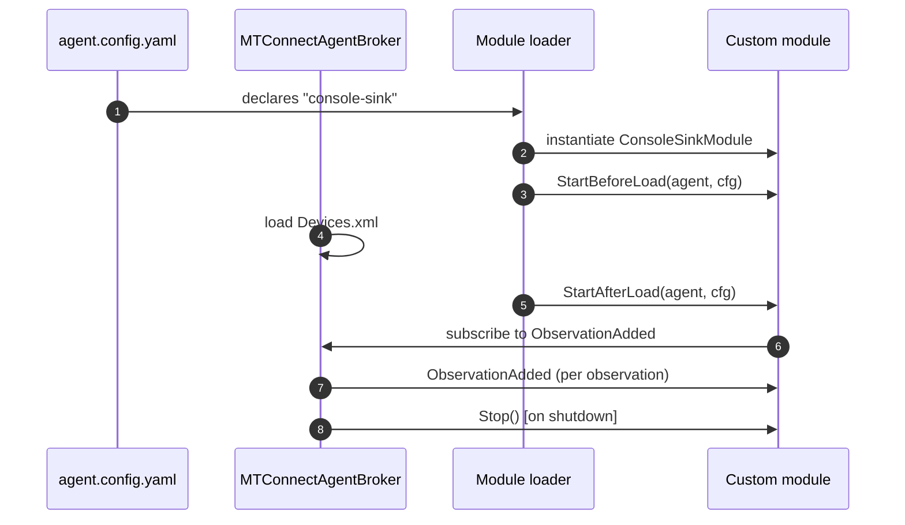

# Write a custom agent module

A **module** is the agent's pluggable extension point. The shipped modules — HTTP server, MQTT broker, MQTT relay, MQTT adapter, SHDR adapter, HTTP adapter — all implement the same [`IMTConnectAgentModule`](/api/MTConnect.Agents/IMTConnectAgentModule) interface. This recipe shows how to write a custom module so an agent can publish to a destination the shipped modules do not cover (an InfluxDB bucket, a Kafka topic, a Postgres table, a webhook).

By the end you have:

- A class implementing `IMTConnectAgentModule`.
- The module wired into the agent and receiving observations as the agent buffers them.
- A pattern for declaring the module's config in `agent.config.yaml`.

## 1. Set up the project

A custom module is a separate class library. Reference `MTConnect.NET-Common`:

```sh
dotnet new classlib -o MyCustomModule
cd MyCustomModule
dotnet add package MTConnect.NET-Common
```

## 2. Implement IMTConnectAgentModule

The interface is small. The full surface:

```csharp
namespace MTConnect.Agents;

public interface IMTConnectAgentModule
{
    string Id { get; }
    void StartBeforeLoad(IMTConnectAgentBroker agent, object configuration);
    void StartAfterLoad(IMTConnectAgentBroker agent, object configuration);
    void Stop();
}
```

Two lifecycle hooks: `StartBeforeLoad` runs before the agent has loaded the device model; `StartAfterLoad` runs after. Most modules use `StartAfterLoad` because they need to subscribe to observation events that fire once the device model is in place.

A minimal module that prints every observation to the console:

```csharp
using System;
using MTConnect.Agents;
using MTConnect.Observations;

namespace MyCustomModule;

public class ConsoleSinkModule : IMTConnectAgentModule
{
    public string Id => "console-sink";

    private IMTConnectAgentBroker _agent;
    private ConsoleSinkConfiguration _config;

    public void StartBeforeLoad(IMTConnectAgentBroker agent, object configuration)
    {
        // no-op for this module.
    }

    public void StartAfterLoad(IMTConnectAgentBroker agent, object configuration)
    {
        _agent = agent;
        _config = configuration as ConsoleSinkConfiguration ?? new ConsoleSinkConfiguration();

        _agent.ObservationAdded += OnObservationAdded;
        Console.WriteLine($"[{Id}] Started.  Prefix='{_config.Prefix}'");
    }

    public void Stop()
    {
        if (_agent != null)
        {
            _agent.ObservationAdded -= OnObservationAdded;
            Console.WriteLine($"[{Id}] Stopped.");
        }
    }

    private void OnObservationAdded(object sender, IObservation obs)
    {
        var valueText = obs.GetValue(ValueKeys.Result) ?? Observation.Unavailable;
        Console.WriteLine($"[{Id}] {_config.Prefix} {obs.DataItemId}={valueText} @ {obs.Timestamp:O}");
    }
}

public class ConsoleSinkConfiguration
{
    public string Prefix { get; set; } = ">>";
}
```

The `ObservationAdded` event on `IMTConnectAgentBroker` fires once per observation as it enters the buffer. Other events on the broker:

- `AssetAdded` — fires when an Asset enters the asset buffer.
- `AssetRemoved` — fires when an Asset is removed.
- `DeviceAdded` — fires when a Device is added to the agent's device list.

## 3. Plug the module into the agent

Three integration shapes:

### a. Programmatic (in-process)

When the agent is hosted in a custom executable, instantiate the module after the agent:

```csharp
var agent = new MTConnectAgentBroker(...);
agent.AddDevice(device);

var module = new ConsoleSinkModule();
module.StartAfterLoad(agent, new ConsoleSinkConfiguration { Prefix = "OBS" });
```

### b. Via the standalone agent's YAML config

The standalone agent loads modules through reflection. Register the assembly with the agent's module loader (drop the assembly into the agent's `modules/` directory) and reference the module by Id in `agent.config.yaml`:

```yaml
modules:
- console-sink:
    prefix: ">>"
```

The agent loader matches the YAML key (`console-sink`) against each module assembly's `Id` property and constructs a configuration object from the YAML value. The config-binding uses YamlDotNet's case-insensitive convention; `Prefix` in C# maps from `prefix` in YAML.

### c. As a NuGet package

Publish the module assembly to a NuGet feed (private or `nuget.org`). Consumers add it with `dotnet add package MyCustomModule` and reference the module's `Id` in their `agent.config.yaml`.

## 4. Lifecycle in detail



The agent stops every module in reverse-registration order on shutdown. A module's `Stop()` MUST unsubscribe from events and release any held resources; otherwise the agent leaks resources on every restart of a long-lived process.

## 5. Production patterns

Custom modules in production deployments typically:

- **Implement `IDisposable`** (in addition to `IMTConnectAgentModule`) so they release I/O resources cleanly on shutdown.
- **Buffer outgoing writes** so a slow downstream does not back-pressure the agent's observation pipeline. A typical pattern: queue observations in an in-memory channel and flush from a background task.
- **Implement structured logging** — wire the module up to the agent's [`ILogger`](https://learn.microsoft.com/dotnet/api/microsoft.extensions.logging.ilogger) so errors are visible in the standard log stream.
- **Honor the `cancellationToken`** that the agent passes for graceful shutdown.

A buffered pattern:

```csharp
private readonly System.Threading.Channels.Channel<IObservation> _queue =
    System.Threading.Channels.Channel.CreateBounded<IObservation>(1000);

public void StartAfterLoad(IMTConnectAgentBroker agent, object configuration)
{
    _agent = agent;
    _agent.ObservationAdded += (_, obs) =>
    {
        // Drop if the queue is full; do not block the agent thread.
        _queue.Writer.TryWrite(obs);
    };
    _ = Task.Run(FlushLoopAsync);
}

private async Task FlushLoopAsync()
{
    await foreach (var obs in _queue.Reader.ReadAllAsync())
    {
        try { await WriteToDownstream(obs); }
        catch (Exception ex) { /* log + retry */ }
    }
}
```

## 6. Test the module

A minimal NUnit test:

```csharp
using NUnit.Framework;
using MTConnect.Agents;
using MTConnect.Devices;
using MTConnect.Observations;
using MyCustomModule;

[TestFixture]
public class ConsoleSinkModuleTests
{
    [Test]
    public void Module_subscribes_and_emits_on_observation()
    {
        var agent = new MTConnectAgentBroker();
        var device = new Device { Id = "test", Uuid = "test", Name = "Test" };
        device.AddDataItem(new MTConnect.Devices.DataItems.AvailabilityDataItem(device.Id));
        agent.AddDevice(device);

        var module = new ConsoleSinkModule();
        module.StartAfterLoad(agent, new ConsoleSinkConfiguration { Prefix = "TEST" });

        // Capture stdout to assert on the module's output.
        using var sw = new System.IO.StringWriter();
        Console.SetOut(sw);

        agent.AddObservation(device.Uuid, new EventValueObservation
        {
            DataItemId = "test-avail",
            Timestamp = DateTime.UtcNow,
            CDATA = "AVAILABLE",
        });

        Assert.That(sw.ToString(), Does.Contain("TEST"));
        Assert.That(sw.ToString(), Does.Contain("AVAILABLE"));
    }
}
```

## Where to next

- [Cookbook: Write an agent](/cookbook/write-an-agent) — the agent host the module plugs into.
- [Configure modules](/configure/module-config) — the configuration shape every shipped module follows.
- [`IMTConnectAgentModule` API reference](/api/MTConnect.Agents/IMTConnectAgentModule).
- [Cookbook: Configure MQTT relay](/cookbook/configure-mqtt-relay) — a shipped-module example to study.
