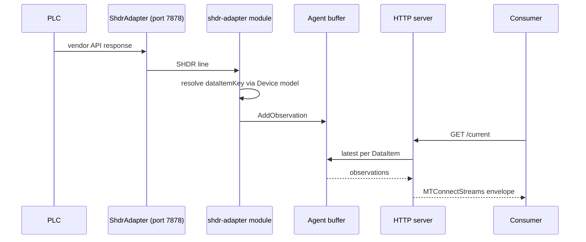

# Write an adapter

This recipe walks through building an MTConnect adapter in code — the upstream half of the data flow that ships values from a custom source (a CSV log, a TCP feed, a PLC) into an MTConnect agent over SHDR.

By the end you have:

- A class implementing `IAdapter` that emits SHDR lines on TCP port 7878.
- A test client that connects to the adapter and prints the lines.
- A pattern for wiring the adapter into the agent's `shdr-adapter` module.

## 1. Set up the project

```sh
dotnet new console -o MyAdapter
cd MyAdapter
dotnet add package MTConnect.NET-SHDR
```

The `MTConnect.NET-SHDR` package contains the SHDR codec — parser, writer, heartbeat state machine.

## 2. Build a minimal adapter

The library's [`ShdrAdapter`](/api/MTConnect.Shdr/ShdrAdapter) class implements an SHDR TCP server. Instantiate it with a device key and a port:

```csharp
using MTConnect.Shdr;

var adapter = new ShdrAdapter(deviceKey: "mill-01", port: 7878);
adapter.Start();

Console.WriteLine("SHDR adapter listening on port 7878 for device mill-01");
```

The adapter is now accepting connections. Any consumer that opens a TCP socket to `localhost:7878` joins the broadcast list.

## 3. Push observations

Each observation is fed into the adapter through the `Add` family of methods:

```csharp
using MTConnect.Shdr;
using MTConnect.Devices;

// EVENT — discrete state.
adapter.AddDataItem(new ShdrDataItem("avail", "AVAILABLE"));
adapter.AddDataItem(new ShdrDataItem("ctrl-mode", "AUTOMATIC"));

// SAMPLE — numeric value.
adapter.AddDataItem(new ShdrDataItem("x-pos-actual", 12.345m));

// CONDITION — a fault.
adapter.AddCondition(new ShdrCondition("ctrl-system",
    ConditionLevel.FAULT,
    nativeCode: "E1024",
    qualifier: "HIGH",
    message: "Spindle over-temperature"));
```

The `AddDataItem` call adds the observation to the adapter's outgoing buffer and broadcasts an SHDR line to every connected consumer. The line shape is `<timestamp>|<dataItemKey>|<value>`, formatted per `Part_5.0` of the MTConnect Standard ([docs.mtconnect.org](https://docs.mtconnect.org/)).

## 4. Drive a real data source

A typical adapter polls a vendor data source and emits observations on each poll. The pattern:

```csharp
using System.Net.Http;
using MTConnect.Shdr;

var adapter = new ShdrAdapter("mill-01", 7878);
adapter.Start();

var http = new HttpClient();

while (true)
{
    // Pretend this is the PLC's HTTP API.
    var json = await http.GetStringAsync("http://192.168.1.100/status");
    var status = ParseStatus(json);

    adapter.AddDataItem(new ShdrDataItem("avail", status.Available ? "AVAILABLE" : "UNAVAILABLE"));
    adapter.AddDataItem(new ShdrDataItem("ctrl-mode", status.Mode));
    adapter.AddDataItem(new ShdrDataItem("x-pos-actual", status.AxisX));

    await Task.Delay(500);
}
```

The 500 ms poll interval is the adapter's own pace; the SHDR consumer sees the lines as they emit. Adjust by data source.

## 5. Test the adapter standalone

In another terminal:

```sh
nc localhost 7878
```

You should see:

```text
2025-01-01T12:34:56.789Z|avail|AVAILABLE
2025-01-01T12:34:56.890Z|ctrl-mode|AUTOMATIC
2025-01-01T12:34:56.890Z|x-pos-actual|12.345
* PING
```

The `* PING` line is the adapter's heartbeat, sent every `Heartbeat` ms (default 10 000). A connected consumer responds with `* PONG <heartbeat-ms>` to confirm liveness.

## 6. Wire the adapter into an agent

On the agent side, configure a `shdr-adapter` module that points at the adapter's TCP socket:

```yaml
modules:
- shdr-adapter:
    deviceKey: mill-01
    hostname: localhost
    port: 7878
    heartbeat: 1000
    reconnectInterval: 1000
    connectionTimeout: 1000
```

The agent's `shdr-adapter` module connects to `localhost:7878`, consumes the SHDR lines, looks up each `dataItemKey` against the Device's model ([`Device.GetDataItemByKey`](/api/MTConnect.Devices/Device#GetDataItemByKey) checks `Id`, then `Name`, then `Source.DataItemId`, then `Source.Value`), and writes the resulting Observation into the agent's buffer.

A flow diagram:



## 7. Handle disconnect / reconnect

The `ShdrAdapter` class manages reconnect / heartbeat / buffer state internally:

- When the consumer disconnects, the adapter drops the connection and listens for a new one.
- When the consumer fails to send a `* PONG` within the heartbeat window, the adapter closes the connection.
- On reconnect, the adapter does NOT replay lines emitted while disconnected — the consumer asks the agent for `/sample?from=<lastSeen>` to fill the gap, and the agent answers from its buffer.

The adapter side does not buffer for replay because the data source (a PLC, a sensor) is the source of truth: the agent re-asks the data source on reconnect, not the adapter. This matches the SHDR spec's lifecycle in `Part_5.0` Network.

## 8. Production patterns

For production deployments:

- **Run the adapter as a service**: use `MTConnect.NET-Services` to host it as a Windows service or systemd unit.
- **Persist the source-side queue**: if the data source is reliable but the adapter-to-agent link is flaky, queue at the data-source side (PLC's log, message queue) and play forward.
- **Use MQTT instead of SHDR**: for cross-network deployments, swap the SHDR output for an MQTT publish to a persistent broker. See [Cookbook: Configure MQTT relay](/cookbook/configure-mqtt-relay).
- **Validate the data source's encoding**: SHDR is plain text; ensure the source's character encoding is UTF-8 to avoid byte-mangling on the wire.

## Where to next

- [Configure an adapter](/configure/adapter-config) — the standalone adapter executable's YAML config, for cases where you do not need a custom C# adapter.
- [Cookbook: Write an agent](/cookbook/write-an-agent) — the agent side.
- [Wire formats: SHDR](/wire-formats/shdr) — the protocol details.
- [Troubleshooting: Common error modes](/troubleshooting/common-error-modes) — adapter disconnect scenarios.
