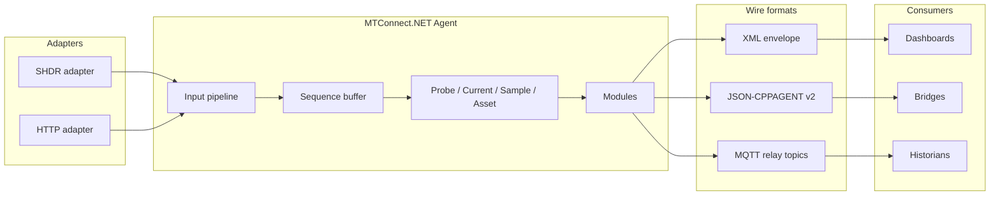

## What is MTConnect.NET?

`MTConnect.NET` is a fully open-source .NET library set, agent application, and adapter application that implements the [MTConnect Standard](https://www.mtconnect.org/) end to end. It ships:

- **A standalone agent application** — a preconfigured executable that hosts an MTConnect agent with a modular architecture (HTTP server, MQTT broker, MQTT relay, SHDR adapter, MQTT adapter, HTTP adapter). Runs on Windows, Linux, and macOS, with installers, a Docker image, and Windows-service / systemd-unit deployment paths.
- **A standalone adapter application** — for shipping data from a PLC or other source into an MTConnect agent over SHDR or MQTT.
- **Embeddable libraries** — fourteen NuGet packages (`MTConnect.NET`, `MTConnect.NET-Common`, `MTConnect.NET-HTTP`, `MTConnect.NET-SHDR`, `MTConnect.NET-MQTT`, `MTConnect.NET-XML`, `MTConnect.NET-JSON`, `MTConnect.NET-JSON-cppagent`, `MTConnect.NET-TLS`, `MTConnect.NET-Services`, `MTConnect.NET-DeviceFinder`, `MTConnect.NET-SysML`, plus the `MTConnect.NET-Applications-Agents` and `MTConnect.NET-Applications-Adapter` host packages) for embedding agent / adapter / client functionality inside a custom application.
- **Spec coverage through v2.7** — the SysML model drives source generation, so every spec-version-introduced type is present, every deprecation is recorded, and every type carries its `MinimumVersion` / `MaximumVersion` metadata.

## Target frameworks

The libraries multi-target .NET 9.0, .NET 8.0, .NET 7.0, .NET 6.0, .NET 5.0, .NET Core 3.1, .NET Standard 2.0, and .NET Framework 4.6.1 through 4.8.

## Architecture at a glance

The diagram above is rendered by the Mermaid plugin. Every architecture / sequence / state-machine / wire-flow diagram in this site is authored in Mermaid — no ASCII art, no external image renders for schematic content.

## Where to next

- New to MTConnect.NET? Start with [Getting started](/getting-started).
- Deciding whether the library covers your spec target? Read the [Compliance](/compliance/) posture.
- Standing up an agent against real equipment? Walk through [Configure & Use](/configure/).
- Looking up a specific class or method? Open the [API reference](/api/).
- Want to see a working program first? Browse the [Examples](/examples/) — four `dotnet run`-able console apps for the common integration shapes.
