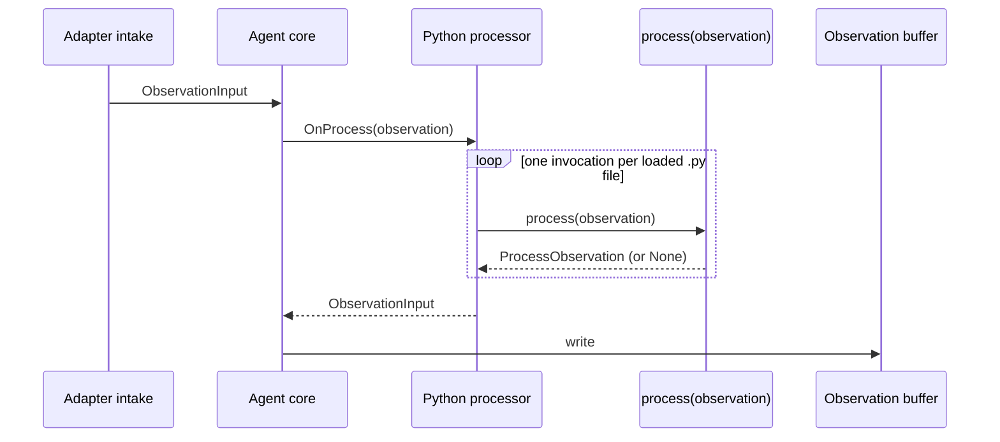

# Python agent processor

- **Module name** — MTConnect Python Agent Processor
- **Identifier** — `python`
- **NuGet package** — `MTConnect.NET-AgentProcessor-Python`
- **Source path** — `agent/Processors/MTConnect.NET-AgentProcessor-Python/`

## Purpose

Runs a directory of Python scripts as a per-observation transform between the adapter intake and the agent's observation buffer. Each script exports a `process(observation)` function; the processor invokes every loaded function in turn and passes the resulting `ProcessObservation` on to the next hop in the pipeline. Use the processor to rewrite a single observation's value (units conversion, threshold mapping), to derive new observations from one observation, or to filter observations out (return `None` to suppress a write).

This is the only processor in the module catalogue that hosts a non-.NET scripting language. It loads scripts in the standalone agent application (`MTConnect.NET-Agent` / `MTConnect.NET-Agent-Application`) and is also available as a standalone NuGet package for embedding in a custom agent host.

## Configuration schema

The module's configuration class is `ProcessorConfiguration`. The keys below describe the YAML map under `python:`.

| Key | Type | Default | Permissible values | Notes |
| --- | --- | --- | --- | --- |
| `directory` | string | `processors` | absolute path or path relative to the agent's base directory | The directory the processor monitors for `.py` script files. Created on startup if absent. |

The processor watches the directory with a `FileSystemWatcher` and reloads any changed, created, or deleted `.py` file on a 2-second debounce — edits land without restarting the agent.

## Wire interaction



Scripts run in declaration order under a single `IronPython.Hosting.Python` engine. A script that throws is logged at `Error` level and skipped — the next script in the directory still runs against the original or partially-transformed observation, so a bad script does not stall the pipeline.

## Example configuration

A typical agent configuration that loads the Python processor alongside a `shdr-adapter` and an `http-server`:

```yaml
processors:
  - python:
      directory: processors

modules:
  - shdr-adapter:
      address: 127.0.0.1
      port: 7878
      deviceKey: M12346

  - http-server:
      port: 5000
```

The example scripts below sit under `./processors/` next to the agent executable.

### Map an `EMERGENCY_STOP` event to `ARMED` / `TRIGGERED`

```python
def process(observation):

    if observation.DataItem.Type == 'EMERGENCY_STOP':

        result = observation.GetValue('Result')

        if result.lower() == 'TRUE'.lower():
            observation.AddValue('Result', 'ARMED')
        else:
            observation.AddValue('Result', 'TRIGGERED')

    return observation
```

### Scale `PATH_FEEDRATE_OVERRIDE` from a fraction to a percentage

```python
def process(observation):

    if observation.DataItem.Type == 'PATH_FEEDRATE_OVERRIDE':

        result = float(observation.GetValue('Result'))
        observation.AddValue('Result', result * 100)

    return observation
```

### Derive a `TIME_SERIES` observation from a discrete sample

```python
import clr
clr.AddReference("MTConnect.NET-Common")
import MTConnect.Input

def process(observation):

    if observation.DataItem.Id == "L2p1Fact":

        timeseries = MTConnect.Input.TimeSeriesObservationInput()
        timeseries.DataItemKey = 'L2p1Sensor'
        timeseries.SampleRate = 100

        n = 15
        samples = [0] * n

        for x in range(n):
            samples[x] = float(x)

        timeseries.Samples = samples

        observation.Agent.AddObservation(observation.DataItem.Device.Uuid, timeseries)

    return observation
```

## Scripting environment

- The scripting engine is **IronPython**, the .NET implementation of Python 3. Standard library coverage is broad but not complete; CPython-only extensions (NumPy, SciPy, pandas, anything with native C extensions) are not available.
- `clr.AddReference` exposes any assembly the agent has loaded. The `MTConnect.NET-Common` reference shown above brings `MTConnect.Input.*` into scope so a script can construct new observations directly.
- The `observation` argument is a [`ProcessObservation`](/api/MTConnect.Agents.ProcessObservation). Its `Agent` property is the running `IMTConnectAgent`, so a script can call `AddObservation(deviceUuid, observationInput)` to inject a new observation without returning it from `process`.
- Returning `None` suppresses the write entirely — useful for filtering noise out of the buffer.

## Troubleshooting pointers

- **A script loads but does not run** — the `process` symbol must be a module-level function with one parameter. Check the agent log for `Python Script Loaded : <path>` at `Debug` level; a script that loads but does not log that line is missing the `process` symbol.
- **`Error Loading Python Script` on startup** — the agent log line includes the script path and the exception message. Most commonly: a `SyntaxError`, or an `ImportError` for a CPython-only module.
- **Edits are not picked up** — the watcher only fires on files matching `*.py` in the configured `directory` (no recursion). Subdirectories are ignored; symlinks follow the platform default.

See the [Troubleshooting](/troubleshooting/) section for general observation-pipeline failures.

## API reference

- [`MTConnect.Agents.MTConnectAgentProcessor`](/api/MTConnect.Agents.MTConnectAgentProcessor) — the processor base class. [`ProcessObservation`](/api/MTConnect.Agents.ProcessObservation) is the per-call model the scripts receive.
- [`MTConnect.Input`](/api/MTConnect.Input) — the `ObservationInput` / `TimeSeriesObservationInput` types a script can construct and feed back into the agent via `AddObservation`.
