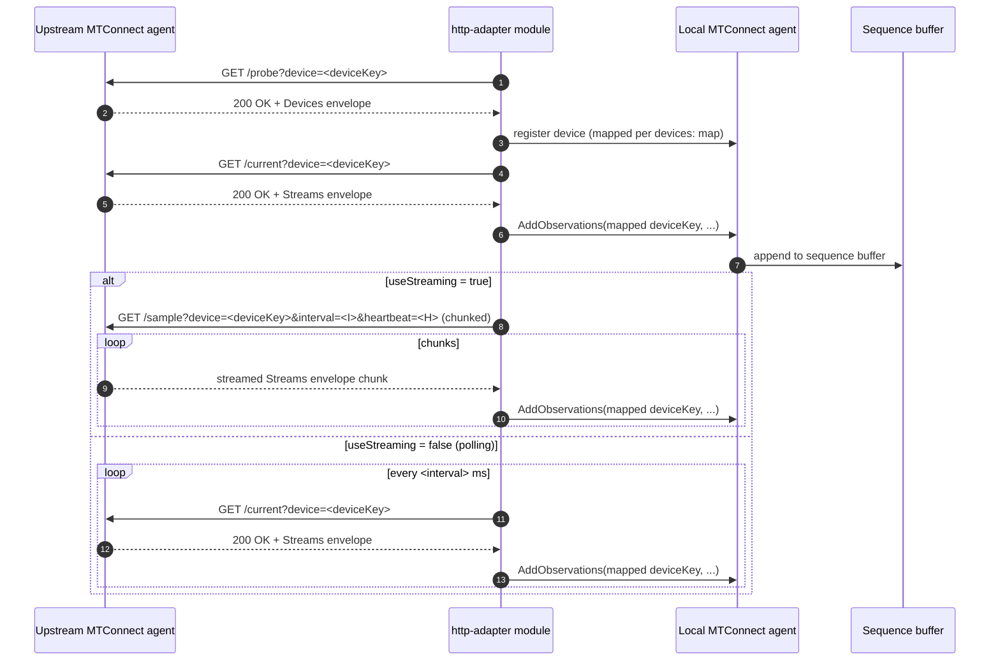

# HTTP adapter

- **Module name** — MTConnect HTTP Adapter agent module
- **Identifier** — `http-adapter`
- **NuGet package** — `MTConnect.NET-AgentModule-HttpAdapter`
- **Source path** — `agent/Modules/MTConnect.NET-AgentModule-HttpAdapter/`

## Purpose

Reads from another MTConnect agent's REST endpoints (`/probe`, `/current`, `/sample`) and forwards the observations into the local agent. Use this module to aggregate observations from several upstream agents into one consolidated agent, or to bridge agents that sit on different networks. The module supports both streaming (chunked-transfer `/sample`) and polling (repeated `/current`) modes.

## Configuration schema

The module's configuration class is `HttpAdapterModuleConfiguration` (it derives from `HttpClientConfiguration`). The keys below describe the YAML map under `http-adapter:`.

| Key | Type | Default | Permissible values | Notes |
| --- | --- | --- | --- | --- |
| `address` | string | `null` | hostname or IP address | The remote agent's address. |
| `port` | int | `5000` | 1-65535 | The remote agent's HTTP / HTTPS port. |
| `deviceKey` | string | `null` | device name or UUID | The remote-agent device to read. |
| `interval` | int | `500` | milliseconds | The polling / streaming interval requested from the remote agent. |
| `heartbeat` | int | `1000` | milliseconds | The heartbeat interval used to keep the streaming connection alive. |
| `useSSL` | bool | `false` | `true`, `false` | Switches the client to HTTPS. |
| `outputConnectionInformation` | bool | `true` | `true`, `false` | Emits host / port of the upstream agent as an observation alongside the forwarded data. |
| `currentOnly` | bool | `false` | `true`, `false` | When `true`, the module polls `/current` only and does not request `/sample` pages. |
| `useStreaming` | bool | `true` | `true`, `false` | When `true`, uses HTTP chunked-transfer streaming on `/sample`; when `false`, polls `/sample` at the configured interval. |
| `devices` | map[string,`DeviceMappingConfiguration`] | `null` | see below | Maps remote device identifiers to local device identifiers. |

### `devices` schema

Each entry maps a remote device to a local device. The map key is the remote-agent device identifier (`Device@name` or `Device@uuid`); the value's fields choose the corresponding local device:

| Key | Type | Notes |
| --- | --- | --- |
| `name` | string | The local device's `name`. |
| `uuid` | string | The local device's `uuid`. |
| `id` | string | The local device's `id`. |

Set at least one of `name` / `uuid` / `id`; the resolver picks the first non-null in that order.

## Wire interaction



## Example configuration

```yaml
modules:
  - http-adapter:
      address: upstream-agent.example.com
      port: 5000
      deviceKey: M12346
      interval: 100
      heartbeat: 10000
      useSSL: false
      currentOnly: false
      useStreaming: true
      devices:
        M12346:
          uuid: 00000000-0000-0000-0000-00000000abcd
```

For HTTPS:

```yaml
modules:
  - http-adapter:
      address: upstream-agent.example.com
      port: 5001
      useSSL: true
      deviceKey: M12346
      useStreaming: true
```

## Troubleshooting

- **Schema-version mismatches** — see [Schema-version mismatches](/troubleshooting/#schema-version-mismatches). If the upstream agent serves a different MTConnect version than the local agent expects, observations may fail to deserialize.
- **Heartbeat / interval tuning** — the upstream agent enforces an MTConnect-spec minimum on the `heartbeat` and `interval` query parameters. The module passes the configured values through verbatim; out-of-range values produce a `MTConnect.Errors.OUT_OF_RANGE` response from the upstream and the module retries.
- **Device-key mismatch** — `deviceKey` must match a device on the upstream agent. Use a browser to hit the upstream's `/probe` and confirm the device exists before configuring this module.
- **TLS / certificate errors** under `useSSL: true` are surfaced as connection-level failures and retried at the module's reconnect interval.

## API reference

- [`HttpAdapterModuleConfiguration`](/api/) — the module's configuration class.
- [`HttpClientConfiguration`](/api/) — the base HTTP client configuration shape.
- [`DeviceMappingConfiguration`](/api/) — the per-device mapping entry.
