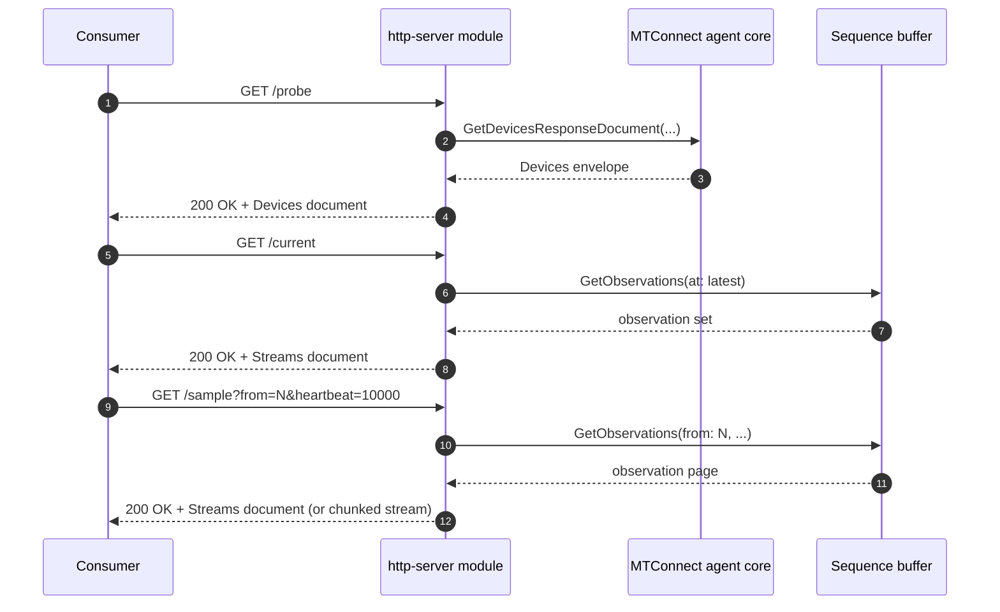

# HTTP server

- **Module name** — MTConnect HTTP Server agent module
- **Identifier** — `http-server`
- **NuGet package** — `MTConnect.NET-AgentModule-HttpServer`
- **Source path** — `agent/Modules/MTConnect.NET-AgentModule-HttpServer/`

## Purpose

Serves the MTConnect REST protocol — `/probe`, `/current`, `/sample`, `/asset` — over HTTP or HTTPS. This is the most common way to expose an agent to dashboards, bridges, and other consumers. The module wraps `MTConnectHttpServer` (under `MTConnect.Servers.Http`), accepts content-negotiated XML and JSON output, optionally accepts HTTP `PUT` of observations and assets, and serves a configurable set of static files (schemas, stylesheets, favicons).

## Configuration schema

The module's configuration class is `HttpServerModuleConfiguration` (it derives from `HttpServerConfiguration`). The keys below describe the YAML map under `http-server:`. Booleans use lowercase `true` / `false`; integer ports are unquoted decimals.

| Key | Type | Default | Permissible values | Notes |
| --- | --- | --- | --- | --- |
| `hostname` | string | `null` (binds to all interfaces) | hostname, IP address, or `localhost` | The IP address or hostname the server binds to. |
| `port` | int | `5000` | 1-65535 | The TCP port to listen on. |
| `tls` | map | `null` (HTTP only) | see below | TLS configuration; presence switches the listener to HTTPS. |
| `accept` | map[string,string] | `{ "text/xml": "XML", "application/xml": "XML", "application/json": "JSON" }` | HTTP-accept-header to document-format-id pairs | Negotiates the response document format from the `Accept` header. |
| `responseCompression` | string[] | `null` | `gzip`, `br`, `deflate` | Compression encodings advertised to the client. |
| `allowPut` | bool | `false` | `true`, `false` | Allow HTTP `PUT` or `POST` of observation values and assets. |
| `allowPutFrom` | string[] | `null` | hostname or IP list | Restricts `PUT` / `POST` access to listed hosts when `allowPut` is `true`. |
| `defaultVersion` | string | unset (latest) | MTConnect version (e.g. `1.7`, `2.0`, `2.7`) | The MTConnect version the agent emits when the request does not specify one. |
| `documentFormat` | string | `XML` | `XML`, `JSON`, `JSON-cppAgent` | Default response document format. |
| `indentOutput` | bool | `true` | `true`, `false` | Indents the response document for readability. |
| `outputComments` | bool | `false` | `true`, `false` | Embeds MTConnect-standard descriptions as comments in the response. |
| `outputValidationLevel` | int | `0` | `0` (Ignore), `1` (Warning), `2` (Strict) | Server-side validation level applied before emitting the response. |
| `files` | list of `FileConfiguration` | `null` | see below | Static files served alongside the protocol endpoints (schemas, stylesheets, favicon). |
| `devicesNamespaces` | list of `NamespaceConfiguration` | `null` | see below | Extra XML namespaces injected into Devices envelopes. |
| `streamsNamespaces` | list of `NamespaceConfiguration` | `null` | as above | Extra XML namespaces injected into Streams envelopes. |
| `assetsNamespaces` | list of `NamespaceConfiguration` | `null` | as above | Extra XML namespaces injected into Assets envelopes. |
| `errorNamespaces` | list of `NamespaceConfiguration` | `null` | as above | Extra XML namespaces injected into Error envelopes. |
| `devicesStyle` | `StyleConfiguration` | `null` | XSLT stylesheet reference | Server-side XSLT applied to Devices responses. |
| `streamsStyle` | `StyleConfiguration` | `null` | as above | Server-side XSLT applied to Streams responses. |
| `assetsStyle` | `StyleConfiguration` | `null` | as above | Server-side XSLT applied to Assets responses. |
| `errorStyle` | `StyleConfiguration` | `null` | as above | Server-side XSLT applied to Error responses. |

### `files[]` schema

Each entry describes a static-file mount:

| Key | Type | Permissible values | Notes |
| --- | --- | --- | --- |
| `path` | string | filesystem path | The location on the server (relative to the agent's working directory or absolute). |
| `location` | string | URL path segment | The path component to match in the inbound URL. |

### `tls` schema

The map accepts either a PFX bundle or a PEM triple:

| Key | Sub-key | Type | Notes |
| --- | --- | --- | --- |
| `pfx` | `certificatePath` | string | Path to the `.pfx` file. |
| `pfx` | `certificatePassword` | string | PFX password. |
| `pem` | `certificatePath` | string | Path to the `.pem` certificate file. |
| `pem` | `privateKeyPath` | string | Path to the key file. |
| `pem` | `privateKeyPassword` | string | Key password (if encrypted). |
| `pem` | `certificateAuthority` | string | Path to the CA certificate. |
| `verifyClientCertificate` | — | bool | Toggles mutual-TLS verification of client certificate chains. |

## Wire interaction



For long-running `sample` requests the module emits an HTTP chunked-transfer stream and pushes new observation pages as the agent receives them, holding the connection open up to the configured heartbeat interval.

## Example configuration

```yaml
modules:
  - http-server:
      hostname: 0.0.0.0
      port: 5000
      allowPut: true
      indentOutput: true
      documentFormat: XML
      accept:
        text/xml: XML
        application/xml: XML
        application/json: JSON-cppAgent
      responseCompression:
        - gzip
        - br
      files:
        - path: schemas
          location: schemas
        - path: styles
          location: styles
        - path: styles/favicon.ico
          location: favicon.ico
      tls:
        pfx:
          certificatePath: /etc/mtconnect/certs/agent.pfx
          certificatePassword: changeme
        verifyClientCertificate: false
```

## Troubleshooting

- **XSD validation failures** — see [XSD validation failures](/troubleshooting/#xsd-validation-failures). The .NET BCL ships XSD 1.0 features only; the v2.x MTConnect schemas use XSD 1.1 constructs.
- **MQTT TLS handshake failures** apply to the broker / relay modules; for HTTPS handshake failures the certificate must be readable by the agent's user account and the `tls.pfx.certificatePassword` must decrypt the PFX bundle.
- **Schema-version mismatches** — set `defaultVersion` to the MTConnect version the consumer expects when the consumer does not send a version parameter.

## API reference

- [`HttpServerModuleConfiguration`](/api/) — the module's configuration class.
- [`HttpServerConfiguration`](/api/) — the base configuration shape this module extends.
- [`MTConnectHttpServer`](/api/) — the runtime HTTP server the module wraps.
- [`MTConnectShdrHttpAgentServer`](/api/) — the concrete server with SHDR-protocol `PUT` handling enabled.
- [`TlsConfiguration`](/api/) — the TLS configuration schema.
