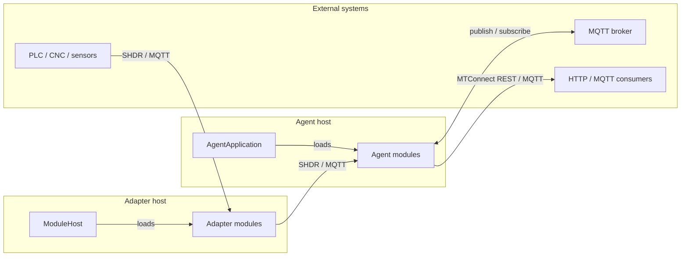

# Modules

`MTConnect.NET` ships an extensible agent and an extensible adapter. The runtime behavior each one exposes is composed from **modules** — small, independently configured units loaded on startup from the host's `agent.config.yaml` (for agent modules) or `adapter.config.yaml` (for adapter modules). A module's identifier is the YAML key under `modules:`; a module's configuration is the YAML map under that key.

This section catalogs every shipped module — its purpose, its configuration knobs, the wire interaction it owns, an example configuration block, and where to look when it misbehaves.

## How modules plug in

Every agent module derives from `MTConnectAgentModule` (under `MTConnect.Modules`) and is registered via a `ConfigurationTypeId` const that matches the YAML key. Every adapter module derives from `MTConnectAdapterModule` and is registered the same way. The host application instantiates one module per YAML entry, passing the deserialized configuration map; the module owns its own startup, shutdown, and reconnection lifecycle.

## Agent modules — shipped

These six modules ship under `agent/Modules/MTConnect.NET-AgentModule-*` and load into the standalone agent application (`MTConnect.NET-Agent` / `MTConnect.NET-Agent-Application`). Each one is also available as a standalone NuGet package for embedding in a custom agent host.

| Module | YAML key | Purpose |
| --- | --- | --- |
| [HTTP server](./http-server) | `http-server` | Serves the MTConnect REST protocol (Probe / Current / Sample / Asset) over HTTP / HTTPS. |
| [MQTT broker](./mqtt-broker) | `mqtt-broker` | Hosts an embedded MQTT broker that publishes the agent's documents and entities. |
| [MQTT relay](./mqtt-relay) | `mqtt-relay` | Publishes the agent's documents and entities to an external MQTT broker. |
| [MQTT adapter](./mqtt-adapter) | `mqtt-adapter` | Subscribes to an external MQTT broker and feeds observations into the agent. |
| [HTTP adapter](./http-adapter) | `http-adapter` | Polls or streams from another MTConnect agent's HTTP endpoints and feeds the observations into the local agent. |
| [SHDR adapter](./shdr-adapter) | `shdr-adapter` | Reads SHDR-protocol input from one or more SHDR adapters and feeds observations into the agent. |

## Adapter modules — shipped

These two modules ship under `adapter/Modules/MTConnect.NET-AdapterModule-*` and load into the standalone adapter application (`MTConnect.NET-Adapter` / `MTConnect.NET-Adapter-Application`).

| Module | YAML key | Purpose |
| --- | --- | --- |
| [SHDR output](./shdr-output) | `shdr` | Hosts an SHDR-protocol server that an MTConnect agent's `shdr-adapter` module connects to. |
| [MQTT output](./mqtt-output) | `mqtt` | Publishes adapter input data to an MQTT broker that an MTConnect agent's `mqtt-adapter` module subscribes to. |

## Reading a module page

Each page has the same structure:

- **Identifier** — the YAML key the host application matches against (set on the module's `ConfigurationTypeId` constant).
- **Purpose** — one paragraph stating what the module does and where it sits in the data path.
- **Configuration schema** — every property the module's configuration class exposes, with type, default, and permissible values.
- **Wire interaction** — a Mermaid sequence diagram showing how the module connects to the agent core and the external world.
- **Example configuration** — a complete YAML block you can drop into the host's config file.
- **Troubleshooting pointers** — links to the [Troubleshooting](/troubleshooting/) section for the failure modes specific to that module.
- **API reference** — links to the [API reference](/api/) for the module's configuration and runtime classes.

## Combining modules

Modules are independent — load none, load one, load several. A common deployment loads `http-server` plus `mqtt-relay` plus `shdr-adapter` so the agent serves REST, publishes to an external broker, and ingests from an SHDR-protocol source in the same process. The host invokes each module's start hook in declaration order and stops them in reverse order on shutdown.
