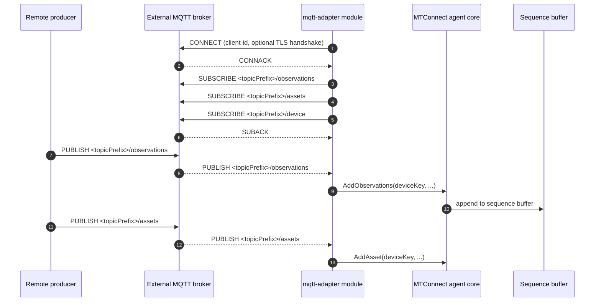

# MQTT adapter

- **Module name** — MTConnect MQTT Adapter agent module
- **Identifier** — `mqtt-adapter`
- **NuGet package** — `MTConnect.NET-AgentModule-MqttAdapter`
- **Source path** — `agent/Modules/MTConnect.NET-AgentModule-MqttAdapter/`

## Purpose

Subscribes to an external MQTT broker and feeds the received observations, assets, and device payloads into the agent. This is the agent-side counterpart to the [MQTT output adapter module](./mqtt-output) — together they form an MQTT-mediated bridge between a remote adapter and the agent.

::: warning Module status
This module is under development and may be deprecated in a future release. Please file feedback or issues on the public GitHub tracker.
:::

## Configuration schema

The module's configuration class is `MqttAdapterModuleConfiguration`. The keys below describe the YAML map under `mqtt-adapter:`.

| Key | Type | Default | Permissible values | Notes |
| --- | --- | --- | --- | --- |
| `server` | string | `localhost` | hostname, IP, or fully qualified domain name | The hostname of the MQTT broker to subscribe to. |
| `port` | int | `1883` | 1-65535 | The broker's MQTT port. |
| `timeout` | int | `5000` | milliseconds | Connection and read / write timeout. |
| `reconnectInterval` | int | `10000` | milliseconds | Delay between reconnect attempts after a disconnect. |
| `username` | string | `null` | any | Username for username + password authentication. |
| `password` | string | `null` | any | Password for username + password authentication. |
| `clientId` | string | `null` (auto-generated) | any MQTT client-id string | Client identifier presented to the broker. |
| `cleanSession` | bool | `true` | `true`, `false` | Sets the MQTT clean-session flag. |
| `qos` | int | `1` | `0` (at-most-once), `1` (at-least-once), `2` (exactly-once) | The QoS level requested on subscriptions. |
| `useTls` | bool | `false` | `true`, `false` | Switches the connection to TLS (mqtts). |
| `certificateAuthority` | string | `null` | filesystem path | Path to the CA certificate file. |
| `pemCertificate` | string | `null` | filesystem path | Path to the PEM client-certificate file. |
| `pemPrivateKey` | string | `null` | filesystem path | Path to the PEM private-key file. |
| `allowUntrustedCertificates` | bool | `false` | `true`, `false` | Disables certificate-chain verification (development only). |
| `topicPrefix` | string | `null` | any MQTT-valid topic prefix | The topic prefix the module subscribes to. |
| `deviceKey` | string | `null` | device name or UUID | Identifies which Device in `Devices.xml` the incoming payloads target. |
| `documentFormat` | string | `json` | `XML`, `JSON`, `JSON-cppAgent` | The document format the broker payloads are encoded in. |

### Subscribed topics

With `topicPrefix: input`, the module subscribes to:

- `input/observations` — observation payloads.
- `input/assets` — asset payloads.
- `input/device` — device-model payloads.

## Wire interaction



## Example configuration

```yaml
modules:
  - mqtt-adapter:
      server: broker.example.com
      port: 1883
      topicPrefix: input
      deviceKey: M12346
      qos: 1
      cleanSession: true
      reconnectInterval: 10000
      documentFormat: json
```

For a TLS-secured broker with mutual TLS:

```yaml
modules:
  - mqtt-adapter:
      server: broker.example.com
      port: 8883
      useTls: true
      certificateAuthority: /etc/mtconnect/certs/rootCA.pem
      pemCertificate: /etc/mtconnect/certs/agent.pem
      pemPrivateKey: /etc/mtconnect/certs/agent.key
      topicPrefix: input
      deviceKey: M12346
```

## Troubleshooting

- **MQTT TLS handshake failures** — see [MQTT TLS handshake failures](/troubleshooting/#mqtt-tls-handshake-failures).
- **`deviceKey` mismatch** — the value must match a `Device@name` or `Device@uuid` in the agent's `Devices.xml`. A mismatch causes the agent to drop the inbound observations silently; verify with the `/probe` endpoint that the device is present.
- **Payload-format mismatch** — `documentFormat` must match the encoding the remote producer publishes. The remote can be the [MQTT output adapter module](./mqtt-output), which publishes JSON.

## API reference

- [`MqttAdapterModuleConfiguration`](/api/) — the module's configuration class.
- [`MqttClientConfiguration`](/api/) — the base MQTT client configuration shape.
