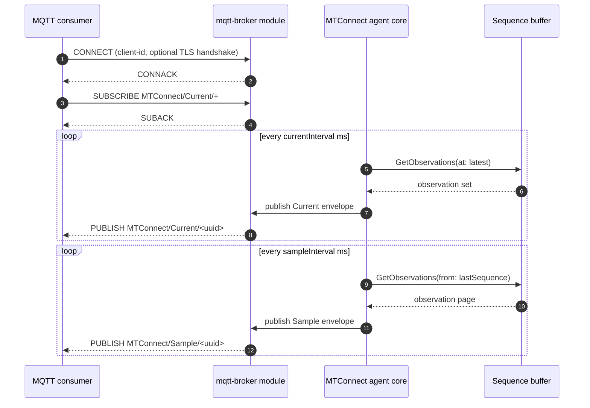

# MQTT broker

- **Module name** — MTConnect MQTT Broker agent module
- **Identifier** — `mqtt-broker`
- **NuGet package** — `MTConnect.NET-AgentModule-MqttBroker`
- **Source path** — `agent/Modules/MTConnect.NET-AgentModule-MqttBroker/`

## Purpose

Hosts an **embedded** MQTT broker inside the agent process. The broker accepts subscriptions from consumers and publishes the agent's documents (Probe / Current / Sample / Asset) and entities (per-DataItem observations) on the topic tree rooted at `topicPrefix`. Use this module when consumers should connect directly to the agent over MQTT without a separate broker deployment; use the [MQTT relay](./mqtt-relay) module when the agent should publish to an external broker instead.

## Configuration schema

The module's configuration class is `MqttBrokerModuleConfiguration`. The keys below describe the YAML map under `mqtt-broker:`.

| Key | Type | Default | Permissible values | Notes |
| --- | --- | --- | --- | --- |
| `server` | string | `null` (binds to all interfaces) | hostname or IP address | The hostname or IP address the embedded broker binds to. |
| `port` | int | `1883` | 1-65535 | The TCP port the embedded broker listens on. `8883` is conventional for TLS. |
| `tls` | map | `null` | see the [HTTP server's `tls` schema](./http-server#tls-schema) | TLS configuration; presence switches the listener to mqtts. |
| `timeout` | int | `5000` | milliseconds | The timeout applied to client connection and read / write operations. |
| `initialDelay` | int | `500` | milliseconds | Delay between module start and broker bind, giving the OS time to release the TCP port from a previous run. |
| `restartInterval` | int | `5000` | milliseconds | Delay between broker-start retries after a bind failure. |
| `qos` | int | `0` | `0` (at-most-once), `1` (at-least-once), `2` (exactly-once) | The QoS level the broker publishes at. |
| `topicPrefix` | string | `MTConnect` | any MQTT-valid topic prefix | Root of the topic tree the broker publishes on. |
| `topicStructure` | enum | `Document` | `Document`, `Entity` | Selects per-document publication (`Document`) or per-DataItem publication (`Entity`). |
| `documentFormat` | string | `json-cppagent` | `XML`, `JSON`, `JSON-cppAgent` | The document format used for the published payloads. |
| `indentOutput` | bool | `false` | `true`, `false` | Indents the payload for readability (raises bytes-on-wire). |
| `currentInterval` | int | `5000` | milliseconds | The interval at which Current envelopes are republished. |
| `sampleInterval` | int | `500` | milliseconds | The interval at which Sample envelopes are republished. |

### Topic tree

With `topicPrefix: MTConnect` and `topicStructure: Document`, the broker publishes on:

- `MTConnect/Probe/<deviceUuid>` — the Probe envelope.
- `MTConnect/Current/<deviceUuid>` — the Current envelope, republished every `currentInterval` ms.
- `MTConnect/Sample/<deviceUuid>` — the Sample envelope, republished every `sampleInterval` ms.
- `MTConnect/Asset/<deviceUuid>/<assetId>` — per-asset payloads.

With `topicStructure: Entity` the broker publishes per-DataItem on `MTConnect/Observations/<deviceUuid>/<componentId>/<dataItemId>` instead.

## Wire interaction



## Example configuration

```yaml
modules:
  - mqtt-broker:
      server: 0.0.0.0
      port: 1883
      topicPrefix: MTConnect
      topicStructure: Document
      documentFormat: json-cppagent
      indentOutput: false
      qos: 1
      currentInterval: 5000
      sampleInterval: 500
      timeout: 5000
      initialDelay: 500
      restartInterval: 5000
```

For TLS-secured broker access:

```yaml
modules:
  - mqtt-broker:
      port: 8883
      topicPrefix: MTConnect
      tls:
        pem:
          certificatePath: /etc/mtconnect/certs/broker.pem
          privateKeyPath: /etc/mtconnect/certs/broker.key
          certificateAuthority: /etc/mtconnect/certs/rootCA.pem
        verifyClientCertificate: true
```

## Troubleshooting

- **Bind failures** — the embedded broker shares the TCP port with no other process. If the port is already in use the module retries every `restartInterval` ms; raise `initialDelay` if a previous run's socket is in `TIME_WAIT`.
- **MQTT TLS handshake failures** — see [MQTT TLS handshake failures](/troubleshooting/#mqtt-tls-handshake-failures).
- **Document format selection** — `json-cppagent` is byte-for-byte cppagent-parity for v2 envelopes; `XML` is the wire format defined by the MTConnect REST protocol; `JSON` is the legacy v1 JSON shape.

## API reference

- [`MqttBrokerModuleConfiguration`](/api/) — the module's configuration class.
- [`MqttTopicStructure`](/api/) — the `Document` / `Entity` enum.
- [`IMTConnectMqttDocumentServerConfiguration`](/api/) — the configuration interface this module implements.
- [`TlsConfiguration`](/api/) — the TLS configuration schema.
