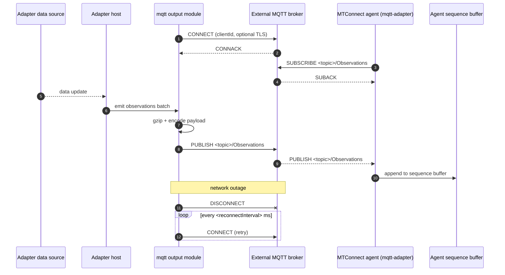

# MQTT output (adapter module)

- **Module name** — MTConnect MQTT adapter module (adapter-side)
- **Identifier** — `mqtt`
- **NuGet package** — `MTConnect.NET-AdapterModule-MQTT`
- **Source path** — `adapter/Modules/MTConnect.NET-AdapterModule-MQTT/`

## Purpose

Publishes the adapter's observation values to an MQTT broker. An MTConnect agent's [`mqtt-adapter`](./mqtt-adapter) module subscribes to the same broker and forwards the observations into the agent. Use this transport when the adapter and the agent sit on opposite sides of a network boundary that does not allow direct TCP connections, or when a centralized broker already mediates the deployment's data movement.

::: warning Module status
This module is under development and may be deprecated in a future release. Please file feedback or issues on the public GitHub tracker.
:::

## Configuration schema

The module's configuration class is `ModuleConfiguration` (under `MTConnect.Configurations` in the `MTConnect.NET-AdapterModule-MQTT` assembly). The keys below describe the YAML map under `mqtt:`.

| Key | Type | Default | Permissible values | Notes |
| --- | --- | --- | --- | --- |
| `server` | string | `localhost` | hostname, IP, or fully qualified domain name | The MQTT broker's address. |
| `port` | int | `7878` | 1-65535 | The MQTT broker's port. `1883` for plaintext, `8883` for TLS — the default `7878` matches the SHDR convention rather than the MQTT convention and is typically overridden. |
| `username` | string | `null` | any | Username for username + password authentication. |
| `password` | string | `null` | any | Password for username + password authentication. |
| `clientId` | string | `null` (auto-generated) | any MQTT client-id string | Client identifier presented to the broker. |
| `qos` | int | `0` | `0` (at-most-once), `1` (at-least-once), `2` (exactly-once) | The QoS level used on every publish. |
| `useTls` | bool | `false` | `true`, `false` | Switches the connection to TLS (mqtts). |
| `certificateAuthority` | string | `null` | filesystem path | Path to the CA certificate. |
| `pemCertificate` | string | `null` | filesystem path | Path to the PEM client-certificate file. |
| `pemPrivateKey` | string | `null` | filesystem path | Path to the PEM private-key file. |
| `allowUntrustedCertificates` | bool | `false` | `true`, `false` | Disables certificate-chain verification (development only). |
| `connectionTimeout` | int | `5000` | milliseconds | Connection and read / write timeout. |
| `reconnectInterval` | int | `10000` | milliseconds | Delay between reconnect attempts after a disconnect. |
| `topic` | string | `null` | any MQTT-valid topic | Root topic the module publishes on; observation payloads land at `<topic>/Observations`. |
| `deviceKey` | string | `null` | device name or UUID | Identifies which Device the published observations target. |
| `documentFormat` | string | `json` | `XML`, `JSON`, `JSON-cppAgent` | The document format used for the published payloads. |

## Payload shape

Payloads are gzip-compressed and published on `<topic>/Observations`. The default JSON shape:

```json
[
  {
    "timestamp": "2024-05-13T23:15:01.7754921Z",
    "observations": [
      {
        "dataItemKey": "avail",
        "values": { "result": "AVAILABLE" }
      },
      {
        "dataItemKey": "estop",
        "values": { "result": "ARMED" }
      },
      {
        "dataItemKey": "system",
        "values": {
          "level": "WARNING",
          "nativeCode": "404"
        }
      }
    ]
  }
]
```

DATA_SET and TABLE observations use the same shape with structured values:

```json
{
  "dataItemKey": "vars",
  "values": {
    "DATASET[E100]": "12.123",
    "DATASET[E101]": "6574"
  }
}
```

```json
{
  "dataItemKey": "toolTable",
  "values": {
    "TABLE[T1][LENGTH]": "142.654",
    "TABLE[T1][DIAMETER]": "12.496"
  }
}
```

## Wire interaction



## Example configuration

```yaml
modules:
  - mqtt:
      server: broker.example.com
      port: 1883
      topic: MTConnect/Input
      deviceKey: M12346
      documentFormat: json
```

For TLS with username + password:

```yaml
modules:
  - mqtt:
      server: broker.example.com
      port: 8883
      useTls: true
      username: adapter
      password: changeme
      topic: MTConnect/Input
      deviceKey: M12346
```

For mutual TLS (AWS IoT shape):

```yaml
modules:
  - mqtt:
      server: a1b2c3d4-ats.iot.us-east-1.amazonaws.com
      port: 8883
      certificateAuthority: certs/AmazonRootCA1.pem
      pemCertificate: certs/adapter-certificate.pem.crt
      pemPrivateKey: certs/adapter-private.pem.key
      topic: MTConnect/Input
      deviceKey: M12346
```

## Troubleshooting

- **MQTT TLS handshake failures** — see [MQTT TLS handshake failures](/troubleshooting/#mqtt-tls-handshake-failures).
- **Topic mismatch** — the adapter's `topic` and the agent's `mqtt-adapter` `topicPrefix` must align. Conventionally the agent subscribes to `<topic>` and the adapter publishes at `<topic>/Observations`; verify against the agent module's [subscribed topics](./mqtt-adapter#subscribed-topics) list.
- **Compression failures** — payloads are gzip-compressed; an agent that subscribes to the topic without gzip-decoding will see opaque binary. The agent's `mqtt-adapter` module handles gzip transparently.
- **Reconnect loops** indicate broker-side rejection (bad credentials, malformed client-id, IP not allow-listed); enable verbose adapter logging to surface the CONNACK reason code.

## API reference

- [`ModuleConfiguration`](/api/) — the adapter-side MQTT module configuration class (under `MTConnect.Configurations` in the `MTConnect.NET-AdapterModule-MQTT` assembly).
- [`MTConnectAdapterModule`](/api/) — the base class adapter modules derive from.
