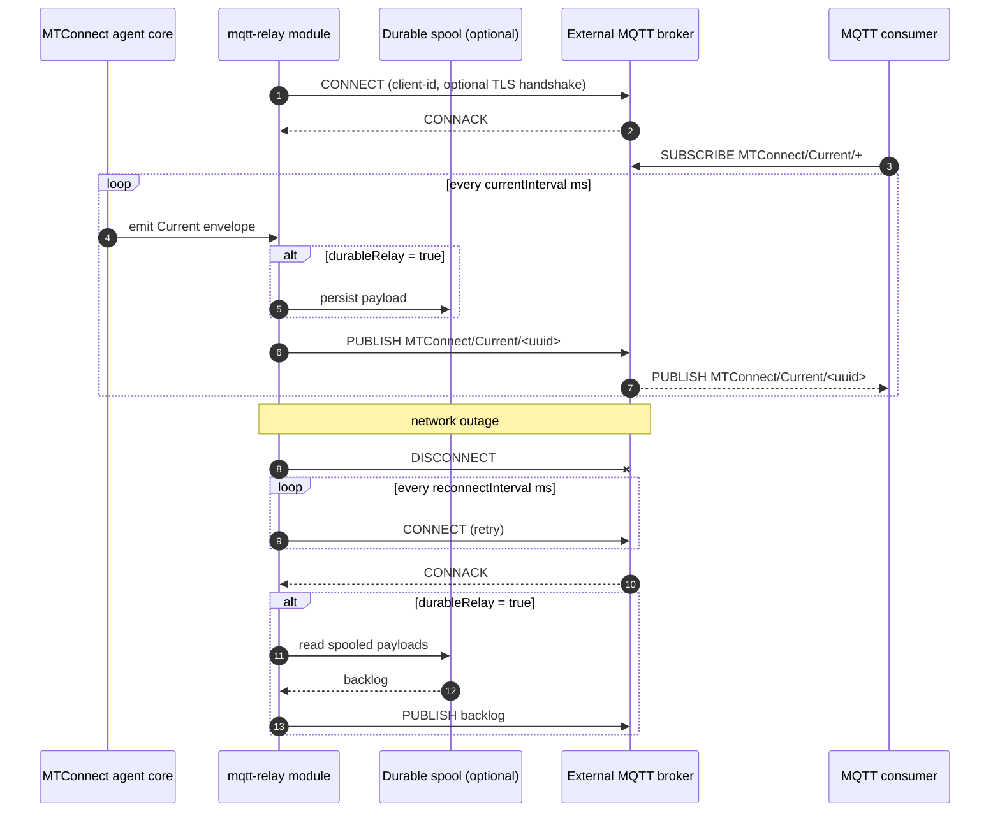

# MQTT relay

- **Module name** — MTConnect MQTT Relay agent module
- **Identifier** — `mqtt-relay`
- **NuGet package** — `MTConnect.NET-AgentModule-MqttRelay`
- **Source path** — `agent/Modules/MTConnect.NET-AgentModule-MqttRelay/`

## Purpose

Publishes the agent's documents (Probe / Current / Sample / Asset) to an **external** MQTT broker. Use this module when consumers should connect to a centralized broker (AWS IoT, HiveMQ, Mosquitto, etc.) rather than directly to the agent process. The module connects to the broker as an MQTT client, reconnects on disconnect, and (optionally) persists unsent observations to disk so a network outage does not drop history.

## Configuration schema

The module's configuration class is `MqttRelayModuleConfiguration`. The keys below describe the YAML map under `mqtt-relay:`.

| Key | Type | Default | Permissible values | Notes |
| --- | --- | --- | --- | --- |
| `server` | string | `localhost` | hostname, IP, or fully qualified domain name | The hostname of the external MQTT broker. |
| `port` | int | `1883` | 1-65535 | The broker's MQTT port. `8883` is conventional for TLS. |
| `timeout` | int | `5000` | milliseconds | Connection and read / write timeout. |
| `reconnectInterval` | int | `10000` | milliseconds | Delay between reconnect attempts after a disconnect. |
| `username` | string | `null` | any | Username for username + password authentication. |
| `password` | string | `null` | any | Password for username + password authentication. |
| `useTls` | bool | `false` | `true`, `false` | Switches the connection to TLS (mqtts). |
| `clientId` | string | `null` (auto-generated) | any MQTT client-id string | Client identifier presented to the broker. |
| `cleanSession` | bool | `false` | `true`, `false` | Sets the MQTT clean-session flag. |
| `qos` | int | `0` | `0` (at-most-once), `1` (at-least-once), `2` (exactly-once) | The QoS level used on every publish. |
| `tls` | map | `null` | see the [HTTP server's `tls` schema](./http-server#tls-schema) | TLS settings (client certificate, CA chain, mutual-TLS toggle). |
| `topicPrefix` | string | `MTConnect` | any MQTT-valid topic prefix | Root of the topic tree the module publishes on. |
| `topicStructure` | enum | `Document` | `Document`, `Entity` | Selects per-document publication or per-DataItem publication. |
| `documentFormat` | string | `json-cppAgent` | `XML`, `JSON`, `JSON-cppAgent` | The document format used for the published payloads. |
| `indentOutput` | bool | `false` | `true`, `false` | Indents the payload for readability. |
| `currentInterval` | int | `5000` | milliseconds | The interval at which Current envelopes are republished. |
| `sampleInterval` | int | `500` | milliseconds | The interval at which Sample envelopes are republished. |
| `durableRelay` | bool | `false` | `true`, `false` | When `true`, the module persists unsent observations to disk and replays them after a reconnect, so observations from a broker outage are not lost. |

## Wire interaction



## Example configuration

```yaml
modules:
  - mqtt-relay:
      server: broker.example.com
      port: 1883
      topicPrefix: enterprise/site/area/line/cell/MTConnect
      topicStructure: Document
      documentFormat: json-cppagent
      currentInterval: 5000
      sampleInterval: 500
      reconnectInterval: 10000
      qos: 1
      durableRelay: true
```

For AWS IoT (mutual-TLS over port 8883):

```yaml
modules:
  - mqtt-relay:
      server: a1b2c3d4e5f6g7-ats.iot.us-east-1.amazonaws.com
      port: 8883
      clientId: mtconnect-agent-01
      tls:
        pem:
          certificateAuthority: certs/AmazonRootCA1.pem
          certificatePath: certs/agent-certificate.pem.crt
          privateKeyPath: certs/agent-private.pem.key
      documentFormat: json-cppagent
      currentInterval: 5000
      sampleInterval: 500
      topicPrefix: enterprise/site/area/line/cell/MTConnect
```

For HiveMQ Cloud (username + password over TLS):

```yaml
modules:
  - mqtt-relay:
      server: a1b2c3d4e5f6.s1.eu.hivemq.cloud
      port: 8883
      username: mtconnect
      password: changeme
      useTls: true
      documentFormat: json-cppagent
      currentInterval: 5000
      sampleInterval: 500
      topicPrefix: enterprise/site/area/line/cell/MTConnect
```

## Troubleshooting

- **MQTT TLS handshake failures** — see [MQTT TLS handshake failures](/troubleshooting/#mqtt-tls-handshake-failures). The most common cause is a CA path that the agent cannot read or that does not chain to the broker's certificate.
- **Reconnect loops** — when the broker rejects the connection (bad credentials, malformed client-id, IP not allow-listed), the module retries every `reconnectInterval` ms. Lower the interval during diagnostic runs so the error appears more frequently in the log.
- **`durableRelay` backlog growth** — disk usage scales with the broker outage window. Monitor the spool directory and provision enough disk for the longest expected outage.
- **AWS IoT-specific** integration walkthroughs live under [Configure & Use / Integrations](/configure/).

## API reference

- [`MqttRelayModuleConfiguration`](/api/) — the module's configuration class.
- [`MqttTopicStructure`](/api/) — the `Document` / `Entity` enum.
- [`IMTConnectMqttDocumentServerConfiguration`](/api/) — the configuration interface this module implements.
- [`TlsConfiguration`](/api/) — the TLS configuration schema.
