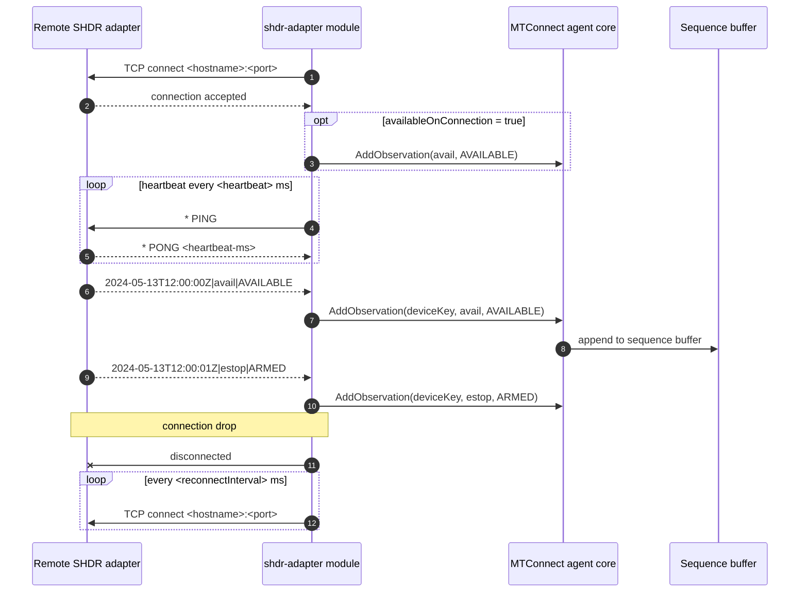

# SHDR adapter

- **Module name** — MTConnect SHDR Adapter agent module
- **Identifier** — `shdr-adapter`
- **NuGet package** — `MTConnect.NET-AgentModule-ShdrAdapter`
- **Source path** — `agent/Modules/MTConnect.NET-AgentModule-ShdrAdapter/`

## Purpose

Opens a TCP connection to an SHDR-protocol adapter (typically a piece of equipment exposing the SHDR protocol over a port) and feeds the received observations into the agent. SHDR is the original MTConnect ingestion protocol — line-oriented, pipe-delimited, optimized for streaming small observations from a PLC. This module is the most common adapter-side ingestion path in MTConnect deployments.

## Configuration schema

The module's configuration class is `ShdrAdapterModuleConfiguration` (it derives from `ShdrAdapterClientConfiguration`, which derives from `ShdrClientConfiguration`). The keys below describe the YAML map under `shdr-adapter:`.

| Key | Type | Default | Permissible values | Notes |
| --- | --- | --- | --- | --- |
| `deviceKey` | string | `null` | device name or UUID | Matches the `Device@name` or `Device@uuid` in `Devices.xml` the inbound observations target. |
| `hostname` | string | `localhost` | hostname or IP address | The remote SHDR adapter's address. |
| `port` | int | `7878` | 1-65535 | The remote SHDR adapter's TCP port. |
| `heartbeat` | int | `10000` | milliseconds | Interval at which the module sends `* PING` keep-alive frames. |
| `connectionTimeout` | int | `5000` | milliseconds | Silence threshold (for legacy adapters that do not support heartbeats) before disconnect. Ignored when heartbeats are present. |
| `reconnectInterval` | int | `10000` | milliseconds | Delay between reconnect attempts after a disconnect. |
| `allowShdrDevice` | bool | `false` | `true`, `false` | When `true`, a `* device` frame from the adapter is accepted as a device-model update. |
| `availableOnConnection` | bool | `false` | `true`, `false` | For devices that do not emit their own availability event, setting this `true` sets `Availability = AVAILABLE` when the TCP connection comes up. |
| `convertUnits` | bool | `true` | `true`, `false` | Whether the agent converts the adapter's values to the DataItem's declared units. Set `false` if the adapter has already converted. |
| `ignoreObservationCase` | bool | `true` | `true`, `false` | Whether the agent ignores case when matching incoming string observations against the DataItem's enumerated values. |
| `ignoreTimestamps` | bool | `false` | `true`, `false` | When `true`, the agent stamps the observation with its own clock instead of trusting the adapter's timestamp. Corrects adapter clock drift at the cost of network-latency error. |
| `outputConnectionInformation` | bool | `true` | `true`, `false` | Emits the adapter's host / port as an observation. |
| `ignoreHeartbeatOnChange` | bool | `true` | `true`, `false` | When `true`, the heartbeat `PING` is suppressed if any data has been received within the heartbeat window. |

## Wire interaction



## Example configuration

```yaml
modules:
  - shdr-adapter:
      deviceKey: M12346
      hostname: 192.168.1.50
      port: 7878
      heartbeat: 10000
      reconnectInterval: 10000
      availableOnConnection: true
      ignoreTimestamps: false
      convertUnits: true
```

For a legacy SHDR adapter that does not respond to `PING`:

```yaml
modules:
  - shdr-adapter:
      deviceKey: M12346
      hostname: 192.168.1.50
      port: 7878
      connectionTimeout: 5000
      ignoreHeartbeatOnChange: false
      heartbeat: 0
```

For multiple adapters, declare the module several times — each entry connects to a different remote adapter:

```yaml
modules:
  - shdr-adapter:
      deviceKey: M12346
      hostname: 192.168.1.50
      port: 7878
  - shdr-adapter:
      deviceKey: M67890
      hostname: 192.168.1.51
      port: 7878
```

## Troubleshooting

- **Empty `name` attributes on probe DataItems** — see [Empty `name` attributes on probe DataItems](/troubleshooting/#empty-name-attributes-on-probe-dataitems). The SHDR protocol does not transmit DataItem metadata; the `name` attribute must exist in the agent's `Devices.xml`.
- **Asset count emitted as a scalar EVENT instead of DATA_SET** — see [Asset count emitted as scalar](/troubleshooting/#asset-count-emitted-as-a-scalar-event-instead-of-a-data_set).
- **Clock drift** — set `ignoreTimestamps: true` if the adapter's system clock cannot be kept in sync.
- **Heartbeat tuning** — set `heartbeat: 0` to disable heartbeats entirely and rely on `connectionTimeout` only. This is rarely the right choice but is required for adapters that mis-handle `PING`.
- **`deviceKey` mismatch** drops observations silently; verify against `/probe` output before declaring the deployment working.

## API reference

- [`ShdrAdapterModuleConfiguration`](/api/) — the module's configuration class.
- [`ShdrAdapterClientConfiguration`](/api/) — the base SHDR adapter-client configuration shape.
- [`ShdrClientConfiguration`](/api/) — the SHDR client configuration shape.
