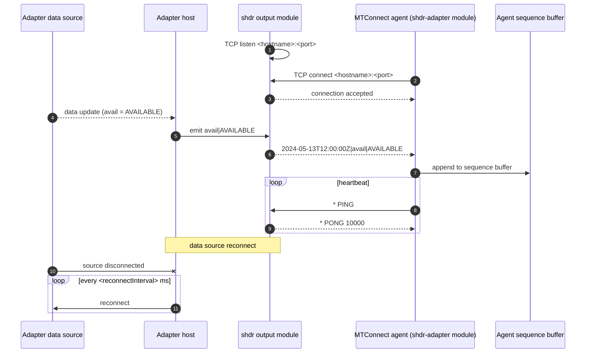

# SHDR output (adapter module)

- **Module name** — MTConnect SHDR adapter module (adapter-side)
- **Identifier** — `shdr`
- **NuGet package** — `MTConnect.NET-AdapterModule-SHDR`
- **Source path** — `adapter/Modules/MTConnect.NET-AdapterModule-SHDR/`

## Purpose

Hosts an SHDR-protocol TCP server on the adapter host. The adapter publishes observation values it has read from its data source (PLC, CNC, sensor, simulator, etc.) to this server; an MTConnect agent's [`shdr-adapter`](./shdr-adapter) module connects to it and forwards the observations into the agent. This is the canonical adapter-to-agent transport in MTConnect deployments — line-oriented, pipe-delimited, low-latency.

## Configuration schema

The module's configuration class is `ModuleConfiguration` (under `MTConnect.Configurations` in the `MTConnect.NET-AdapterModule-SHDR` assembly). The keys below describe the YAML map under `shdr:`.

| Key | Type | Default | Permissible values | Notes |
| --- | --- | --- | --- | --- |
| `hostname` | string | `localhost` | hostname or IP address | The address the SHDR server binds to. `localhost` accepts loopback only; set to `0.0.0.0` to accept from any interface. |
| `port` | int | `7878` | 1-65535 | The TCP port the SHDR server listens on. `7878` is the conventional MTConnect SHDR port. |
| `heartbeat` | int | `10000` | milliseconds | The heartbeat interval advertised in the server's `* PONG` response. |
| `connectionTimeout` | int | `5000` | milliseconds | Silence threshold (for legacy clients that do not heartbeat) before disconnecting the client. Ignored when the client heartbeats. |
| `reconnectInterval` | int | `10000` | milliseconds | Delay between adapter-source reconnection attempts. |
| `timeZoneOutput` | string | `Z` | IANA TZ identifier or fixed offset (`Z`, `+05:30`, etc.) | The time-zone identifier appended to outbound timestamps. `Z` is UTC. |
| `deviceKey` | string | (none) | device name or UUID | Identifies which Device the observations target. Required for the agent's `shdr-adapter` to bind incoming observations. |

::: tip Adapter-host vs module config
The `shdr` module is loaded by the adapter host's `adapter.config.yaml`. Some adapter-host implementations expose a top-level `deviceKey` rather than a per-module one — check the adapter-host's documentation for whether the key sits on the module entry or on the surrounding `adapter:` block.
:::

## Wire interaction



## Example configuration

```yaml
modules:
  - shdr:
      hostname: 0.0.0.0
      port: 7878
      heartbeat: 10000
      connectionTimeout: 5000
      reconnectInterval: 10000
      timeZoneOutput: Z
```

For multiple SHDR endpoints on a single adapter host, declare the module several times — each entry binds a different port:

```yaml
modules:
  - shdr:
      port: 7878
      deviceKey: M12346
  - shdr:
      port: 7879
      deviceKey: M67890
```

## Troubleshooting

- **Port already in use** — pick a different `port`. The MTConnect SHDR spec does not mandate `7878`; conventionally many CNC adapters use it.
- **Agent shows the device as `UNAVAILABLE`** — the adapter-side module must be connected to a data source, and the data source must publish an `avail` observation (or set `availableOnConnection: true` on the agent's `shdr-adapter` to default to `AVAILABLE` whenever the TCP connection is up).
- **Time-zone offset mismatch** — the `timeZoneOutput` of the adapter and the timestamp parsing in the agent must agree. `Z` (UTC) is the safest default.
- **Asset count emitted as scalar EVENT** — see [Asset count emitted as scalar](/troubleshooting/#asset-count-emitted-as-a-scalar-event-instead-of-a-data_set); the adapter must emit asset counts as `DATA_SET` observations.

## API reference

- [`ModuleConfiguration`](/api/) — the adapter-side SHDR module configuration class (under `MTConnect.Configurations` in the `MTConnect.NET-AdapterModule-SHDR` assembly).
- [`MTConnectAdapterModule`](/api/) — the base class adapter modules derive from.
