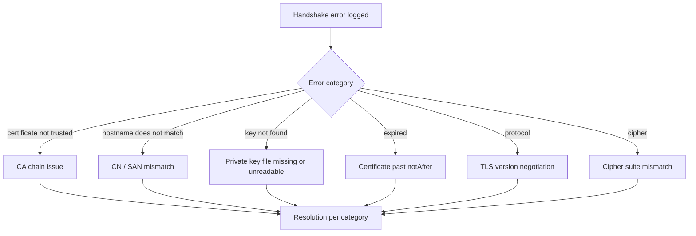

# MQTT TLS handshake failures

The `mqtt-relay`, `mqtt-broker`, and `mqtt-adapter` modules each support TLS termination through the shared [`TlsConfiguration`](/api/MTConnect.Tls/TlsConfiguration) class. When the TLS handshake fails, the agent logs a structured error and refuses to publish or subscribe. This page documents the common handshake failures and the resolution path for each.

## Symptoms

A failed TLS handshake typically surfaces as:

- The relay logs `[ERR] MQTT TLS handshake failed: <reason>`.
- The relay reconnect loop spins (every `reconnectInterval` ms the same failure repeats).
- A subscriber connecting through the same broker fails with the same error.
- A `mosquitto_sub -h <broker> -p 8883` from a known-good client fails too, confirming the broker side.

The shipped relay surfaces enough detail in the log to map directly to the root cause; this page indexes the most common error messages.

## Diagnostic flow



## Category 1: certificate not trusted

**Log**:

```text
[ERR] MQTT TLS handshake failed: The remote certificate is invalid according to the validation procedure.
```

**Cause**: the agent's TLS client cannot validate the broker's certificate chain against any root CA it trusts. Either the broker is using a self-signed certificate the agent has not been told about, or the broker's certificate was issued by a private CA the agent does not have in its trust store.

**Fix**: configure the `tls.pem.certificateAuthority` to point at the CA's PEM file:

```yaml
modules:
- mqtt-relay:
    server: broker.example.com
    port: 8883
    useTls: true
    tls:
      pem:
        certificateAuthority: /etc/mtconnect/ca.crt
        certificatePath: /etc/mtconnect/agent.crt
        privateKeyPath: /etc/mtconnect/agent.key
        privateKeyPassword: <secret>
```

The `certificateAuthority` file is appended to the platform trust store for the duration of the relay's connection. For brokers using a public CA (Let's Encrypt, DigiCert, etc.), the platform trust store already trusts the root and the `certificateAuthority` key can be omitted entirely.

## Category 2: hostname does not match

**Log**:

```text
[ERR] MQTT TLS handshake failed: The remote certificate is invalid because of errors in the certificate chain: PartialChain
```

or

```text
[ERR] MQTT TLS handshake failed: The certificate's hostname does not match the requested server name.
```

**Cause**: the certificate's CN / SAN list does not include the hostname the relay is connecting to. A certificate issued for `broker.example.com` does not validate a connection to `192.168.1.50`.

**Fix**: connect to the broker by the hostname listed in the certificate. If the broker has multiple addresses (IP + hostname), use the hostname:

```yaml
- mqtt-relay:
    server: broker.example.com   # not 192.168.1.50
    port: 8883
```

For development against a self-signed certificate that you trust, the [OpenSSL](/configure/integrations/openssl) integration page walks through re-issuing the certificate with the right SAN entries.

## Category 3: private key file missing or unreadable

**Log**:

```text
[ERR] MQTT TLS handshake failed: Could not load private key from /etc/mtconnect/agent.key.
```

**Cause**: the agent's TLS client uses a client certificate (mutual TLS), and the corresponding private key file is either missing or not readable by the agent's process user.

**Fix**:

1. Confirm the file exists at the configured `privateKeyPath`.
2. Confirm the agent's process user has read permission on it: `ls -la /etc/mtconnect/agent.key`. The file is typically `0600` owned by the agent's user.
3. Confirm the `privateKeyPassword` is correct if the key is encrypted.

## Category 4: certificate expired

**Log**:

```text
[ERR] MQTT TLS handshake failed: The remote certificate is invalid: certificate has expired.
```

**Cause**: the broker's certificate (or the agent's client certificate) is past its `notAfter` date.

**Fix**:

1. Inspect the certificate's validity window: `openssl x509 -in broker.crt -noout -dates`.
2. Renew the certificate. For Let's Encrypt-issued certs, the broker's renewal hook should run automatically; for private CAs, re-issue and re-deploy.
3. Restart the relay (or wait for the next `reconnectInterval` to elapse) so the new certificate is loaded.

## Category 5: TLS version negotiation

**Log**:

```text
[ERR] MQTT TLS handshake failed: Authentication failed because the remote party has closed the transport stream.
```

**Cause**: the broker accepts only TLS 1.2+ and the agent's runtime defaults to a lower version, or vice versa. .NET 6+ defaults to TLS 1.2 / 1.3 negotiation; older runtimes may default to TLS 1.0 / 1.1.

**Fix**:

- If the agent runs on .NET Framework 4.6.1 / 4.7, set the `SecurityProtocol` early in startup: `System.Net.ServicePointManager.SecurityProtocol = SecurityProtocolType.Tls12 | SecurityProtocolType.Tls13;`.
- If the broker is the limiting party, configure it to accept TLS 1.2; on Mosquitto this is `tls_version tlsv1.2` in `mosquitto.conf`.

The shipped library targets `SslProtocols.None` (let the runtime pick the highest mutually-supported version) by default, which works for any broker accepting TLS 1.2+ on .NET 6+.

## Category 6: cipher suite mismatch

**Log**:

```text
[ERR] MQTT TLS handshake failed: A call to SSPI failed, see inner exception. The Local Security Authority cannot be contacted.
```

**Cause**: the broker advertises a cipher suite set that does not intersect with the agent's runtime's cipher suite set. This is most common on legacy Mosquitto deployments with `ciphers HIGH:!aNULL:!MD5` overrides.

**Fix**: relax the broker's cipher restrictions, or configure the agent's runtime to enable a cipher the broker supports. The runtime-side fix is .NET-version-specific; consult the [.NET TLS configuration docs](https://learn.microsoft.com/dotnet/framework/network-programming/tls).

## Category 7: clock skew

**Log**:

```text
[ERR] MQTT TLS handshake failed: The remote certificate is invalid: certificate is not yet valid.
```

**Cause**: the agent's clock is set to a time before the certificate's `notBefore` date. Common on freshly-provisioned VMs whose NTP sync has not yet happened.

**Fix**: configure NTP and let the clock sync. Re-attempting after the clock corrects resolves it without restart.

## Mutual TLS

For brokers that require client-certificate authentication (mTLS), the relay's `tls.pem.certificatePath` is the agent's client certificate (not the broker's CA), and `tls.pem.privateKeyPath` is the agent's private key. The full config:

```yaml
- mqtt-relay:
    server: broker.example.com
    port: 8883
    useTls: true
    tls:
      pem:
        certificateAuthority: /etc/mtconnect/ca.crt      # broker's CA
        certificatePath: /etc/mtconnect/agent.crt        # agent's client cert
        privateKeyPath: /etc/mtconnect/agent.key         # agent's client key
        privateKeyPassword: <secret>
```

The broker's CA file validates the broker's server certificate; the agent's certificate and key authenticate the agent to the broker. Both halves are required for mTLS.

## Verifying with openssl

When the handshake fails and the cause is not obvious from the log, the next step is to reproduce the handshake outside the agent:

```sh
openssl s_client -connect broker.example.com:8883 \
  -CAfile /etc/mtconnect/ca.crt \
  -cert /etc/mtconnect/agent.crt \
  -key /etc/mtconnect/agent.key \
  -tls1_2 < /dev/null
```

A successful run prints the broker's certificate chain and the negotiated cipher. A failed run prints the same error category the agent would see; cross-check against the categories above.

## Where to next

- [Configure modules: MQTT relay](/configure/module-config#mqtt-relay) — the full TLS config-key reference.
- [Cookbook: Configure MQTT relay](/cookbook/configure-mqtt-relay) — the TLS-enabled relay walk-through.
- [Configure & Use: OpenSSL setup](/configure/integrations/openssl) — generating certificates for development.
- [Troubleshooting: Common error modes](/troubleshooting/common-error-modes) — for non-TLS connection failures.
