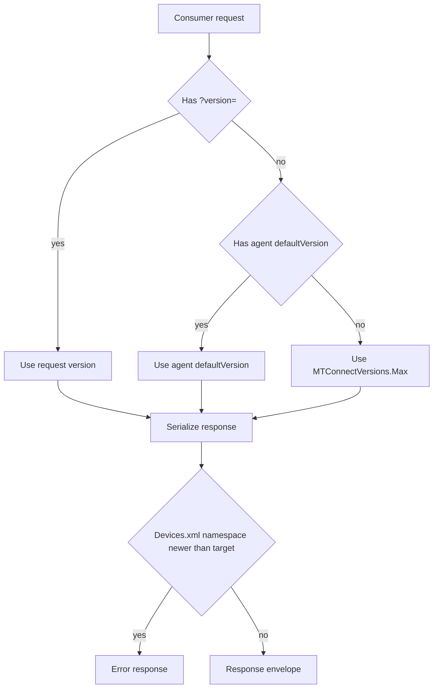

# Schema version mismatches

The MTConnect spec is published per major.minor version, with one XSD per envelope per version. When the agent, the consumer, and the device model disagree on which version is in play, the symptoms are subtle — a `/probe` response that omits an attribute the consumer expected, a `Devices.xml` that fails validation, an MQTT payload that does not parse — and the fix depends on the version misalignment's shape. This page is the diagnostic playbook.

## What "version" means in three places

At least three distinct version values can be in play simultaneously:

1. **`Devices.xml` namespace**: the spec version the device model is authored against (`urn:mtconnect.org:MTConnectDevices:2.5`). The XSD validator uses this to pick the schema.
2. **Agent's `defaultVersion`**: the spec version the agent serializes responses for when the request omits `?version=`. Configured in `agent.config.yaml`.
3. **Request's `?version=` parameter**: the consumer's per-request override of the agent's default.

The agent reconciles these per request:



Three distinct mismatch shapes follow from this flow.

## Mismatch 1: consumer requests a version newer than the agent supports

**Symptom**: the agent returns an Error envelope:

```xml
<MTConnectError xmlns="urn:mtconnect.org:MTConnectError:2.5">
  <Header creationTime="2025-01-01T12:34:56Z" sender="agent-01" instanceId="..." version="2.5.0.0"/>
  <Errors>
    <Error errorCode="UNSUPPORTED">The requested version '2.8' is not supported by this agent.</Error>
  </Errors>
</MTConnectError>
```

**Cause**: the consumer asked for a version higher than `MTConnectVersions.Max`. The library's `Max` advertises the highest version the library can serialize for.

**Fix**: either upgrade the agent (so `MTConnectVersions.Max` covers the requested version), or have the consumer pin to a version the agent supports.

## Mismatch 2: Devices.xml namespace exceeds the agent's `Max`

**Symptom**: the agent fails to start with:

```text
[ERR] Devices.xml declares namespace 'urn:mtconnect.org:MTConnectDevices:3.0',
      but this agent supports up to MTConnectDevices_2.7.xsd.
```

**Cause**: the device model was authored against a spec version the library has not yet shipped support for.

**Fix**: upgrade the library, or downgrade the `Devices.xml` namespace to the highest version the library supports. If the device model uses features introduced in the newer version, those features will need to be re-authored against the older shape — see [Cookbook: Migrate between MTConnect versions](/cookbook/migrate-versions).

## Mismatch 3: consumer rejects an attribute introduced in a later version

**Symptom**: the consumer's parser throws an error like `Unknown attribute 'hash' on Header element`.

**Cause**: the agent is serializing responses for a higher version than the consumer's parser was built against. A consumer pinned to v2.1 sees the v2.2-introduced `Hash` attribute on `Header` and rejects it.

**Fix**: either upgrade the consumer's parser, or pin the consumer's requests with `?version=2.1`. The agent prunes v2.2-introduced attributes when serializing for v2.1.

## Mismatch 4: consumer expects a DataItem that does not appear

**Symptom**: the consumer queries `/current?path=//DataItem[@type='ASSET_COUNT']` and the response is empty, even though the device model declares an `AssetCount` DataItem on the Agent Device.

**Cause**: the requested version is below the DataItem's `MinimumVersion`. `ASSET_COUNT` enters at v1.2; a request with `?version=1.0` elides it.

**Fix**: pin the request to a version at or above the DataItem's `MinimumVersion`. The introduction version is on the DataItem's API reference page.

## Mismatch 5: SHDR adapter sends a DataItem key the agent does not have

**Symptom**: the agent logs `[WRN] Received SHDR observation for unknown DataItem 'x-pos-actual' on Device 'mill-01'`.

**Cause**: the adapter is using a DataItem key (`Id` or `Name`) that does not exist in the version-resolved Device model. This often happens when the adapter was authored against a model that has since been pruned because the agent runs at an older version that elides the DataItem.

**Fix**: serialize the Device model at the version the adapter expects, or update the adapter to send only DataItem keys that survive at the agent's target version.

## How to read the version on the wire

Every response carries a `schemaVersion` attribute on the `Header` element:

```xml
<Header schemaVersion="2.5" .../>
```

Inspect the response to confirm which version the agent actually serialized at:

```sh
curl -s http://agent:5000/probe | grep schemaVersion
```

The output:

```text
<Header creationTime="2025-01-01T12:34:56Z" sender="agent-01"
        instanceId="1735734896" version="2.5.0.0" assetBufferSize="1000"
        assetCount="0" bufferSize="150000" schemaVersion="2.5"/>
```

If `schemaVersion` is not what you expected, the agent picked it from one of the three sources above; check `agent.config.yaml`'s `defaultVersion`, then re-read the request URL for a `?version=` parameter.

## How to read the version a class lives at

A consumer wondering "is this DataItem available at v2.0?" can introspect:

```csharp
using System;
using MTConnect.Devices.DataItems;

var minVer = new AssetCountDataItem().MinimumVersion;
Console.WriteLine($"AssetCount introduced at {minVer}");
// → AssetCount introduced at 1.2
```

Every class exposes `MinimumVersion` and `MaximumVersion` properties; the introduction-version metadata is generated from the SysML model's `introducedAtVersion` tag and is auditable through the type's API reference page.

## Production patterns

To avoid surprise mismatches in production:

- **Pin explicitly**: set `defaultVersion` in `agent.config.yaml` and `?version=` in every consumer request. Default-to-Max is the source of "the agent upgraded and now my consumer breaks" stories.
- **Validate at build time**: run `xmllint --noout --schema <xsd>` against `Devices.xml` in CI. The agent does this on startup; CI catches it earlier.
- **Test against the version pair**: a consumer pinned to v2.1 should have a test suite that asserts its behavior against a v2.1-pinned agent, not against an agent running at `MTConnectVersions.Max`.
- **Audit on bump**: when bumping the library version, re-run the consumer-side schema validator against captured responses. The `Header.schemaVersion` in those captures tells you which schema to validate against.

## Where to next

- [Cookbook: Migrate between MTConnect versions](/cookbook/migrate-versions) — the migration playbook.
- [Compliance: Per-version matrix](/compliance/per-version-matrix) — which features ship in which version.
- [Troubleshooting: XSD validation failures](/troubleshooting/xsd-validation-failures) — the diagnostic flow when validation fails.
- [Configure an agent](/configure/agent-config) — where `defaultVersion` lives.
