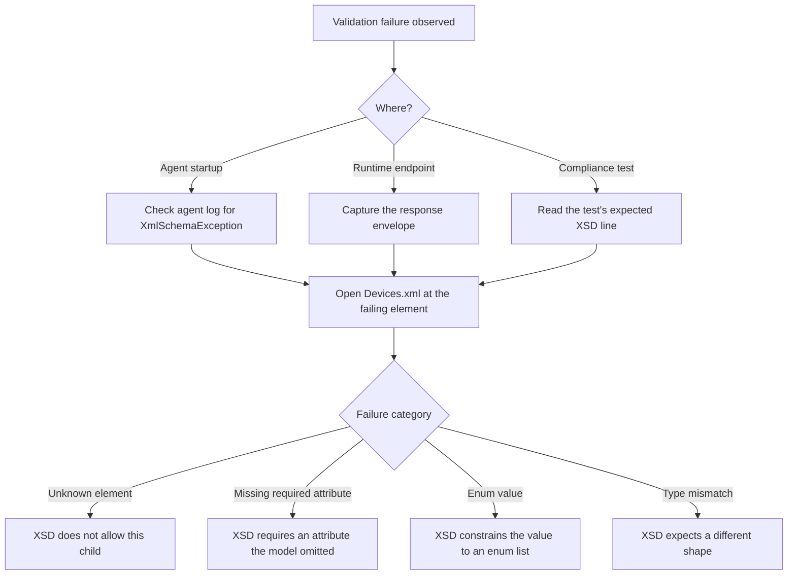

# XSD validation failures

The MTConnect XSDs are strict. When a `Devices.xml` or a runtime envelope fails XSD validation, the library logs a structured error and (for `Devices.xml` at agent startup) refuses to continue. This page documents the common failures, what they mean, and how to fix each.

## Symptoms

A failed validation typically surfaces as one of:

- Agent startup logs a `XmlSchemaException` and exits with a non-zero code.
- A request to `/probe` returns a `MTConnectError` envelope with `errorCode="INVALID_DEVICES"`.
- A consumer rejects the agent's response with a "schema validation failed" exception.
- A compliance test fixture fails with an assertion message naming an XSD line number.

## Diagnostic flow



Resolve based on the failure category below.

## Category 1: Unknown element

Example log:

```text
The element 'Component' has invalid child element 'CustomThing'.
List of possible elements expected: 'DataItems, Components, Compositions, References, Configuration'.
```

**Diagnosis**: the `Devices.xml` declares an element the XSD does not allow at that nesting depth. Most often this is a Component / Composition / DataItem type that was introduced in a later spec version than the document's namespace declares — for example, a v2.4 `PalletAsset` measurement in a document whose namespace is `urn:mtconnect.org:MTConnectAssets:2.3`.

**Fix**:

1. Identify the element's introduction version (see [Per-version matrix](/compliance/per-version-matrix) or the API page for the element).
2. Bump the document's namespace to match the introduction version, or remove the offending element.
3. Re-validate.

## Category 2: Missing required attribute

Example log:

```text
The element 'DataItem' is missing the required attribute 'id'.
```

**Diagnosis**: a DataItem (or Component, Device, Composition) declared in the model omits an attribute the XSD marks `use="required"`. `id` is required everywhere; `category` and `type` are required on every `DataItem`.

**Fix**:

1. Open the offending element.
2. Add the missing attribute. For `id`, generate a unique value across the Device.
3. Re-validate.

## Category 3: Enum value violation

Example log:

```text
The 'category' attribute is invalid. The value 'INFO' is invalid according to its datatype.
The enumeration constraint failed.
```

**Diagnosis**: an attribute carries a value not in the XSD's enumerated list. For `category`, the spec-defined values are `EVENT`, `SAMPLE`, `CONDITION` ([`MTConnect.Devices.DataItemCategory`](/api/MTConnect.Devices/DataItemCategory)). For `representation`, the values are `VALUE`, `DATA_SET`, `TABLE`, `TIME_SERIES` ([`MTConnect.Devices.DataItemRepresentation`](/api/MTConnect.Devices/DataItemRepresentation)).

**Fix**:

1. Look up the attribute's spec-defined enum on the API reference page for the containing element.
2. Replace the invalid value with a spec-defined one.
3. Re-validate.

## Category 4: Type mismatch

Example log:

```text
The 'sampleRate' attribute is invalid. The value 'fast' does not match the pattern '[+-]?\d*(\.\d+)?'.
```

**Diagnosis**: a numeric or pattern-constrained attribute carries a non-conforming value. `sampleRate`, `sampleInterval`, `assetCount`, and most timestamps have format-pattern constraints.

**Fix**:

1. Inspect the attribute's XSD declaration (the `xs:pattern` or `xs:simpleType` it points at).
2. Re-format the value to match.
3. Re-validate.

## Category 5: XSD 1.1 assertion failure

A small number of MTConnect XSDs use XSD 1.1's `xs:assert` element to encode cross-attribute constraints (such as "if `representation='DATA_SET'`, then ...). The .NET BCL's XSD validator is XSD 1.0; it does not enforce `xs:assert` at parse time. The library injects runtime checks for the most-likely-to-be-violated assertions, but a validator on a different toolchain (Java's Xerces, libxml2 with XSD 1.1 enabled) might surface an assertion failure the .NET validator did not.

**Symptom**: validation succeeds against `MTConnect.NET`'s XSD validator but fails against an external XSD 1.1 validator.

**Fix**:

1. Identify the failing assertion in the external validator's log.
2. Adjust the model to satisfy the assertion. The library's runtime checks log a warning when the same constraint is at risk.
3. If the assertion is not enforced by the library at runtime, file an issue at [TrakHound/MTConnect.NET](https://github.com/TrakHound/MTConnect.NET/issues) so the library can pick it up.

## A worked example

A consumer sends this `Devices.xml`:

```xml
<MTConnectDevices xmlns="urn:mtconnect.org:MTConnectDevices:2.5"
                  xsi:schemaLocation="urn:mtconnect.org:MTConnectDevices:2.5
                                      https://schemas.mtconnect.org/schemas/MTConnectDevices_2.5.xsd">
  <Devices>
    <Device id="mill-01" uuid="abc-123">
      <DataItems>
        <DataItem id="mode" category="EVENT" type="CONTROLLER_MODE"/>
      </DataItems>
    </Device>
  </Devices>
</MTConnectDevices>
```

The agent rejects it with:

```text
[ERR] XmlSchemaException: The element 'DataItem' with type 'CONTROLLER_MODE' is declared
      under the Device root, but CONTROLLER_MODE is only allowed under a Controller component.
```

**Diagnosis**: `CONTROLLER_MODE` is spec-defined to live on a `Controller` component, not directly under the Device. The XSD encodes this via element-substitution groups; the validator catches it.

**Fix**: wrap the `DataItem` in a `Controller` component:

```xml
<Device id="mill-01" uuid="abc-123">
  <Components>
    <Controller id="ctrl">
      <DataItems>
        <DataItem id="mode" category="EVENT" type="CONTROLLER_MODE"/>
      </DataItems>
    </Controller>
  </Components>
</Device>
```

Re-validate; the agent now starts.

## Cross-validator differences

Different XSD validators report the same error in different shapes. A short translation guide:

| Validator | "Unknown element" wording |
|---|---|
| .NET BCL `XmlSchemaValidator` | `The element ... has invalid child element ...` |
| `xmllint` | `element ...: This element is not expected.` |
| Java Xerces | `cvc-complex-type.2.4.a: Invalid content was found starting with element ...` |

If a CI test validates against one toolchain and a local check uses another, expect different wording. The substance is the same.

## Where to next

- [Per-version compliance matrix](/compliance/per-version-matrix) — confirm which version introduces an element.
- [Compliance: Wire-format compliance](/compliance/wire-format) — the validation tier in the compliance harness.
- [Troubleshooting: Schema version mismatches](/troubleshooting/schema-version-mismatches) — when the validation issue is a version mis-pin rather than a content error.
- [Concepts: Devices](/concepts/devices) — the model-authoring fundamentals.
