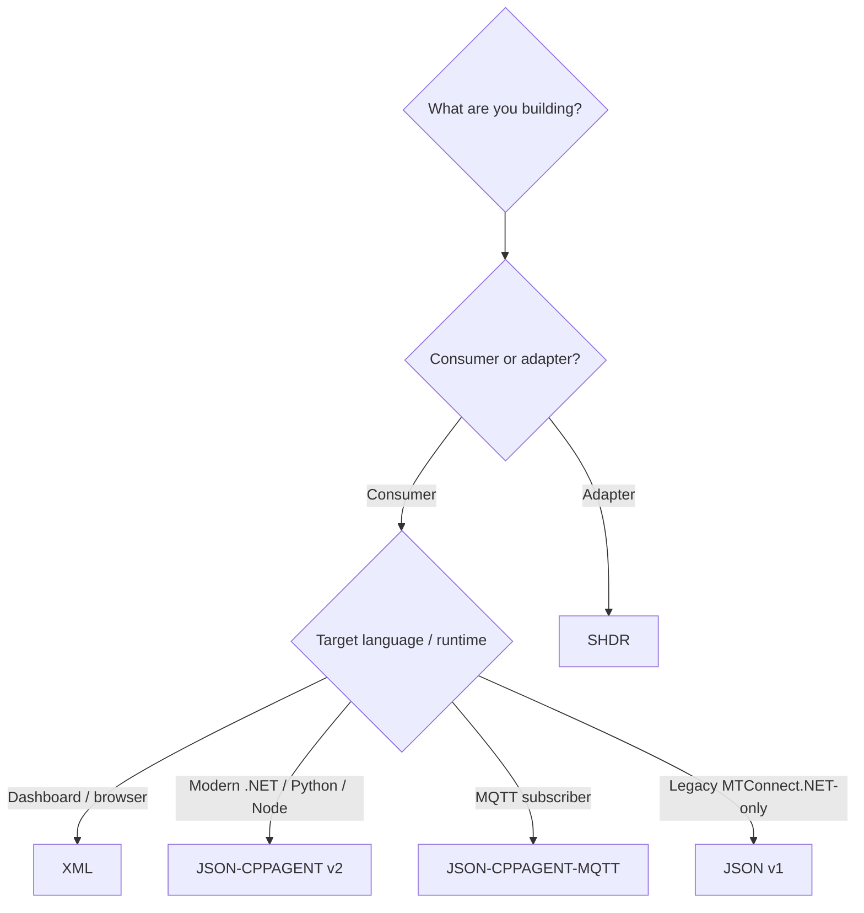

# Wire formats

`MTConnect.NET` ships codecs for every wire format the MTConnect Standard recognizes, plus the SHDR adapter protocol that feeds the agent from upstream. This section is the codec-level reference — sample envelopes, codec class names, spec-version compatibility, and Mermaid sequence diagrams for the wire-flow handshakes.

## The five formats

- **[XML](./xml)** — the canonical wire format defined by the per-version XSDs (`MTConnectStreams_<ver>.xsd`, `MTConnectDevices_<ver>.xsd`, `MTConnectAssets_<ver>.xsd`, `MTConnectError_<ver>.xsd`). Codec lives in `MTConnect.NET-XML`. Validated at write-time against the corresponding XSD.
- **[JSON v1](./json-v1)** — the legacy JSON codec, object-keyed everywhere. Pre-dates the formal cppagent JSON v2 codec; shipped for compatibility with consumers built against early MTConnect.NET releases. Codec lives in `MTConnect.NET-JSON`.
- **[JSON-CPPAGENT (v2)](./json-cppagent)** — the cppagent reference's current JSON codec. Array-of-wrappers where order matters; object-keyed where it doesn't. Byte-for-byte cppagent parity is the library's compliance target. Codec lives in `MTConnect.NET-JSON-cppagent`.
- **[JSON-CPPAGENT-MQTT](./json-cppagent-mqtt)** — JSON-CPPAGENT v2 envelopes published over MQTT topics with a documented topic tree. Codec lives in `MTConnect.NET-JSON-cppagent` plus the `MTConnect.NET-MQTT` transport layer.
- **[SHDR](./shdr)** — the Simple Hierarchical Data Representation; the line-oriented adapter protocol that ships values from a PLC reader into the agent. Codec lives in `MTConnect.NET-SHDR`.

## Picking a format

- Pulling data into a dashboard? XML is the canonical format and every consumer can read it.
- Building a modern consumer in any non-browser runtime? Use JSON-CPPAGENT v2 — it's the cppagent-parity format and the spec's current direction.
- Subscribing to a stream over MQTT? Use JSON-CPPAGENT-MQTT.
- Maintaining an old consumer built before the JSON v2 codec landed? JSON v1 still ships.
- Feeding the agent from upstream equipment? Use SHDR if your reader speaks it; the MQTT adapter and HTTP adapter are alternatives.

## Spec-version compatibility

Every wire-format page lists the MTConnect spec versions the format is conformant for, along with the per-version differences (new envelope types, new attributes, deprecated fields). The agent emits the wire format that matches the spec version the consumer requests.

## Round-tripping

Every codec in `MTConnect.NET` is symmetric — it both reads and writes its format. Consumers can read agent output, modify it, and re-emit it without information loss. The per-codec test suites assert round-trip identity against fixtures generated from the SysML model and against captures from the cppagent reference.

## See also

- [Compliance](/compliance/) — the wire-format compliance matrix and the known divergences from the cppagent reference, with justifications.
- [Configure & Use](/configure/) — how to enable each wire format on the agent and the adapter.
- [API reference](/api/) — the codec classes (`MTConnectXmlSerializer`, `MTConnectJsonSerializer`, `MTConnectCppAgentJsonSerializer`, `ShdrLine`, …) and their public surface.
