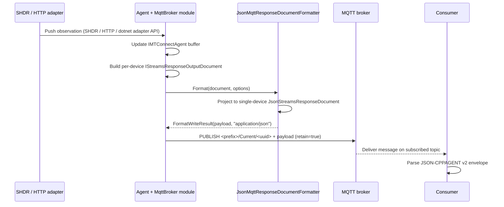

# JSON-CPPAGENT-MQTT

JSON-CPPAGENT-MQTT publishes JSON-CPPAGENT v2 envelopes over an MQTT broker on a documented topic tree. The codec is the same `MTConnect.NET-JSON-cppagent` library that serializes HTTP responses, but with an MQTT-flavored formatter that splits per-device documents into per-topic payloads. Consumers subscribe to a fixed `<prefix>/<envelope>/<device-uuid>` pattern and parse the resulting messages with any JSON parser that handles the HTTP form of JSON-CPPAGENT v2.

## Document format ID

The codec registers as `JSON-cppagent-mqtt` in the formatter registry. It inherits from the HTTP JSON-CPPAGENT formatter and overrides only the Devices and Assets methods so the MQTT broker module emits one device or one asset per message rather than a multi-device array.

## Codec classes

| Class | Role |
|---|---|
| [`MTConnect.Formatters.JsonMqttResponseDocumentFormatter`](/api/mtconnect-formatters/JsonMqttResponseDocumentFormatter) | MQTT-flavored `IResponseDocumentFormatter` derived from the HTTP codec. Overrides `Format(IDevicesResponseDocument)` to emit a single `JsonDeviceContainer` and `Format(IAssetsResponseDocument)` to emit a single asset per message. Returns `application/json`. |
| [`MTConnect.Formatters.JsonMqttEntityFormatter`](/api/mtconnect-formatters/JsonMqttEntityFormatter) | Per-entity formatter for MQTT relays that publish per-observation messages. |
| [`MTConnect.Devices.Json.JsonDeviceContainer`](/api/mtconnect-devices-json/JsonDeviceContainer) | Single-device wrapper the MQTT formatter emits in place of the multi-device `JsonDevicesResponseDocument`. |
| [`MTConnect.Assets.Json.JsonAssetContainer`](/api/mtconnect-assets-json/JsonAssetContainer) | Single-asset wrapper the MQTT formatter emits per asset message. |
| [`MTConnect.MTConnectMqttDocumentServer`](/api/mtconnect/MTConnectMqttDocumentServer) | Holds the topic constants — `Probe`, `Current`, `Sample`, `Asset` — that downstream agent modules use to build the published topic. |

## Topic tree

The default topic tree, as composed by the [MqttBroker agent module](/modules/mqtt-broker) using [`MTConnectMqttDocumentServer`](/api/mtconnect/MTConnectMqttDocumentServer) constants:

| Topic pattern | Payload | Retained? |
|---|---|---|
| `<prefix>/Probe/<device-uuid>` | One `MTConnectDevices` envelope, single-device wrapper. | Yes — late-joiners receive the latest probe on connect. |
| `<prefix>/Current/<device-uuid>` | One `MTConnectStreams` envelope, single-device, snapshot semantics. | Yes — `/current`-equivalent for new subscribers. |
| `<prefix>/Sample/<device-uuid>` | One `MTConnectStreams` envelope, single-device, sample-stream semantics. | No — sample messages stream live. |
| `<prefix>/Asset/<device-uuid>/<asset-id>` | One `MTConnectAssets` envelope, single asset. | Yes — current state of the named asset. |

The prefix defaults to `MTConnect` (see the [MqttBroker module configuration](/modules/mqtt-broker) and [MqttAdapter module configuration](/modules/mqtt-adapter) pages); operators override it per deployment. The agent's MqttBroker module fans documents out across these topics; the MqttAdapter module subscribes to `<prefix>/#` and ingests messages back into an agent.

## Sample envelope

A `Current` message on `MTConnect/Current/5fd88408-7811-3c6b-5400-11f4026b6890` carries the same JSON-CPPAGENT v2 envelope shape the HTTP codec emits, scoped to a single device. The payload below is the per-device slice of the HTTP fixture:

```json
{
  "MTConnectStreams": {
    "jsonVersion": 2,
    "schemaVersion": "2.0",
    "Header": {
      "instanceId": 1702144894,
      "version": "6.0.1.0",
      "sender": "DESKTOP-HV74M4N",
      "bufferSize": 150000,
      "firstSequence": 1,
      "lastSequence": 246,
      "nextSequence": 247,
      "deviceModelChangeTime": "2023-12-09T18:01:38.0133172Z",
      "creationTime": "2023-12-10T03:06:48.4086283Z"
    },
    "Streams": {
      "DeviceStream": [
        {
          "name": "M12346",
          "uuid": "5fd88408-7811-3c6b-5400-11f4026b6890",
          "ComponentStream": [
            {
              "component": "Device",
              "componentId": "d1",
              "name": "M12346",
              "uuid": "5fd88408-7811-3c6b-5400-11f4026b6890",
              "Events": {
                "Application": [
                  {
                    "value": "UNAVAILABLE",
                    "dataItemId": "gui",
                    "timestamp": "2023-12-09T18:01:37.7811108Z",
                    "sequence": 11
                  }
                ]
              }
            }
          ]
        }
      ]
    }
  }
}
```

The fixture derivation is `libraries/MTConnect.NET-JSON-cppagent/Examples/MTConnectStreamsResponseDocument.json`, scoped to a single `DeviceStream`. An Asset message on `MTConnect/Asset/<device-uuid>/<asset-id>` carries a single-asset envelope rather than the per-type-array shape the HTTP Assets endpoint returns.

## Spec-version compatibility

The MQTT formatter is a thin override of the HTTP JSON-CPPAGENT codec; the on-the-wire JSON shape is identical to the [JSON-CPPAGENT v2](./json-v2-cppagent) page's coverage. Topic shape and retention policy are set by the agent's MqttBroker module configuration; they are deployment metadata, not part of the MTConnect Standard.

| Spec version | Codec shape | Notes |
|---|---|---|
| v1.0 – v1.8 | Same as JSON-CPPAGENT v2 HTTP. | Topic tree applies uniformly across versions; the per-message envelope carries the negotiated `schemaVersion`. |
| v2.0 – v2.5 | Same as JSON-CPPAGENT v2 HTTP — default + canonical target. | The MQTT codec's NuGet ships alongside the HTTP codec and tracks the same upper bound. |
| v2.6 – v2.7 | Codec shape unchanged; type-system additions tracked under [Compliance](/compliance/). | The MqttBroker module exposes the same fields on every published envelope as the HTTP module would on `/current` and `/sample`. |

The reference implementation for the JSON shape remains cppagent's [`JsonPrinter`](https://github.com/mtconnect/cppagent/blob/main/src/mtconnect/printer/JsonPrinter.cpp). The MTConnect Standard does not specify an MQTT transport for JSON envelopes; the topic tree this library uses is convention, not normative.

## Wire-flow sequence



For Sample-topic messages the same pipeline runs but with retain set false; for Asset-topic messages the broker module switches to the [`JsonAssetContainer`](/api/mtconnect-assets-json/JsonAssetContainer) per-asset shape via [`JsonMqttResponseDocumentFormatter.Format(IAssetsResponseDocument)`](/api/mtconnect-formatters/JsonMqttResponseDocumentFormatter) and publishes on `<prefix>/Asset/<device-uuid>/<asset-id>`.

Reads (ingress) run via the [MqttAdapter agent module](/modules/mqtt-adapter): the module subscribes to `<prefix>/#`, routes each message to [`JsonMqttResponseDocumentFormatter.CreateDevicesResponseDocument`](/api/mtconnect-formatters/JsonMqttResponseDocumentFormatter) (or the Assets equivalent), and projects back to the canonical `IDevicesResponseDocument` / `IAssetsResponseDocument` interfaces.

## Caveats and known divergences

- **No normative spec — neither for the JSON shape nor for the MQTT topic tree.** The JSON envelope mirrors cppagent's HTTP output; the topic tree is this library's convention, aligned with cppagent's MQTT module where it overlaps. Consumers should consider the topic shape stable but not standardized.
- **One device per message, one asset per message.** The MQTT formatter overrides the HTTP formatter's Devices and Assets methods to emit a single-device or single-asset payload, in contrast to the HTTP envelope that may carry many devices or many asset types. Subscribers that expect multi-device payloads will mis-parse MQTT messages.
- **Retain semantics differ by topic.** Probe, Current, and Asset messages are retained so a late-joining subscriber receives the current state on connect; Sample messages stream live and are not retained. This matches the snapshot vs change-feed distinction the HTTP endpoints draw between `/current` and `/sample`.
- **Topic prefix is operator-configured.** The default `MTConnect` prefix is the MqttBroker module's default; operators are free to change it, and a consumer that hard-codes `MTConnect/` will silently fail against a renamed deployment. Discover the prefix via the deployment's agent configuration, not from this page.
- **QoS is operator-configured.** The MqttBroker module exposes a per-broker QoS setting (default 1); message ordering across QoS-0 deployments is the broker's responsibility, not the codec's.
- **JSON-level caveats inherit.** Every caveat on the [JSON-CPPAGENT v2](./json-v2-cppagent#caveats-and-known-divergences) page (`UNAVAILABLE` sentinel, string `schemaVersion`, single-element-arrays, etc.) applies identically here.
- **Topic-tree extensibility is non-normative.** Some downstream MQTT bridges add per-DataItem topics (`<prefix>/Observation/<dataItemId>`). The library's MqttBroker module ships only the four topic kinds in the table above; downstream extensions live in adapter / bridge code, not in this codec.

## See also

- [`MTConnect.NET-JSON-cppagent` library README](https://github.com/TrakHound/MTConnect.NET/blob/master/libraries/MTConnect.NET-JSON-cppagent/README.md) — package install + per-version notes.
- [JSON-CPPAGENT v2](./json-v2-cppagent) — the same envelope shape over HTTP.
- [MqttBroker module](/modules/mqtt-broker) — agent-side configuration that drives the publish topic tree.
- [MqttAdapter module](/modules/mqtt-adapter) — agent-side ingress that consumes the published topic tree.
- [MQTT-Protocol guide](/configure/integrations/mqtt-protocol) — operator-side topic tree and prefix configuration.
- [Compliance](/compliance/) — JSON-CPPAGENT vs cppagent reference parity matrix and divergence ledger.
