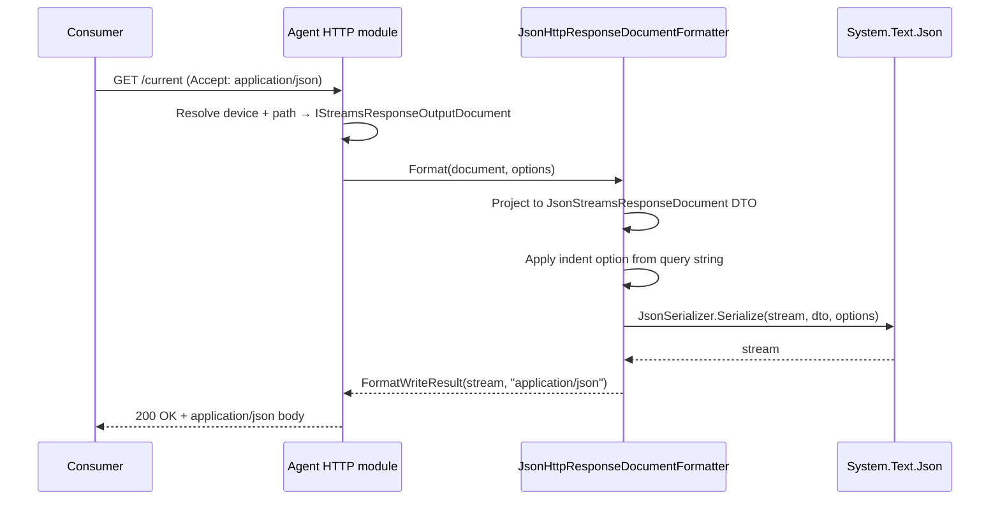

# JSON-CPPAGENT (v2)

The JSON-CPPAGENT codec produces output that matches the cppagent reference implementation's JSON v2 format byte-for-byte. The MTConnect Standard does not currently specify a JSON wire format via SysML XMI / XSD / prose; cppagent's [`src/printer/JsonPrinter.cpp`](https://github.com/mtconnect/cppagent/blob/main/src/mtconnect/printer/JsonPrinter.cpp) is the de-facto specification. This library's codec targets that reference so a consumer written against cppagent's JSON output works against an `MTConnect.NET` agent without per-implementation conditionals, and vice versa.

The format uses three structural idioms:

- **Object-keyed top-level wrappers** — `MTConnectStreams`, `MTConnectDevices`, `MTConnectAssets`, `MTConnectError` — one per envelope kind.
- **Array-of-wrappers for ordered collections** — Streams' `DeviceStream`, `ComponentStream`, the per-category observation arrays (`Events`, `Samples`, `Condition`), and Assets' per-type containers (`CuttingTool`, `File`, …) all serialize as JSON arrays so order is preserved.
- **Object-keyed properties for attribute-style data** — `Header`, individual observation properties, asset measurement properties.

## Document format ID

The codec registers as `JSON-cppagent` in the formatter registry.

## Codec classes

| Class | Role |
|---|---|
| [`MTConnect.Formatters.JsonHttpResponseDocumentFormatter`](/api/mtconnect-formatters/JsonHttpResponseDocumentFormatter) | Top-level `IResponseDocumentFormatter` for the four envelope kinds. Returns `application/json`. |
| [`MTConnect.Formatters.JsonHttpEntityFormatter`](/api/mtconnect-formatters/JsonHttpEntityFormatter) | Per-entity formatter (single Observation, single Asset) for callers that splice individual entities into a larger document. |
| [`MTConnect.Streams.Json.JsonStreamsResponseDocument`](/api/mtconnect-streams-json/JsonStreamsResponseDocument) | DTO that mirrors the `MTConnectStreams` envelope. |
| [`MTConnect.Devices.Json.JsonDevicesResponseDocument`](/api/mtconnect-devices-json/JsonDevicesResponseDocument) | DTO that mirrors the `MTConnectDevices` envelope. |
| [`MTConnect.Assets.Json.JsonAssetsResponseDocument`](/api/mtconnect-assets-json/JsonAssetsResponseDocument) | DTO that mirrors the `MTConnectAssets` envelope. |
| [`MTConnect.Streams.Json.JsonDeviceStream`](/api/mtconnect-streams-json/JsonDeviceStream) / [`JsonComponentStream`](/api/mtconnect-streams-json/JsonComponentStream) | Per-device + per-component stream containers. |
| [`MTConnect.Streams.Json.JsonObservation`](/api/mtconnect-streams-json/JsonObservation) | Base shape for every observation under `Events`, `Samples`, and `Condition`. |
| [`MTConnect.JsonFunctions`](/api/mtconnect/JsonFunctions) | Serializer options bundle (default vs indented) shared across the codec. |

## Sample envelope

The codec's output for a `/current` request demonstrates every idiom — the top-level `MTConnectStreams` wrapper, the `jsonVersion`: 2 marker, the `Header` object, and the array-of-wrappers shape for `DeviceStream`, `ComponentStream`, and the per-DataItem observation arrays (`AdapterUri`, `ConnectionStatus`, etc.).

```json
{
  "MTConnectStreams": {
    "jsonVersion": 2,
    "schemaVersion": "2.0",
    "Header": {
      "instanceId": 1702144894,
      "version": "6.0.1.0",
      "sender": "DESKTOP-HV74M4N",
      "bufferSize": 150000,
      "firstSequence": 1,
      "lastSequence": 246,
      "nextSequence": 247,
      "deviceModelChangeTime": "2023-12-09T18:01:38.0133172Z",
      "creationTime": "2023-12-10T03:06:48.4086283Z"
    },
    "Streams": {
      "DeviceStream": [
        {
          "name": "agent",
          "uuid": "b85fa5f1-bc29-40e0-9893-c8ef8eac6761",
          "ComponentStream": [
            {
              "component": "Adapter",
              "componentId": "adapter_shdr_56697b5624",
              "name": "adapterShdr",
              "Events": {
                "AdapterUri": [
                  {
                    "value": "shdr://localhost:7878",
                    "dataItemId": "adapter_shdr_56697b5624_adapterUri",
                    "name": "adapterUri",
                    "timestamp": "2023-12-09T18:01:39.8259158Z",
                    "sequence": 243
                  }
                ],
                "ConnectionStatus": [
                  {
                    "value": "LISTEN",
                    "dataItemId": "adapter_shdr_56697b5624_connectionStatus",
                    "name": "connectionStatus",
                    "timestamp": "2023-12-09T18:01:52.1224823Z",
                    "sequence": 246
                  }
                ]
              }
            }
          ]
        }
      ]
    }
  }
}
```

The fixture is `libraries/MTConnect.NET-JSON-cppagent/Examples/MTConnectStreamsResponseDocument.json`. Assets and Devices envelopes follow the same envelope-wrapper + array-of-types pattern; the assets sample under the same `Examples/` directory shows the per-type containers (`CuttingTool`, `File`, …) holding asset arrays.

## Spec-version compatibility

cppagent's JSON v2 codec covers the same MTConnect data model as the XML codec, so the version coverage matches the XML page's table where the codec is implemented. The library currently targets MTConnect versions up to v2.5 (see [`MTConnectVersions.Max`](/api/mtconnect/MTConnectVersions)); the NuGet package's description states the same upper bound.

| Spec version | Status in this library | Notes |
|---|---|---|
| v1.0 – v1.8 | Read + write. | The codec emits the same JSON shape regardless of MTConnect version; the version surfaces on the document via `schemaVersion`. |
| v2.0 – v2.5 | Read + write. | Default + canonical target. |
| v2.6 – v2.7 | Codec shape unchanged; new type-system additions (e.g. Pallet rich measurements) are tracked under [Compliance](/compliance/). | cppagent has continued to evolve its emitted JSON across these releases; the divergence ledger in [Compliance](/compliance/) lists every observed difference. |

The `jsonVersion` field on the envelope is fixed at `2` for this codec. A future JSON v3 codec, should one land, would carry `jsonVersion: 3`; consumers gate on that value to pick a parser.

The reference implementation is at [`mtconnect/cppagent`](https://github.com/mtconnect/cppagent); the normative MTConnect Standard for the type-system data the JSON carries is the SysML XMI at [`mtconnect/mtconnect_sysml_model`](https://github.com/mtconnect/mtconnect_sysml_model) and the XSDs at [schemas.mtconnect.org](https://schemas.mtconnect.org/) (the XSDs pin XML wire shape; the JSON codec mirrors the same field set without inheriting the XML attribute-vs-element distinction).

## Wire-flow sequence



Reads run the same pipeline in reverse via [`JsonHttpResponseDocumentFormatter.CreateStreamsResponseDocument`](/api/mtconnect-formatters/JsonHttpResponseDocumentFormatter) (and the matching Devices / Assets methods): `System.Text.Json` deserializes into the `Json*ResponseDocument` DTOs, which then project back to the canonical `IStreamsResponseDocument` / `IDevicesResponseDocument` / `IAssetsResponseDocument` interfaces the rest of the library consumes.

## Caveats and known divergences

- **No normative spec.** The MTConnect Standard does not specify a JSON wire format. The de-facto reference is cppagent's `JsonPrinter`; the [Compliance](/compliance/) section tracks any divergence between this library's output and that reference.
- **Field ordering inside objects is not load-bearing.** JSON object keys are unordered by specification. The codec emits them in DTO-declaration order for diff-readability against the cppagent reference, but a consumer that gates on key order is non-conformant to RFC 8259.
- **Array order is load-bearing.** Arrays in this codec (`DeviceStream`, `ComponentStream`, the per-DataItem observation arrays under `Events` / `Samples` / `Condition`, the per-type asset arrays) preserve insertion order. Consumers that re-order arrays on parse will mis-render time-series data and condition transitions.
- **Single-element collections still serialize as arrays.** Even when only one `DeviceStream` is present, the field is `"DeviceStream": [ { … } ]`. This matches cppagent and lets a consumer parse with a single shape regardless of cardinality; consumers must not special-case the 1-element case.
- **`UNAVAILABLE` is the canonical sentinel for missing observations.** The codec emits `"value": "UNAVAILABLE"` (a string) rather than `null` or an absent field, matching cppagent.
- **`schemaVersion` is a string, not a number.** The field carries `"2.0"`, `"2.5"`, etc. — never `2.0` as a JSON number. Older toolchains that strip the quotes will round-trip to a different shape.
- **Round-trip is asymmetric for some Asset subtypes.** The codec serializes every shipped asset type, but read-path coverage lags for assets that the agent doesn't ingest as a primary type (e.g. legacy QIF-wrapped payloads). The [Compliance](/compliance/) section enumerates which asset types round-trip cleanly.
- **Indentation is request-time selectable.** Passing `indentOutput=true` in the formatter options (or `pretty=true` on an HTTP query string, depending on the agent module) switches to the indented `System.Text.Json` profile. The default is compact output, matching cppagent's default.

## See also

- [`MTConnect.NET-JSON-cppagent` library README](https://github.com/TrakHound/MTConnect.NET/blob/master/libraries/MTConnect.NET-JSON-cppagent/README.md) — package install + per-version notes.
- [JSON-CPPAGENT-MQTT](./json-v2-cppagent-mqtt) — the same envelope shape published over MQTT topics.
- [JSON v1](./json-v1) — the legacy JSON codec.
- [XML](./xml) — the canonical, XSD-pinned wire format.
- [cppagent `JsonPrinter` source](https://github.com/mtconnect/cppagent/blob/main/src/mtconnect/printer/JsonPrinter.cpp) — the reference implementation this codec mirrors.
- [Compliance](/compliance/) — JSON-CPPAGENT vs cppagent reference parity matrix and divergence ledger.
