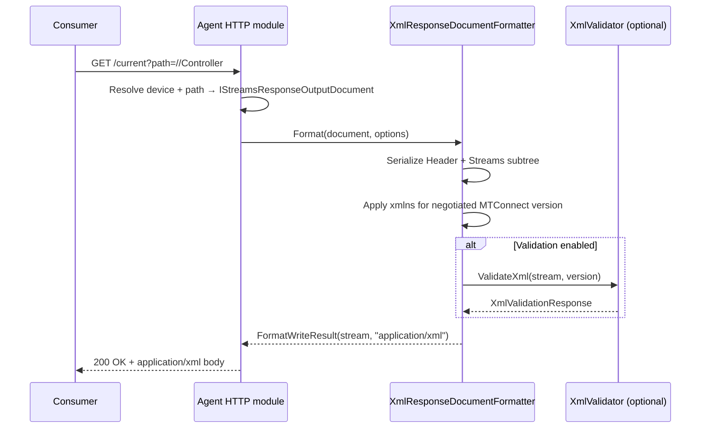

# XML

XML is the canonical MTConnect wire format. Every MTConnect Standard version (v1.0 through v2.5 in this library; v2.7 in the standard at large) defines an XSD set that pins the on-the-wire envelope shape — `MTConnectStreams_<ver>.xsd`, `MTConnectDevices_<ver>.xsd`, `MTConnectAssets_<ver>.xsd`, and `MTConnectError_<ver>.xsd`. The library's XML codec produces output that validates against the matching-version XSD published at [schemas.mtconnect.org](https://schemas.mtconnect.org/).

The codec round-trips: it both reads agent output (e.g. an HTTP `GET /current` response) and writes envelopes for the agent to serve. Reads dispatch on the document's `xmlns` value to select the matching MTConnect version (see [`MTConnect.Namespaces`](/api/mtconnect/Namespaces) for the URI → version table).

## Document format ID

The codec registers as `XML` in the formatter registry. Agent modules and adapters pass that string into `IResponseDocumentFormatter` / `IEntityFormatter` lookups to select XML output.

## Codec classes

| Class | Role |
|---|---|
| [`MTConnect.Formatters.XmlResponseDocumentFormatter`](/api/mtconnect-formatters/XmlResponseDocumentFormatter) | Top-level `IResponseDocumentFormatter` for the four envelope kinds (Streams, Devices, Assets, Error). Returns `application/xml`. |
| [`MTConnect.Formatters.XmlEntityFormatter`](/api/mtconnect-formatters/XmlEntityFormatter) | Per-entity formatter (single Observation, single Asset, etc.) for callers that splice individual entities into a larger document. |
| [`MTConnect.Formatters.XmlPathFormatter`](/api/mtconnect-formatters/XmlPathFormatter) | XPath-style path resolver used by the `path=` query parameter on `/current` and `/sample`. |
| [`MTConnect.Streams.Xml.XmlStreamsResponseDocument`](/api/mtconnect-streams-xml/XmlStreamsResponseDocument) | DTO that mirrors the `<MTConnectStreams>` envelope. |
| [`MTConnect.Devices.Xml.XmlDevicesResponseDocument`](/api/mtconnect-devices-xml/XmlDevicesResponseDocument) | DTO that mirrors the `<MTConnectDevices>` envelope. |
| [`MTConnect.Assets.Xml.XmlAssetsDocument`](/api/mtconnect-assets-xml/XmlAssetsDocument) | DTO that mirrors the `<MTConnectAssets>` envelope. |
| [`MTConnect.Errors.Xml.XmlErrorDocument`](/api/mtconnect-errors-xml/XmlErrorDocument) | DTO that mirrors the `<MTConnectError>` envelope. |
| [`MTConnect.XmlValidator`](/api/mtconnect/XmlValidator) | XSD validator that loads the embedded per-version schema set under [`MTConnect.Schemas`](/api/mtconnect/Schemas) and reports structural errors. |

## Sample envelope

A minimal `<MTConnectStreams>` response captures the shape every Streams document follows — a `<Header>` with sequence + buffer metadata, a `<Streams>` container, one `<DeviceStream>` per device, one `<ComponentStream>` per addressed component, and a category container (`<Events>`, `<Samples>`, or `<Condition>`) holding the observations.

```xml
<?xml version="1.0" encoding="utf-8"?>
<MTConnectStreams
    xmlns="urn:mtconnect.org:MTConnectStreams:2.0"
    xmlns:m="urn:mtconnect.org:MTConnectStreams:2.0"
    xmlns:xsi="http://www.w3.org/2001/XMLSchema-instance"
    xsi:schemaLocation="urn:mtconnect.org:MTConnectStreams:2.0">
  <Header
      instanceId="1663078056"
      version="1.0.0.0"
      sender="ADSKPF3FBP2T"
      bufferSize="131072"
      firstSequence="1"
      lastSequence="222"
      nextSequence="223"
      deviceModelChangeTime="2022-09-13T14:07:36.2828516Z"
      creationTime="2022-09-13T14:07:47.2901070Z" />
  <Streams>
    <DeviceStream name="Machine" uuid="cc17e6f8-61c2-427b-a45f-11a2189ae3a4">
      <ComponentStream component="Controller" componentId="cont" name="controller">
        <Condition>
          <Fault dataItemId="comms_cond" type="COMMUNICATIONS"
                 sequence="221" timestamp="2022-09-13T14:07:36.444Z" />
          <Normal dataItemId="comms_cond" type="COMMUNICATIONS"
                  sequence="222" timestamp="2022-09-13T14:07:36.570Z" />
        </Condition>
      </ComponentStream>
    </DeviceStream>
  </Streams>
</MTConnectStreams>
```

The fixture is `tests/MTConnect.NET-XML-Tests/Streams-Files/Current-Simple.xml`. Devices, Assets, and Error envelopes share the same `<Header>` + payload pattern, with the per-envelope payload swapped (`<Devices>`, `<Assets>`, `<Errors>`).

## Spec-version compatibility

The codec walks the `xmlns` attribute on the root element to pick the version. The XSDs are embedded into `MTConnect.NET-XML.dll` and exposed via [`MTConnect.Schemas`](/api/mtconnect/Schemas); the [`MTConnect.XmlValidator`](/api/mtconnect/XmlValidator) class loads them on demand and runs structural validation against the matching version.

| Spec version | XML namespace | Status in this library |
|---|---|---|
| v1.0 | `urn:mtconnect.org:MTConnectStreams:1.0` (and the matching Devices / Assets / Error) | Read + write. |
| v1.1 | `urn:mtconnect.org:MTConnectStreams:1.1` | Read + write. |
| v1.2 | `urn:mtconnect.org:MTConnectStreams:1.2` | Read + write. |
| v1.3 | `urn:mtconnect.org:MTConnectStreams:1.3` | Read + write. |
| v1.4 | `urn:mtconnect.org:MTConnectStreams:1.4` | Read + write. |
| v1.5 | `urn:mtconnect.org:MTConnectStreams:1.5` | Read + write. |
| v1.6 | `urn:mtconnect.org:MTConnectStreams:1.6` | Read + write. |
| v1.7 | `urn:mtconnect.org:MTConnectStreams:1.7` | Read + write. |
| v1.8 | `urn:mtconnect.org:MTConnectStreams:1.8` | Read + write. |
| v2.0 | `urn:mtconnect.org:MTConnectStreams:2.0` | Read + write. |
| v2.1 | `urn:mtconnect.org:MTConnectStreams:2.1` | Read + write. |
| v2.2 | `urn:mtconnect.org:MTConnectStreams:2.2` | Read + write. |
| v2.3 | `urn:mtconnect.org:MTConnectStreams:2.3` | Read + write. |
| v2.4 | `urn:mtconnect.org:MTConnectStreams:2.4` | Read + write. |
| v2.5 | `urn:mtconnect.org:MTConnectStreams:2.5` | Read + write. The library's current `MTConnectVersions.Max`. |

The per-envelope coverage rolls up to the same table — Streams, Devices, Assets, and Error all ship XSDs across the same version span. There is no v1.9 row because the MTConnect Standard skipped that number between v1.8 and v2.0; the XSD set has no `1.9` namespace and the library tracks the canonical gap. See the [`MTConnectVersions`](/api/mtconnect/MTConnectVersions) constants for the full enum.

For v2.6 and v2.7 namespaces, the codec falls through to the v2.5 reader path; the library's compliance posture for those versions is tracked under [Compliance](/compliance/). Authoritative XSDs for every version are at [schemas.mtconnect.org](https://schemas.mtconnect.org/) and the normative SysML XMI is at [`mtconnect/mtconnect_sysml_model`](https://github.com/mtconnect/mtconnect_sysml_model). Prose narration lives at [docs.mtconnect.org](https://docs.mtconnect.org/) in Part 2.0 (Streams), Part 3.0 (Devices), and Part 4.0 (Assets).

## Wire-flow sequence

The `/probe`, `/current`, `/sample`, and `/asset` HTTP endpoints all follow the same envelope-build pipeline. The Mermaid diagram below shows a `/current` request from a consumer through the agent's HTTP module, the codec, and back to the wire.



Reads run the same pipeline in reverse: the agent (or an `XmlAdapter` peer) reads the response stream, [`MTConnect.MTConnectVersion`](/api/mtconnect/MTConnectVersion) walks the document's `xmlns` to pick the version, and the matching DTO deserializes the payload.

## Caveats and known divergences

- **Schema validation is opt-in.** The codec emits XML unconditionally; it does not validate every write against the XSD. Call [`XmlValidator.ValidateXml`](/api/mtconnect/XmlValidator) explicitly when validation matters (e.g. before persisting an envelope or before relaying to a downstream consumer that gates on validation).
- **The v1.9 namespace does not exist.** The MTConnect Standard numbered v1.8 → v2.0 directly. A document carrying `urn:mtconnect.org:MTConnectStreams:1.9` is malformed by definition; the codec's namespace lookup returns the default empty `Version` for it, and downstream code paths treat the result as an unknown version.
- **XSD 1.1 features are not enforced.** The published XSDs include XSD 1.1 assertions and conditional type assignments that .NET's `XmlReader` does not evaluate. Validation catches structural shape only; spec-prose rules (e.g. cross-element constraints not expressible in pure XSD 1.0) are enforced by the agent's typed object model, not by the validator. The compliance harness under `tests/Compliance/` carries the XSD 1.1 + xlink runner that fills the gap.
- **Schema-pinned attribute order is not load-bearing.** The MTConnect XSDs declare attributes in a documented order, but XML itself is order-insensitive for attributes. The codec emits attributes in the order the DTOs declare them; consumers that gate on a particular ordering are non-conformant to the XML specification, not to MTConnect.
- **The `m:` namespace prefix is conventional, not required.** The library emits `xmlns:m="urn:mtconnect.org:MTConnectStreams:<ver>"` alongside the default `xmlns` declaration because the reference fixtures use that prefix. Consumers must accept any prefix (or none) bound to the same URI — the MTConnect Standard pins the namespace URI, not the prefix.

## See also

- [`MTConnect.NET-XML` library README](https://github.com/TrakHound/MTConnect.NET/blob/master/libraries/MTConnect.NET-XML/README.md) — package install + per-version notes.
- [JSON v1](./json-v1) — the legacy JSON codec that pre-dates the cppagent JSON shape.
- [JSON-CPPAGENT v2](./json-v2-cppagent) — the modern JSON wire format with cppagent parity.
- [SHDR](./shdr) — the adapter-side line protocol that feeds the agent.
- [Compliance](/compliance/) — the per-envelope, per-version conformance matrix.
- [Configure & Use](/configure/) — how to enable XML output on an agent + how to read it from a consumer.
